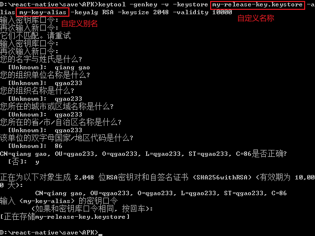
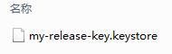

## rn打包

### release模式

1. 生成签名：
   
   
2. 将生成后的 my-release-key.keystore 放到你工程中的android/app文件夹下

3. 打开编辑项目目录下的android/app/build.gradle文件，添加如下的签名配置（signingConfigs ）
   ```
   signingConfigs {
        // 将默认的debug 注释或者去掉都可以
        // debug {
        //     storeFile file('debug.keystore')
        //     storePassword 'android'
        //     keyAlias 'androiddebugkey'
        //     keyPassword 'android'
        // }
        release {
              keyAlias 'my-key-alias' //别名
              keyPassword 'zkr123521' //密钥密码 之前设置秘钥口令
              storeFile file('app.keystore') //my-release-key.keystore文件的绝对路径
              storePassword 'zkr123521' //存储密码
         }
    }
   ```
4. 修改android/app/build.gradle 中buildTypes 配置;
   ```
   buildTypes {
        debug {
            signingConfig signingConfigs.debug
        }
        release {
            // Caution! In production, you need to generate your own keystore file.
            // see https://reactnative.dev/docs/signed-apk-android.
            signingConfig signingConfigs.release //将默认的debug 改成 release
            minifyEnabled enableProguardInReleaseBuilds
            proguardFiles getDefaultProguardFile("proguard-android.txt"), "proguard-rules.pro"
        }
    }
   ```
5. 修改android/app/build.gradle 中的enableProguardInReleaseBuilds属性
   ```
   /**
    * Run Proguard to shrink the Java bytecode in release builds.
    */
    def enableProguardInReleaseBuilds = true //将默认的false 改成true
   ```
6. 进入 react native 的andriod 目录 运行【在生成之前，最后先测试下，连上数据线，输入gradlew installRelease在手机上测试通过后，再发布不迟】
   ```
   gradlew assembleRelease     //windows命令
   ./gradlew assembleRelease   //在macOS和Linux系统
   ```
7. 执行完毕后在    你的项目下\android\app\build\outputs\apk\release中可以找到 app-release.apk

### 切换为debug模式
正常使用即可
