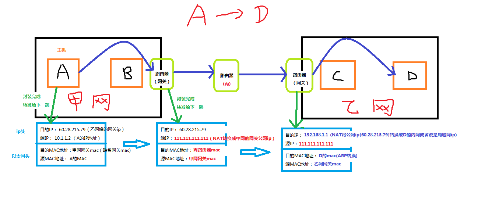
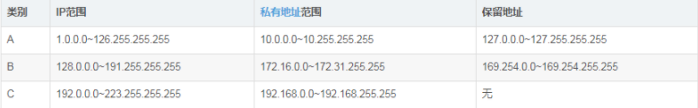
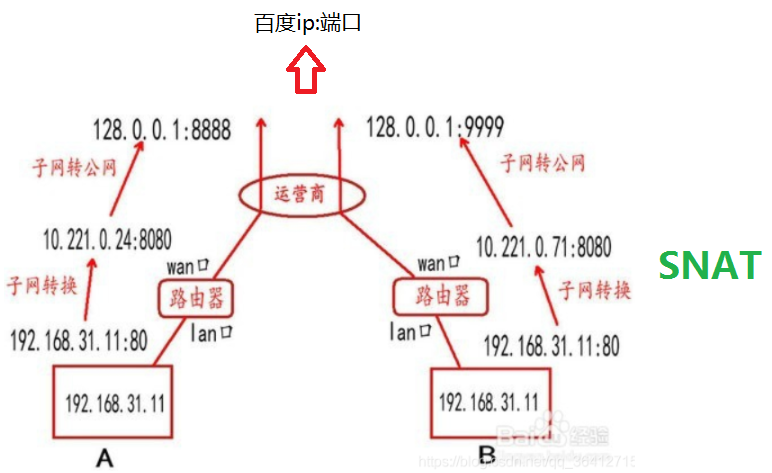
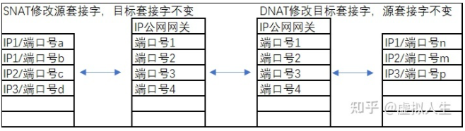

## 网络间主机通信原理

上图有正确的地方也有不正确的地方。

二层转发IP和MAC都不变（指的是局域网内通信）

三层转发IP不变，MAC变成路由器出接口MAC（网络之间通信）

NAT的时候IP会依据策略改变，有可能变成源，也有可能是目标的IP。一般我们称他为SNAT和DNAT

处在局域网内的主机如何向网站发起请求:

首先要知道，局域网中的主机使用的是私网ip，而私网ip是在A,B,C三类网络中各截取的一段网段。

ipconfig查出来的是你**本机的IP地址，也就是内网私有地址**，此类地址仅在局域网使用，不能联通外网。
百度搜索IP查出来的地址是你**上网的公有地址，并不是你主机的地址**，而是运营商（电信或联通）分给你的地址，用于连接互联网。

网络之间的通迅实际上是**某个软件和软件之间的通讯**， 利用的是套接字（ip+端口）。

当局域网的主机想访问外网时，通过端口映射，端口映射是 NAT （网络地址转换）的一种，它将外网主机的 IP 地址的一个端口映射到内网中一台机器，提供相应的服务。当用户访问该 IP 的这个端口时，服务器自动将请求映射到对应局域网内部的机器上。

网关提供NAT服务，而通常路由器的ip地址即为网关，

路由器至少有两个端口：WAN 口和 LAN 口。
WAN：接外部 IP 地址用，通常指的是出口，转发来自内部 LAN 接口的 IP 数据包，这个口的 IP 是唯一的。
LAN：接内部 IP 地址用，LAN 内部是交换机。
LAN口到WAN口有一个NAT转换，WAN口到公网之间也通过NAT转换。

租用（申请）公有 IP 是需要钱的。A 家庭的局域网 IP 和 B 家庭的局域网 IP 相同很正常，但是，最终 A 和 B 能上网（数据走出去）还是通过运营商的公有 IP。
假如 A 和 B 的局域网 IP 相同（192.168.31.11），他们的公有IP也相同，当他们同时访问百度服务器的时候，百度服务器还是能够区分A，B。如下图所示。

以上是SNAT,还有DNAT，如下图。

百度的网站其实也是放在局域网内的，但为了让局域网外的主机能够访问也做了访问映射，看起来我是直接访问的公网上的ip加端口，其实是路由器把外来的访问给映射到了局域网的机器（DNAT）。当然同样的，自己写的网站也可以利用这样的原理，将其映射到公网ip上的端口，这样其他网络中的主机也就能访问自己的网站了。