## **查找**
不同类型的数据表使用不同的数据结构进行存储，在增删改查时有不同的效率。

数据存储好后，便不再改的数据，称之为静态数据表

若需要再改，则为动态数据表

查找算法的指标：查找长度，平均查找长度ASL

ASL的数量级反应了查找算法的时间复杂度。

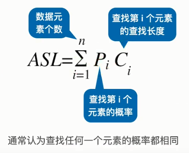

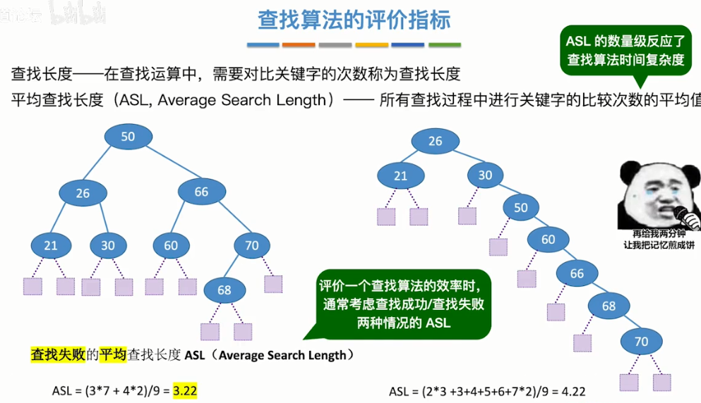
### **顺序查找**
### **折半查找**
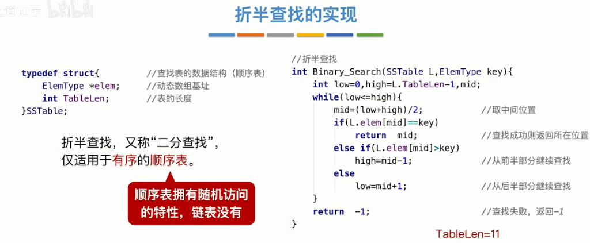
### **分块查找**

### **B树**
结合了平衡二叉树，分块、折半等思想，并且b树为绝对平衡，没有相差1的说法

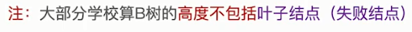
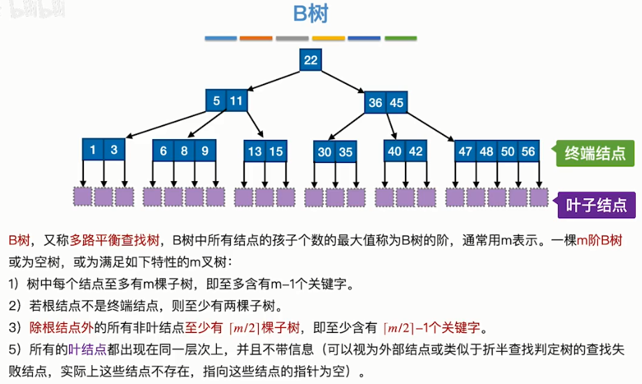
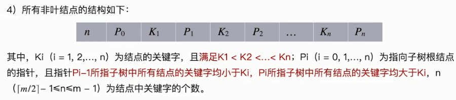
### **B树的插入、删除**
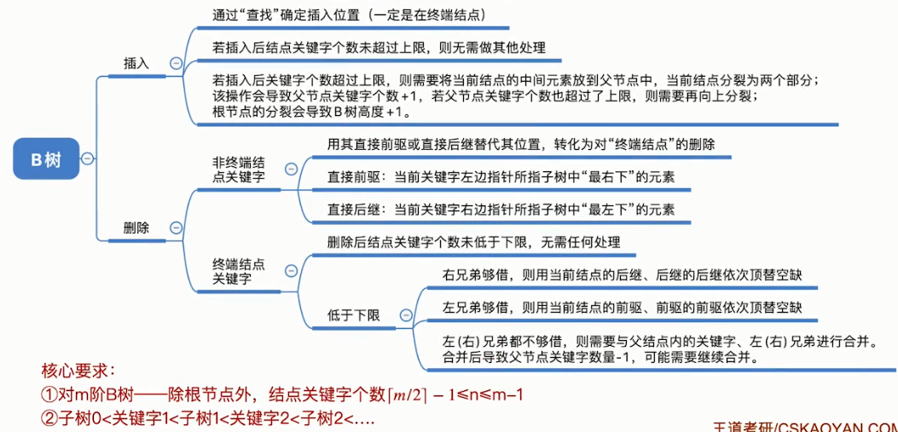

插入时由下而上：上一级的节点，是由下一级的节点中关键字数量满了脱胎出来的。

删除时保证下面的核心要求，来改变结点中关键字的位置。

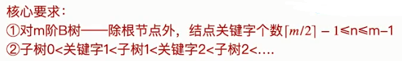
### **B+树**
应用了分块查找的算法。

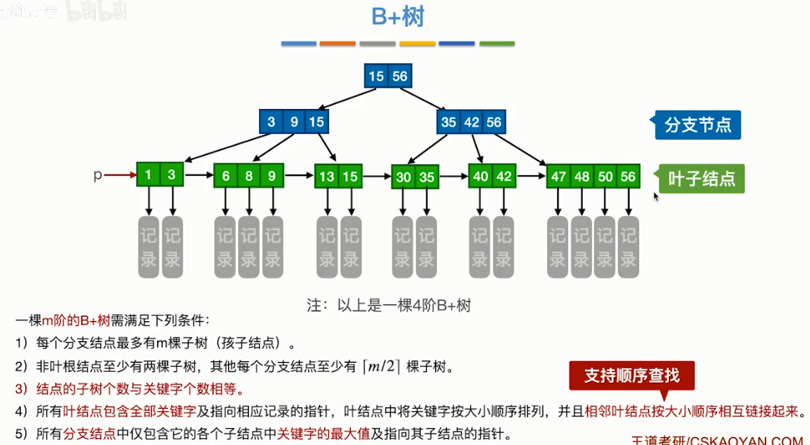
### **B树与B+树的区别**
#### **1**
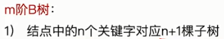
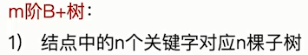

#### **2为了树不要太高（太空）**
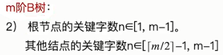
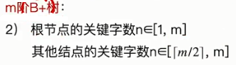
#### **3**
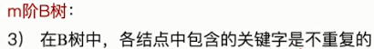
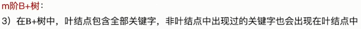
#### **4**
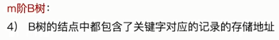

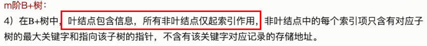
### **散列查找**
存储的数据（关键字）与存储地址直接相关。

通过某种映射关系将数据(x)映射到存储地址(y)：y=f(x)

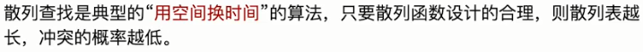
#### **冲突**
**链地址法**：冲突后，紧接着在相同的位置以链表的形式插入。

**开放地址法**：各个地址中存储的将是实实在在的数据，而不是链地址法中有可能存在的链表。如果经过哈希函数后计算出的位置已经有数据了，再通过某种算法（线性探测法）将计算出的位置向其他空位挪移。

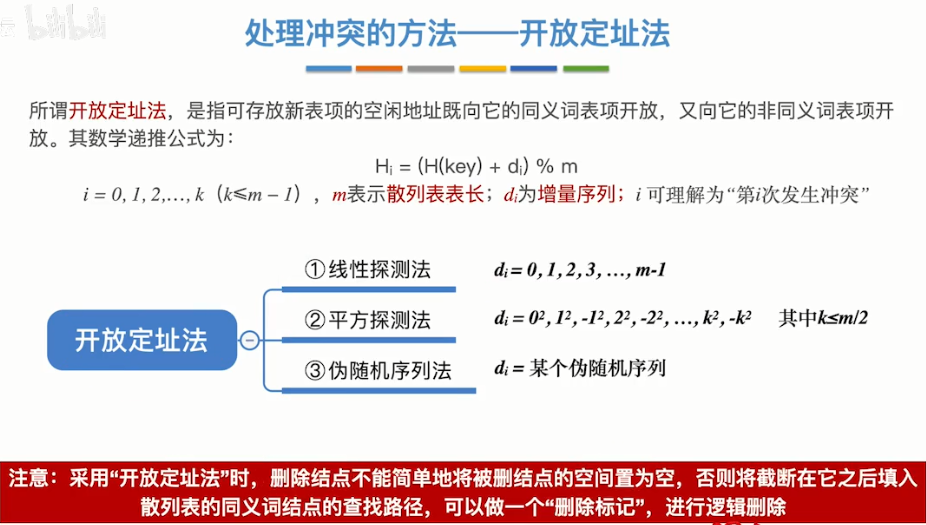

