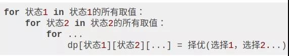

## 动态规划
三要素：
1.	重叠子问题
2.	最优子结构
3.	状态转移方程

重叠子问题：递归调用的函数会有重复的出现；
最优子结构：子问题之间互相独立，不能互相干扰；
状态转移方程：“选择”而来。

【比如说，你的原问题是考出最高的总成绩，那么你的子问题就是要把语文考到最高，数学考到最高…… 为了每门课考到最高，你要把每门课相应的选择题分数拿到最高，填空题分数拿到最高…… 当然，最终就是你每门课都是满分，这就是最高的总成绩。

得到了正确的结果：最高的总成绩就是总分。因为这个过程符合最优子结构，“每门科目考到最高”这些子问题是互相独立，互不干扰的。

但是，如果加一个条件：你的语文成绩和数学成绩会互相制约，此消彼长。这样的话，显然你能考到的最高总成绩就达不到总分了，按刚才那个思路就会得到错误的结果。因为子问题并不独立，语文数学成绩无法同时最优，所以最优子结构被破坏。】

### 思考方法
1.	明确「状态」
2.	定义 dp 数组（迭代，自底向上）/函数（递归，自顶向下，备忘录）的含义
3.	明确「选择」
4.	明确 base case。

**状态：**

令y=f(x),则自变量x为状态，f为函数或者说dp数组，y则为该函数对应的**人为定义**。

通常小时候做数学题，是令问题中的未知数为x，根据相等关系列出方程，最后求得的x解则是问题的答案。

但在动态规划题目中，y才是我们要求的解，而x是我们需要穷举的。

**选择：**

如何穷举x，则是通过题目的要求，人为选择而来，即通过循环或者是递归，令当前x等于不同值的情况下，y对应的人为定义哪一个更符合问题的解，而进行的选择题。

**base case:**

最开始的初始值，在令x=0或者是其它初始情况时，我们必须得给y=f(0)【给f(0)赋初值】,因为母问题的解是由子问题的解得来的。而这一步的初始赋值根据实际情况不同具体赋值。

注：备忘录解决重叠子问题，有了备忘录的递归就相当于迭代的动态规划了。

