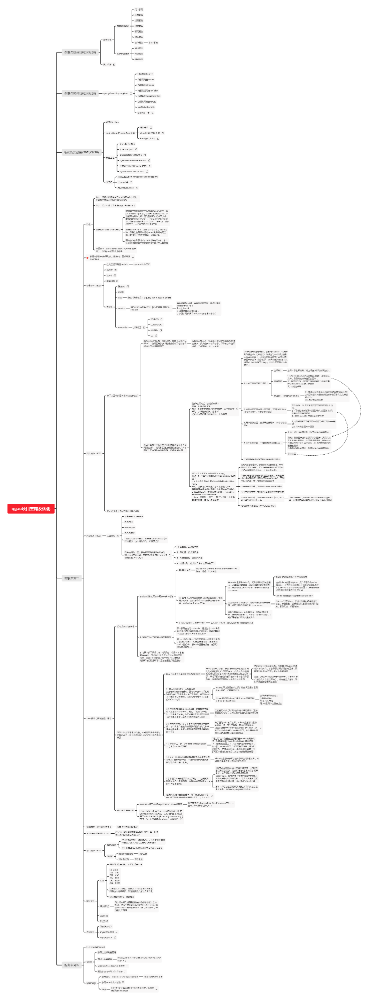

# 项目篇

## 后台概览

## html弹幕实现

https://www.jb51.net/html5/624715.html

1、css实现

通过left属性，实现了弹幕的效果，left会改变元素的布局，因此会发生reflow(回流)，表现在移动端页面上会造成弹幕动画的卡顿。

解决动画的卡顿

在浏览器中用css开启硬件加速，使用GPU（Graphics Processing
Unit）可以提升网页性能。

CSS animations, transforms 以及 transitions
不会自动开启GPU加速，而是由浏览器的缓慢的软件渲染引擎来执行。那我们怎样才可以切换到GPU模式呢，很多浏览器提供了某些触发的CSS规则。

比较常见的方式是，我们可以通过3d变化（translate3d属性）来开启硬件加速，

2、canvas实现弹幕

实时画并删除，24fps

第2种实现更好

https://www.jb51.net/web/561438.html

http://www.demodashi.com/demo/10595.html
