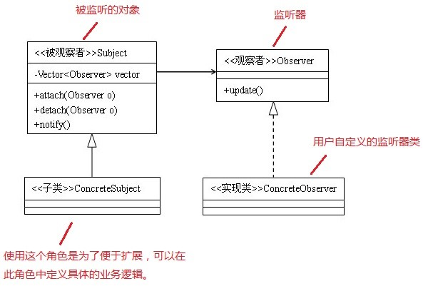

## 观察者模式



https://blog.csdn.net/u010644448/article/details/53764489
应用场景：监听器

通过观察者模式可以实现监听器，

我认为用户自定义的监听器类可以通过反射的方式获取，具体方法是通过获得监听器接口的类加载器，获得该类加载器所加载的所有类，遍历判断哪些类实现了该监听器接口。具体如下：
```
@SuppressWarnings("unchecked") private List<Class<ScmJob>> getAllSubclassOfTestInterface() {
    Field field = null;
    Vector v = null;
    List<Class<TestInterface>> allSubclass = new ArrayList<Class<TestInterface>>();
    Class<TestInterface> scmJobClass =   
                ClassLoader classLoader = Thread.currentThread().getContextClassLoader();
    Class<?> classOfClassLoader = classLoader.getClass();
    try {
        testInterfaceClass =  
                                (Class<TestInterface>) Class.forName("com.xxx.xxx.xxx.TestInterface");
    }
    catch (ClassNotFoundException e) {
        throw new RuntimeException(  
                                "无法获取到TestInterface的Class对象!查看包名,路径是否正确");
    }
    while (classOfClassLoader != ClassLoader.class) {
        classOfClassLoader = classOfClassLoader.getSuperclass();
    }
    try {
        field = classOfClassLoader.getDeclaredField("classes");
    }
    catch (NoSuchFieldException e) {
        throw new RuntimeException(  
                                "无法获取到当前线程的类加载器的classes域!");
    }
    field.setAccessible(true);
    try {
        v = (Vector) field.get(classLoader);
    }
    catch (IllegalAccessException e) {
        throw new RuntimeException(  
                                "无法从类加载器中获取到类属性!");
    }
    for (int i = 0; i < v.size(); ++i) {
        Class<?> c = (Class<?>) v.get(i);
        if (scmJobClass.isAssignableFrom(c) && !scmJobClass.equals(c) && !abstractScmJobClass  
                                .equals(c)) {
            allSubclass.add((Class<ScmJob>) c);
        }
    }
    return allSubclass;
}
```