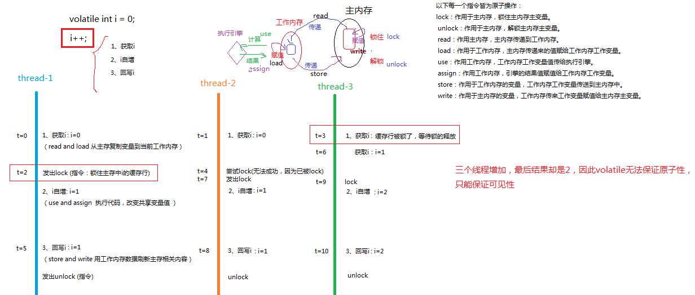

## volatile

https://www.cnblogs.com/yaowen/p/11240540.html

volatile关键字使用的是Lock指令，volatile的作用取决于Lock指令。

**可见性：**

起到内存屏障的作用，保证了**有序性**。

java内存屏障可以被分为以下几种类型：
1. LoadLoad屏障：对于这样的语句Load1; LoadLoad; Load2，在Load2及后续读取操作要读取的数据被访问前，保证Load1要读取的数据被读取完毕。
2. StoreStore屏障：对于这样的语句Store1; StoreStore; Store2，在Store2及后续写入操作执行前，保证Store1的写入操作对其它处理器可见。
3. LoadStore屏障：对于这样的语句Load1; LoadStore; Store2，在Store2及后续写入操作被刷出前，保证Load1要读取的数据被读取完毕。
4. StoreLoad屏障：对于这样的语句Store1; StoreLoad; Load2，在Load2及后续所有读取操作执行前，保证Store1的写入对所有处理器可见。它的开销是四种屏障中最大的。

在大多数处理器的实现中，**StoreLoad屏障**是个万能屏障，兼具其它三种内存屏障的功能。
