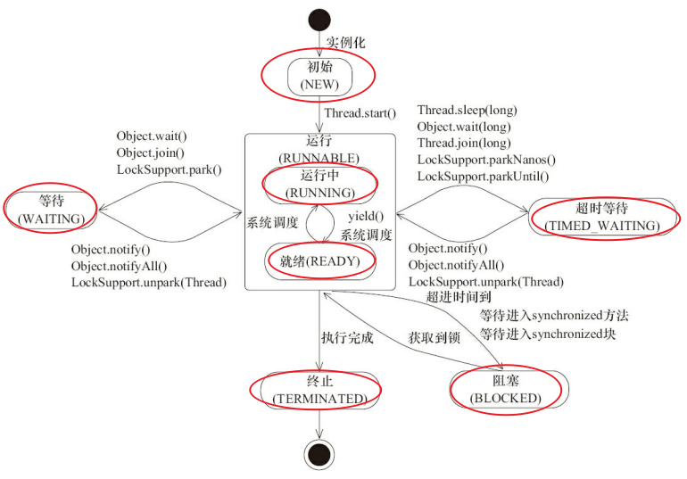

## 生命周期（各个状态）

wait叫等待，抢不到锁才叫阻塞。

【操作系统中层面线程有 READY 和 RUNNING 状态，但jvm因为这两种状态切换时间太短，直接合二为一称之为**RUNNABLE**状态】

通过 sleep（long millis）方法或 wait（long millis）方法可以将 Java 线程置于 **TIMED_WAITING** 状态。当超时时间到达后 Java 线程将会返回到 RUNNABLE （其实是就绪）状态。

