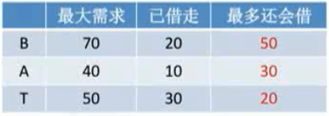
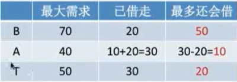

## 死锁：4个条件同时成立

资源得：
1.	互斥：资源被获得后必须得由共享变成非共享，即一次只有一个进程可以使用。如果另一进程申请该资源，那么必须等待直到该资源被释放为止。
2.	占有并等待：一个进程至少应该占有一个资源，并等待另一资源，而该资源被其他进程所占有。
3.	不能被抢：已经获得的资源不能被抢占。只能在持有资源的进程完成任务后，该资源才会被释放。
4.	循环等待：有一组等待进程 {P0, P1,..., Pn}， P0 等待的资源被 P1 占有，P1 等待的资源被 P2 占有，......，Pn-1 等待的资源被 Pn 占有，Pn 等待的资源被 P0 占有。

注意，只有四个条件同时成立时，死锁才会出现。

### 避免死锁

静态策略，破坏上述2、3、4的条件就行。

* 破坏2，一口气将所有需要的资源全部获得。
* 破坏3，有线程来抢资源时，抢不到，就把它自己占有的资源放弃了。
* 破坏4，按某一顺序申请资源，释放资源则反序释放。

动态策略：在资源分配时，借助于算法（比如银行家算法）对资源分配进行计算评估，使其进入安全状态。

### 银行家算法

核心思想：在资源分配之前，预先判断这次分配是否会导致系统进入不安全状态，如果会导致，就不答应资源分配请求，否则答应。

算法解释：

#### 手里有100

如果你手里有100元，有3个人(B/A/T)来找你借钱。

如果手里的钱+已经借出去的钱不能满足任意一人的最大需求，人家就不还钱了（不安全序列，不答应资源分配）。

>解释：手里的钱+已经借出去的钱能满足至少一人的最大需求，就安全，否则连一个人都满足不了了，就不安全。

首先B(70)来借20，判断如果借给它，自己手里还有80，如果A(40)或者T(50)来借钱，自己是能满足二人中任意一人的最大需求的，因此可以借。

A和T相继借钱。

#### 手里有40

等三个人借完后，借钱的情况如下图所示，而自己手里还有40元，

* 判断一：
>此时，如果B想借50，判断如果将手里的40全给他，加上已经借给他的20，就是60<70，满足不了其最大需求，因此是不安全序列，不能给B借，看看能不能借给其它人，满足其它人后，再让他还了，可能钱就够借给B了。
* 判断二：
>或者此时B只借30，判断如果借30给B，加上已经借给他的20，就是50<70，此时自己手里还有40-30=10，这时如下图所示，
>
>自己手里的10元钱+三人中任意一人已经借出去的钱都满足不了每个人的最大需求了，此时是不安全序列，因此给B借30也是不行的。
>【如果给B借30，系统进入不安全状态，此时自己只有10元，而B、A、T三人只要还没有再借钱，虽然我现在一个人都满足不了，但我还没真正进入死锁状态，只是有可能而已】
* 判断三：
>如果A借20，判断如果借20给A，加上之前借的就是30<40，此时自己还有40-20=20，能满足A和T，不能满足B，因此安全，可以借20给A，如下图所示。
>

#### 手里有20

计算当BAT三人如果把还需要借的钱全部借完的话，此时的安全序列。

* 判断一：

>此时A再借10，自己剩20-10=10，满足其最大需求后，A会将所有的钱还给自己，即自己又有了10+40=50，能满足B和T，安全，可以给A借10.
>此时剩下B和T，先借给B或者T都无所谓了，因此所有的人都能满足，此为安全序列：A->B->T或A->T->B

* 判断二：

>此时T再借20，自己分文不剩20-20=0，满足需求后，T还回来，自己又有了50，能满足B和A，
安全序列为：T->A->B或T->B->A
