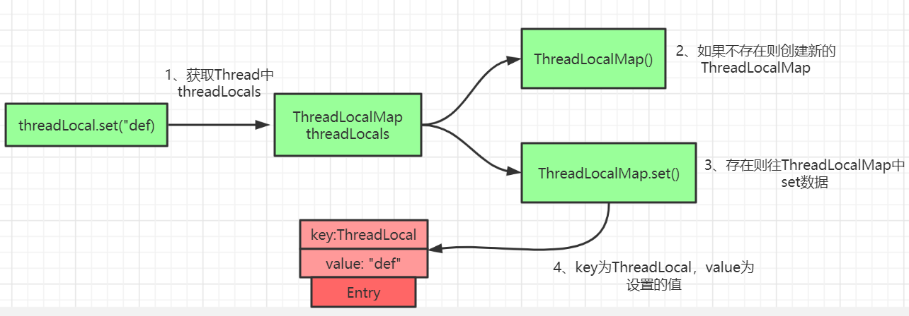
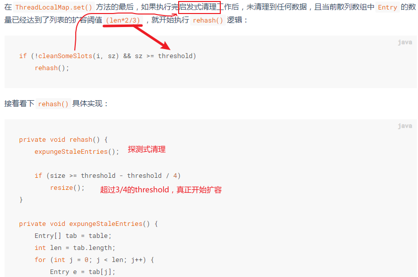

## threadLocal

可以看成存放变量副本的一个容器，各线程之间放在threadLocal中的变量互不依赖。

使用完 ThreadLocal后 最好手动调用remove()方法，清理掉 key 为 null 的记录，否则在垃圾回收的时候，key (弱引用)会被清理掉，而 value 不会被清理掉，造成内存泄露。

**原理：**

ThreadLocalMap的hash采用**开放地址法**:

