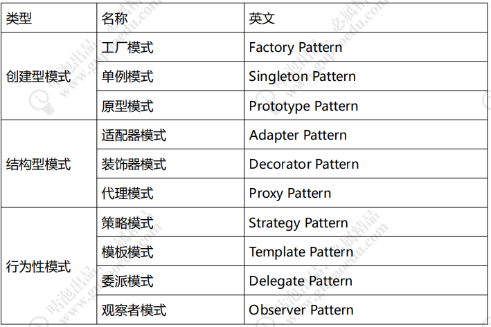

## spring使用的设计模式

### 1. Spring 中常见的设计模式

工厂模式 ： BeanFactory

装饰器模式： BeanWrapper

代理模式： AopProxy

单例模式： ApplicationContext

委派模式： DispatcherServlet

策略模式:  HandlerMapping

适配器模式： HandlerApdapter

模板方法模式： JdbcTemplate

观察者模式： ContextLoaderListener

### 2. Spring 的四大模块及典型的设计模式

1. Spring IOC   工厂模式、单例模式、装饰器模式
2. Spring AOP  代理模式、观察者模式
3. Spring MVC  委派模式、适配器模式
4. Spring JDBC 模板方法模式

### 3. Spring 中常见设计模式分类
