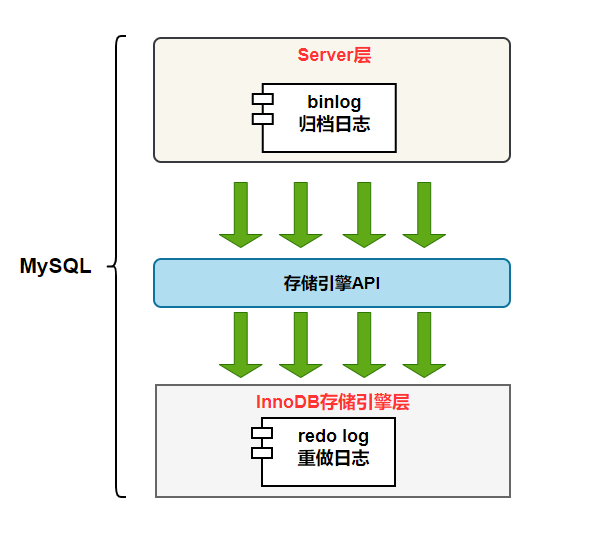
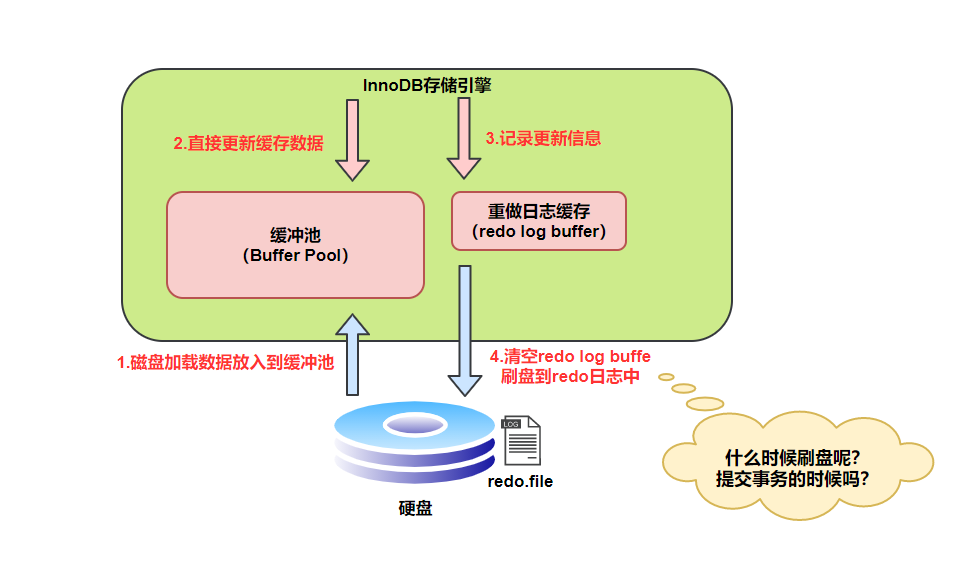
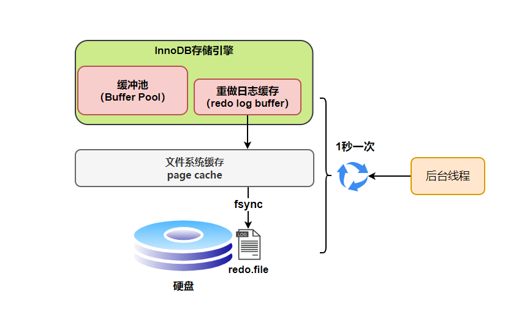
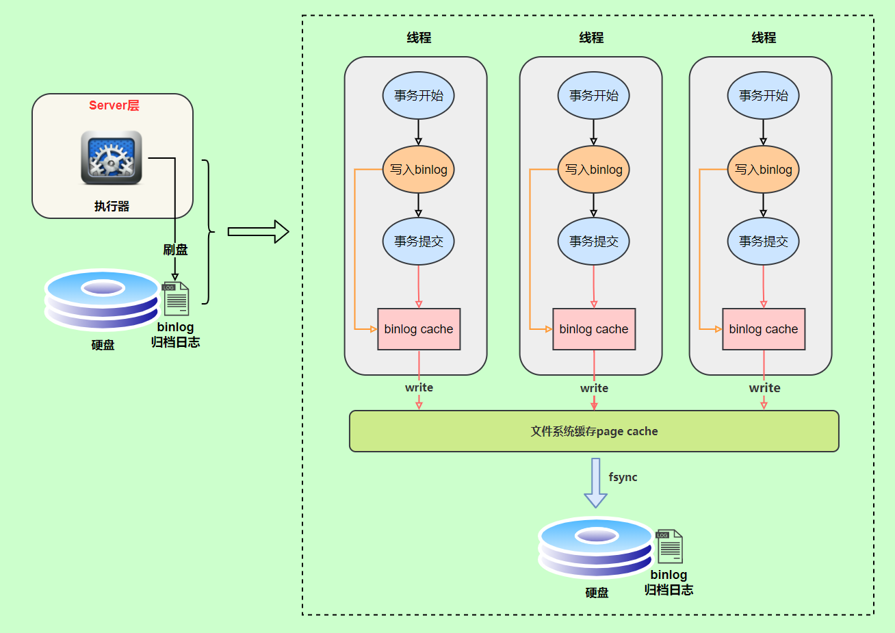
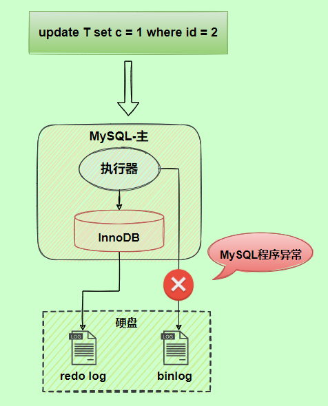
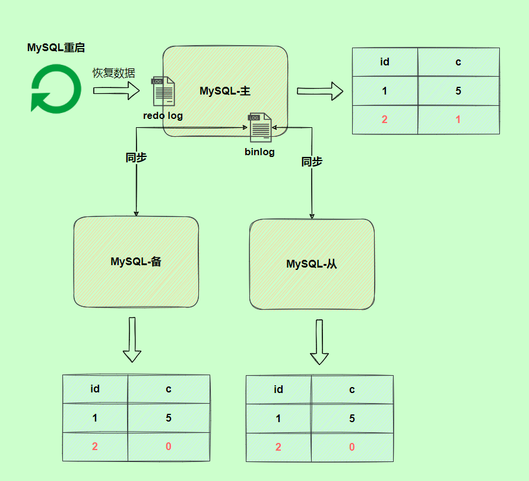
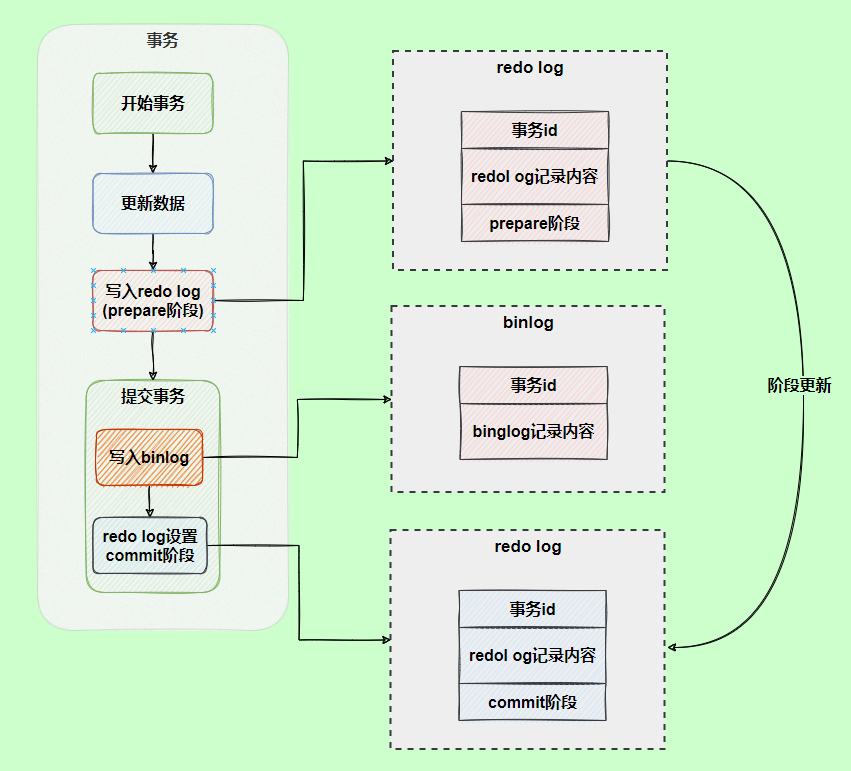
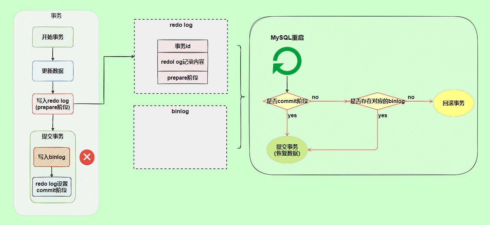

## **日志**
MySQL 日志 主要包括5大类：

1. 错误日志、
1. 查询日志、
1. 慢查询日志、
1. 事务日志
   >**redo log**（重做日志）和 **undo log**（回滚日志）
2. 二进制日志
   >**binlog**（归档日志）


**MySQL InnoDB 引擎使用 redo log(重做日志) 保证事务的持久性，使用 undo log(回滚日志) 来保证事务的原子性。**

**MySQL数据库的数据备份、主备、主主、主从都离不开binlog，需要依靠binlog来同步数据，保证数据一致性。**



### **redo log**
redo log 是物理日志，记录内容是“在某个数据页上做了什么修改”，是**InnoDB存储引擎独有**的，它让MySQL拥有了**崩溃恢复能力**。

**MySQL实例**挂了或宕机了，重启时，InnoDB存储引擎会使用redo log恢复数据，保证数据的持久性与完整性。


>mysql实例：是应用程序,是位于用户与操作系统**之间**的一层数据管理软件，用户对数据库进行操作，包括定义表结构，数据查询，数据维护等控制，都是在数据库实例下进行的，可以这样理解，应用程序通过数据库实例才能和数据库打交道。
>mysql中用户创建与数据库的连接，是与实例之间搭上了桥梁，然后建立会话，是在这条桥梁上进行沟涌。
>MySQL中建立一个会话session，不是和具体的数据库相连接，而是跟某个instance建立好的连接里创建会话（每个会话可以使用不同的用户身份）。
>例：如果以打电话来比喻：connect就好比你接通对方，这时，connect就建立了，有没有通话，不管。双方进行通话，则session建立了，如果换人，则新的session建立，原session结束，类似的，可以在同一个connect上进行多个会话。最后，挂机，connect结束。


MySQL 中数据是以**页为单位**，你查询一条记录，会从硬盘把一页的数据加载出来，加载出来的数据叫数据页，会放入到 **Buffer Pool** 中。

后续的查询都是先从 Buffer Pool 中找，没有命中再去硬盘加载，减少硬盘 IO 开销，提升性能。

更新表数据的时候，也是如此，发现 Buffer Pool 里存在要更新的数据，就直接在 Buffer Pool 里更新。

然后会把“**在某个数据页上做了什么修改**”

1. 记录到重做日志缓存（**redo log buffer**）里【必做】，
1. 接着刷盘（写到磁盘）到 **redo log 文件**里【刷盘策略】。



>注：每条 redo 记录由“表空间号+数据页号+偏移量+修改数据长度+具体修改的数据”组成

#### **刷盘策略**
innodb\_flush\_log\_at\_trx\_commit 参数

* 0 ：每次事务提交时不刷盘

* **1** ：每次事务提交时都将会调用 fsync把 redo log buffer 内容刷盘（**默认值**）

* 2 ：每次事务提交时都只把 redo log buffer 内容写入 page cache（文件系统缓存）

>注：InnoDB 存储引擎有一个后台线程，每隔1 秒，会先进行2,然后再将page cache内容刷盘的操作。

也就是说，一个没有提交事务的数据页修改记录，也可能会刷盘到redo log。

当 redo log buffer 占用的空间即将达到 innodb\_log\_buffer\_size 一半的时候，后台线程会主动刷盘。



分析：

* 为0时，若后台线程刚刷盘了redo log，有1秒的真空期，此时某个事务在这1秒内提交了，并且在提交前，所有的修改记录都已经记录在了redo log buffer里，但是刚提交完，mysql实例就宕了，那么redo log buffer和buffer pool里的数据自然就没了，因此会丢失最多1秒内的数据修改。

* 为1时， 只要事务提交成功，redo log记录就一定在硬盘里，不会有任何数据丢失。如果事务执行期间MySQL挂了或宕机，这部分日志丢了，但是事务并没有提交，所以日志丢了也不会有损失。

* 为2时， 只要事务提交成功，redo log buffer中的内容只写入文件系统缓存（page cache）。

如果仅仅只是MySQL挂了不会有任何数据丢失，mysql重启后，可以对page cache的内容进行刷盘，但是计算机系统宕机可能会有1秒数据的丢失。

#### **存储机制**
<https://snailclimb.gitee.io/javaguide/#/docs/database/mysql/MySQL%E4%B8%89%E5%A4%A7%E6%97%A5%E5%BF%97?id=redo-log>

#### **redo log存在的必要性**
实际上，数据页大小是16KB，刷盘比较耗时，可能就修改了数据页里的几 Byte 数据，有必要把完整的数据页刷盘吗？

而且数据页刷盘是随机写，因为一个数据页对应的位置可能在硬盘文件的随机位置，所以性能是很差。

如果是写 redo log，一行记录可能就占几十 Byte，只包含表空间号、数据页号、磁盘文件偏移 量、更新值，再加上是顺序写，所以刷盘速度很快。

所以用 redo log 形式记录修改内容，性能会远远超过刷数据页的方式，这也让数据库的并发能力更强。

注：通过redo log的存储数据结构，可以知道，每次修改了数据库中的内容，并不是真正的将“修改”记录到磁盘中，而是将“修改”刷盘到redo log；每次 MySQL 加载redo log,恢复数据时（这时才**真正**地将之前**修改过的数据**写进了**磁盘**），会清空之前加载过的 redo log 记录，并把 checkpoint 后移更新。

注：其实内存中buffer poll的数据页在一定时机也会刷盘，我们把这称为**页合并**，
### **bin log**
binlog 是逻辑日志，记录内容是语句的原始逻辑，类似于“给 ID=2 这一行的 c 字段加 1”，属于MySQL Server 层。

**不管用什么存储引擎**，只要发生了表数据更新，都会产生 binlog 日志。

binlog会记录所有涉及更新数据的逻辑操作，并且是**顺序写**。

主要作用保证数据一致性:

1. 数据备份、
1. 主备同步、
1. 主主同步、
1. 主从同步.


#### **存储机制**
<https://snailclimb.gitee.io/javaguide/#/docs/database/mysql/MySQL%E4%B8%89%E5%A4%A7%E6%97%A5%E5%BF%97?id=binlog>


#### **刷盘策略**
1. 事务执行过程中，先把日志写到binlog cache，
1. 事务提交的时候，再把binlog cache写到binlog文件中。

因为**一个事务的binlog不能被拆开**，无论这个事务多大，也要确保一次性写入，所以系统会给每个线程分配一个块内存作为binlog cache。

我们可以通过binlog\_cache\_size参数控制单个线程 binlog cache 大小，如果存储内容超过了这个参数，就要暂存到磁盘（Swap）。

binlog日志刷盘流程如下:



上图的 write，是指把日志写入到文件系统的 page cache，并没有把数据持久化到磁盘，所以速度比较快;

上图的 fsync，才是将数据持久化到磁盘的操作;

write和fsync的时机，可以由参数sync\_binlog控制，

- 0，(默认)表示每次提交事务都只write，由系统自行判断什么时候执行fsync【虽然性能得到提升，但是机器宕机，page cache里面的 binglog 会丢失。】。
- 1，表示每次提交事务都会执行fsync，就如同binlog 日志刷盘流程一样。
- N(N>1)，表示每次提交事务都write，但累积N个事务后才fsync。

在出现IO瓶颈的场景里，将sync\_binlog设置成一个比较大的值，可以提升性能。
### **两阶段提交**
**redo log（重做日志）让InnoDB存储引擎拥有了崩溃恢复能力。**

**binlog（归档日志）保证了MySQL集群架构的数据一致性。**

二者的区别：

在执行更新语句过程，以基本的事务为单位，

1. redo log在事务执行过程中可以不断写入（后台线程），
1. 而binlog只有在提交事务时才写入，

所以redo log与binlog的写入时机不一样，但有可能导致redo log与binlog两份日志之间的逻辑不一致（即记录的内容不一样），这会出现问题！

例：以update语句为例，假设id=2的记录，字段c值是0，把字段c值更新成1，SQL语句为
```
update T set c=1 where id=2 
```
问：假设执行过程中写完redo log日志后，binlog日志写期间发生了异常，会出现什么情况呢？



答：由于binlog没写完就异常，这时候binlog里面没有对应的修改记录。因此，之后**集群用binlog**日志恢复数据时，就会少这一次更新，恢复出来的这一行c值是0，而**原库因为redo log**日志恢复，这一行c值是1，**最终数据不一致**，如图：



为了解决两份日志之间的逻辑一致问题，InnoDB存储引擎使用两阶段提交方案。

原理很简单，将**redo log**的写入拆成了两个状态**prepare**和**commit**进行**标记**，这就是**两阶段提交**。

也就是说以前怎么做的就怎么做，有后台线程刷盘就刷盘，只是说多了两个标记，在事务提交前，redo log存进磁盘里的记录标记为prepare，而只有当提交事务后，并且bin log正常刷盘后才能将redo log中之前写入磁盘里的记录标记为commit，如图：



使用两阶段提交后，写入binlog时发生异常也不会有影响，因为MySQL根据redo log日志恢复数据时，

发现**redo log还处于prepare阶段**，并且**没有对应binlog日志**，就会**回滚该事务**。

问：redo log设置commit阶段发生异常，会不会回滚事务？

答：不会回滚事务，虽然redo log是处于prepare阶段，但是能通过事务id找到对应的binlog日志，所以MySQL认为是完整的，就会提交事务恢复数据。



### **undo log**
undo: 撤销，即回滚。

想要保证事务的原子性，就需要在异常发生时，对已经执行的操作进行回滚，在 MySQL 中，恢复机制是通过 回滚日志（undo log） 实现的，所有事务进行的修改都会先记录到这个回滚日志中，然后再执行相关的操作。如果执行过程中遇到异常的话，我们直接利用 回滚日志 中的信息将数据回滚到修改之前的样子即可！并且，

**回滚日志会先于数据持久化到磁盘上**。这样就保证了即使遇到数据库突然宕机等情况，当用户再次启动数据库的时候，数据库还能够通过查询回滚日志来回滚将之前未完成的事务。

