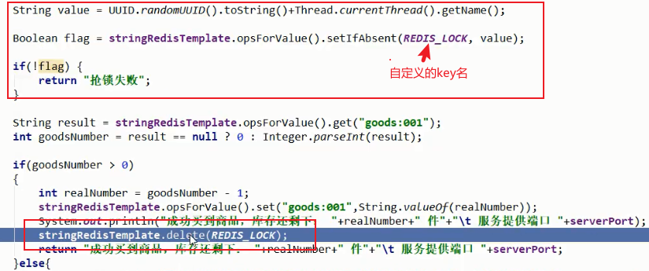
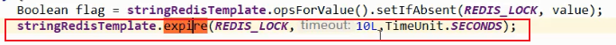
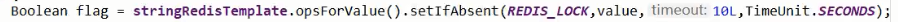
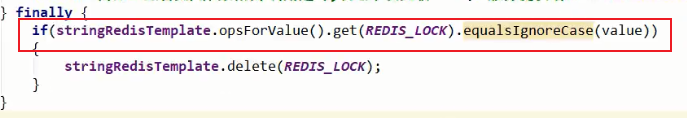
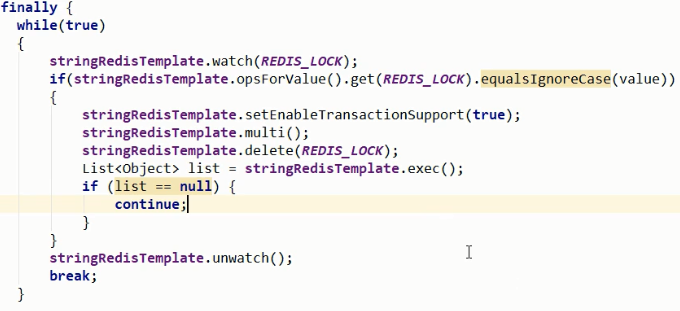
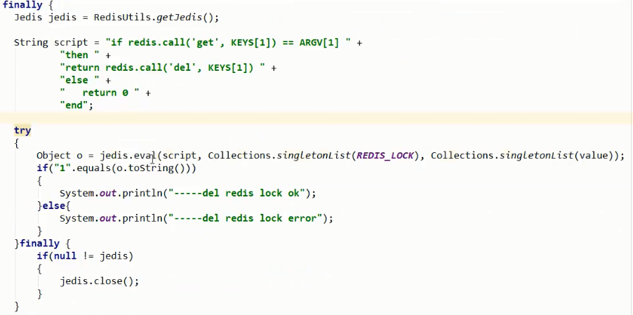

## **从单机锁到分布式锁**
1. 单机锁选择synchronized还是reentrantlock根据业务需要来。

2. 集群架构下，单机锁无法保证在同一时刻，相同的代码只有一份代码在执行，因此去掉单机锁，改为分布式锁，使用redis的setnx命令存key加锁，在业务完成后再delete掉key进行解锁。

   

3. 在获得锁后，执行业务过程中，有可能抛出异常，导致没有解锁，因此加finally释放锁。

4. 执行业务过程中，程序所在的机器宕机了，走不到finally，导致没有解锁，需要给key设置过期时间。

   

5. setnx与expire不是一个原子操作，如果程序执行完第一步后异常了，第二步jedis.expire(lockKey, expireTime)没有得到执行，相当于这个锁没有过期时间，有产生死锁的可能。因此设置锁à过期时间，这两个步骤加在一起必须是原子的。

   

6. 当线程A处理业务的实际时间大于key的过期时间，redis会删除掉已经过期的A设置的key,此时B重新设置key加锁，当A处理完业务后，会进行代码的finally删锁，但这时删除的是B设置的key（key名相同）。因此一个线程只能删除自己设置的锁。

   

7. 和第6点相同情景，理论上会出现在A执行完第一步if判断操作后锁其实已经过期，并且被其它线程获取，这是时候在执行del(lockKey)操作，相当于把别人的锁释放了，因此要保证判断+删除得是原子操作：

   ①事务

   

   ②lua脚本

   

8. 扩展：

①如果业务时间大于key的过期时间，给key续期。

②redis集群主从架构下，为保证高可用，采取主从异步复制，只要主节点存入了key则返回响应成功，如果主节点挂掉，从从结点中新选举出来的主结点将有可能缺少数据，降低了数据一致性。

zookeeper采取主从同步复制，只有从节点完全同步了主节点的数据，才返回响应成功。但降低了并发，即可用性。

因此这种情况下，自己写的有点不靠谱，直接使用redisson.

