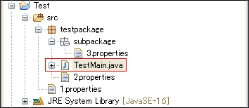

## 从磁盘获取资源

Java中取资源时，经常用到**Class.getResource**和**ClassLoader.getResource**，这里来看看他们在取资源文件时候的路径问题。

### Class.getResource(String path)
* path不以’/'开头时，默认是从此类所在的包下取资源；
* path  以’/'开头时，则是从ClassPath根下获取；

什么意思呢？看下面这段代码的输出结果就明白了：
```
package testpackage;
public class TestMain {
    public static void main(String[] args) {
        System.out.println(TestMain.class.getResource(""));
        System.out.println(TestMain.class.getResource("/"));
    }
}
```
输出结果：
```
file:/E:/workspace/Test/bin/testpackage/
file:/E:/workspace/Test/bin/
```
上面说到的【path以’/'开头时，则是从ClassPath根下获取；】在这里就是相当于bin目录(Eclipse环境下)。

再来一个实例，假设有如下Project结构：


如果我们想在TestMain.java中分别取到1~3.properties文件，该怎么写路径呢？代码如下：
```
package testpackage;

public class TestMain {

    public static void main(String[] args) {
        // 当前类(class)所在的包目录
        System.out.println(TestMain.class.getResource(""));
        // class path根目录
        System.out.println(TestMain.class.getResource("/"));
        
        // TestMain.class在<bin>/testpackage包中
        // 2.properties  在<bin>/testpackage包中
        System.out.println(TestMain.class.getResource("2.properties"));
        
        // TestMain.class在<bin>/testpackage包中
        // 3.properties  在<bin>/testpackage.subpackage包中
        System.out.println(TestMain.class.getResource("subpackage/3.properties"));
        
        // TestMain.class在<bin>/testpackage包中
        // 1.properties  在bin目录（class根目录）
        System.out.println(TestMain.class.getResource("/1.properties"));
    }
}
```
注：
>Class.getResource和Class.getResourceAsStream在使用时，路径选择上是一样的。

### Class.getClassLoader().getResource(String path)
* path不能以’/'开头；
* path是从ClassPath根下获取；

还是先看一下下面这段代码的输出：
```
package testpackage;
public class TestMain {
    public static void main(String[] args) {
        TestMain t = new TestMain();
        System.out.println(t.getClass());
        System.out.println(t.getClass().getClassLoader());
        System.out.println(t.getClass().getClassLoader().getResource(""));
        System.out.println(t.getClass().getClassLoader().getResource("/"));//null
    }
}
```
输出结果：
```
class testpackage.TestMain
sun.misc.Launcher$AppClassLoader@1fb8ee3
file:/E:/workspace/Test/bin/
null
```
从结果来看:
>TestMain.class.getResource("/") == t.getClass().getClassLoader().getResource("")

如果有同样的Project结构

使用Class.getClassLoader().getResource(String path)可以这么写：
 
```
package testpackage;

public class TestMain {
    public static void main(String[] args) {
        TestMain t = new TestMain();
        System.out.println(t.getClass().getClassLoader().getResource(""));
        
        System.out.println(t.getClass().getClassLoader().getResource("1.properties"));
        System.out.println(t.getClass().getClassLoader().getResource("testpackage/2.properties"));
        System.out.println(t.getClass().getClassLoader().getResource("testpackage/subpackage/3.properties"));
    }
}
```
注：
>Class.getClassLoader（）.getResource和Class.getClassLoader（）.getResourceAsStream在使用时，路径选择上也是一样的。

