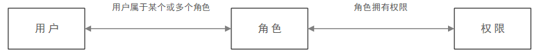

## **授权**
### **RBAC**
即基于角色的权限访问控制（Role-Based Access Control）：**用户通过**成为适当**角色**的成员而**获得**这些角色的**权限**。

### **OAuth 2.0协议**
一种授权机制，它的最终目的是**为第三方应用**颁发一个**有时效性**的令牌 **Token**，使得第三方应用能够通过该令牌获取相关的资源。

OAuth 2.0 比较常用的场景就是应用程序的第三方登录或者支付场景。

比如登录王者荣耀，登录界面会用提示用QQ还是微信登录，此时王者荣耀想获得QQ或微信的用户信息用来填充王者荣耀本身的登录信息，此时点击通过QQ登录，紧接着会出现叫你选通过哪一个账号，还询问是否授权的步骤，此时王者荣耀就是第三方应用，而我们通过点击确定授权（发放令牌），之后王者荣耀可以**携带令牌访问QQ提供的API**获得QQ的用户信息，当然，这些**信息**是**有限制**的，而且这个授权的**令牌**是**有时限**的（是不是点过授权后，有一段时间都不会再叫你登录了），当时限过去后，表示你给的授权的令牌失效了，需要重新授权，即重新登录。

OAuth 引入了一个授权层，用来分离不同的角色：

1. 客户端（王者荣耀）

2. 资源所有者（我）

3. 资源服务器（QQ）

**四种授权方式**

1. 授权码（authorization-code）：前后端分离的web应用
1. 隐藏式（implicit）：纯前端
1. 密码式（password）
1. 客户端凭证（client credentials）

>不管哪一种授权方式，第三方应用申请令牌之前，都必须先到系统备案，说明自己的身份，然后会拿到两个身份识别码：客户端 ID（client ID）和客户端密钥（client secret）。这是为了防止令牌被滥用，没有备案过的第三方应用，是不会拿到令牌的。

以下通过B网站授权给A说明。

#### **授权码**
指的是第三方应用先申请一个授权码，然后再用该码获取令牌。

①A网站前台提供一个链接到B申请获得授权码（将A接收授权码的后台地址传过去）。

②A网站后台收到授权码，在后端向 B 网站发起RPC，请求令牌（将A接收令牌的后台地址传过去）。

③A网站后台收到一段包含令牌的json数据。

#### **隐藏式**
直接返回令牌

①A网站前台提供一个链接到B申请获得令牌（将A接收授权码的前台地址传过去）。

②A网站前台通过锚点接收令牌（https://a.com/callback#token=ACCESS\_TOKEN）

OAuth 2.0 允许跳转网址是 HTTP 协议，因此存在"中间人攻击"的风险，而浏览器跳转时，锚点不会发到服务器，就减少了泄漏令牌的风险。

用于一些安全要求不高的场景，并且令牌的有效期必须非常短，通常就是会话期间（session）有效，浏览器关掉，令牌就失效了。

#### **密码式**
如果你高度信任某个应用，RFC 6749 也允许用户把用户名和密码，直接告诉该应用。该应用就使用你的密码，申请令牌，这种方式称为"密码式"（password）。

①A 网站要求用户提供 B 网站的用户名和密码。

②A 有了用户名和密码就直接向 B 请求令牌（请求成功后，直接返回包含令牌的json）。

#### **凭证式**
命令行获得令牌，针对第三方应用，而不是针对用户的，即有可能多个用户共享同一个令牌。

①A通过命令行直接向B申请获得令牌（请求成功后，直接返回包含令牌的json）。

