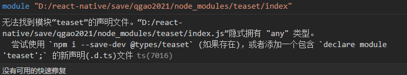

## **react-native踩过的坑**
### **钩子函数**
#### **useRef不可成为依赖项**
ref.current 不可以作为其他 hooks（useMemo, useCallback, useEffect）依赖项；ref.current 的值发生变更并不会造成 re-render, Reactjs 并不会跟踪 ref.current 的变化。
#### **useState 异步回调获取不到最新值及解决方案**
<https://www.cnblogs.com/hymenhan/p/14991789.html>

1. 用ref保存再改变状态，

2. 或回调方式获取以前的值，再进行更新状态。

3. 使用 useReducer 仿造类组件中的 forceUpdate 实现组件强制渲染
### **scrollable-tab-view和tab-view**

||**scrollable-tab-view**|**tab-view**|
| - | - | - |
|**1**|没维护了，使用的pager-view也是老版本的|一直在维护|
|**2**|bug多，如左右滑动时会触发flatlist中的触摸事件|bug也多，和tab-view同层级的其它组件涉及到高度的动画时，掉帧严重|
|**3**|滑动时，标签没有动画|有动画|
|**4**|对ios的兼容不好|android和ios都兼容|

### **react-navigation集成redux**
因为在react-navigation v4.x的时候，官网就说了不建议用redux来管理navigation的state,说是会拖慢运行速度，不过仍然提供了redux-helper来集成navigation的state,不过在5.x和6.x中，有关redux的集成，在官网中已经不写了，

也就是说，navigation官网希望navigation自己管理自己的state，redux一边去。

而从redux-helper的github中也可以发现，在2年前提供的最新的代码v4.1中依赖的是5.x的@react-navigation/core，但我在使用后，发现有bug，而redux-helper后期也没继续更新，估计也不想搞了，haha

好吧。
### **打包失败**

#### **扩大使用的堆空间**

android - Execution failed for task ':app:minifyReleaseWithR8'老是抛堆内存不够out of memory

在android目录下的gradle.properties增加
```
#增大使用的堆空间
org.gradle.jvmargs=-Xms1024m -Xmx4096m
```

#### **uploadCrashlyticsMappingFileXXXRelease 打包connect timed out**
https://blog.csdn.net/m0\_37587256/article/details/112028327

Firebase千般好，但是有一样就是他会自动生成mapping之类的文件(android\app\build\crashlytics\release\mappings目录)并打包 .gz 压缩包，自己上传Google，这对国外当然没问题，国内就别想了，

因此关闭自动上传

啥时候手动上传，太简单，发布google play 新版本的时候，自己把生成的 .gz 文件上传就ok了，

```
buildTypes {
    debug {
        signingConfig signingConfigs.debug
        proguardFiles getDefaultProguardFile('proguard-android-optimize.txt'), 'proguard-rules.pro'
        minifyEnabled false
        versionNameSuffix "_debug"
    }
    release {
        // Caution! In production, you need to generate your own keystore file.
        // see https://reactnative.dev/docs/signed-apk-android.
        signingConfig signingConfigs.release //将默认的debug 改成 release
        minifyEnabled enableProguardInReleaseBuilds
        proguardFiles getDefaultProguardFile("proguard-android.txt"), "proguard-rules.pro"

        shrinkResources true
        // Zipalign优化
        zipAlignEnabled true
        // 设置firebase是否要自动上传
        firebaseCrashlytics {
            mappingFileUploadEnabled false
        }

    }
}
```


### **打包安装后，打开闪退**
#### **第1次发布版本包**

使用android studio的logcat（sdk目录下的tools目录中的工具，打开命令窗口，直接输入monitor）

关键字，在过滤那输入java.lang

然后打开app，然后app闪退，在logcat找到报错原因：
```
java.lang.IllegalStateException: java.lang.NoSuchFieldException: fill
```
参考：

<http://www.uwenku.com/question/p-fhlllpqy-kr.html>

<https://stackoverflow.com/questions/68643215/how-to-use-minifyenable-in-release-apk>

解决：

<https://www.codeleading.com/article/27112954688/>

我项目里使用了一个 react-native-svg 的库，是它导致的，需要在{project\_path}/android/app/proguard-rules.pro 文件里面添加一行:
```
-keep public class com.horcrux.svg.** {*;}
```
#### **第2次发布版本包**
由于logcat打印的错误不清晰，定位不准确，因此使用了google的firebase中的crashlytics

这次发布包，先后出现了两个错误，

一是no such field exception

是因为这个类被混淆后，另外的类在反射调用的时候找不到字段了，因此不允许该类被混淆，

通过混淆后生成的mapping.txt中找到对应的映射类，然后将其写进proguard-rule.pro中，保留该类，不被混淆
```
-keep class com.facebook.react.uimanager.** { *; }
```
第二个异常是com.facebook.jni.CppException

https://github.com/facebook/react-native/issues/26930

通过了解，这个是新js引擎hermes无法运行的异常，将android/app/build.gradle中的IntlJsc注释掉

```
// 想使用hermes就得注释这个
    // def useIntlJsc = false
    // if (useIntlJsc) {
    //     implementation 'org.webkit:android-jsc-intl:+'
    // } else {
    //     implementation 'org.webkit:android-jsc:+'
    // }
```

这个运行，会导致hermes的停止。

并同时保证hermes的相关类不被混淆(不知道起作用没)
```
-keep class com.facebook.hermes.unicode.** { *; }
```
### **启动页**
<https://github.com/crazycodeboy/RNStudyNotes/blob/master/React%20Native%20%E9%97%AE%E9%A2%98%E5%8F%8A%E8%A7%A3%E5%86%B3%E6%96%B9%E6%A1%88%E5%90%88%E9%9B%86/React%20Native%20%E5%90%AF%E5%8A%A8%E7%99%BD%E5%B1%8F%E9%97%AE%E9%A2%98%E8%A7%A3%E5%86%B3%E6%95%99%E7%A8%8B/React%20Native%20%E5%90%AF%E5%8A%A8%E7%99%BD%E5%B1%8F%E9%97%AE%E9%A2%98%E8%A7%A3%E5%86%B3%E6%95%99%E7%A8%8B.md>

<https://www.jianshu.com/p/78571e5435ec>


react-native是0.64.0

首先安装yarn add react-native-splash-screen

1.

```
//android/app/src/main/res/layout/launch_screen.xml  
<?xml version="1.0" encoding="utf-8"?>  
<LinearLayout xmlns:android="http://schemas.android.com/apk/res/android"  
	      android:orientation="vertical" android:layout_width="match_parent"  
	      android:layout_height="match_parent"  
	      android:background="@drawable/launch_screen">  
  
</LinearLayout>  
  
//drawable是res中以该字符串为开头，然后加上”-xhdpi/-xxhdpi”之类的文件夹，  
//launch_screen是文件夹中的图片的名字，即想放的启动页的图片名  
```
  
2.
  
```
//android\settings.gradle  //通过该设置找到源文件位置  
include ':react-native-splash-screen'  
project(':react-native-splash-screen').projectDir = new File(rootProject.projectDir, '../node_modules/react-native-splash-screen/android')  
  
//android\app\build.gradle //通过该配置将上述找到的源代码依赖到当前android项目  
dependencies {  
    implementation project(':react-native-splash-screen')   # 确认存在, 如果不存在则需要手动增加这行。  
}  
```
  
3.
  
```
//MainApplication.java  
@Override  
	protected List<ReactPackage> getPackages() {  
	  @SuppressWarnings("UnnecessaryLocalVariable")  
	  List<ReactPackage> packages = new PackageList(this).getPackages();// 会自动添加 new SplashScreenReactPackage()  
	  // Packages that cannot be autolinked yet can be added manually here, for example:  
	  // packages.add(new MyReactNativePackage());  
	    
	  return packages;  
	}  
  
//MainActivity.java  
@Override  
  protected void onCreate(Bundle savedInstanceState) {  
    super.onCreate(null);  
    SplashScreen.show(this,true);  // 添加这一句  
  
}  
```

  
4.
  
```
//最后在js里关掉，一般写在入口页app.js里  
import SplashScreen from 'react-native-splash-screen';  
componentDidMount(){  
	SplashScreen.hide();  
    }  
```

### **默认props**
static defaultProps设置的默认的父组件的props和父组件传进来的props，

constructor() 无法获得默认props.

constructor(props)可以获得props.
### **PanResponder**
react-native中的手势控制组件，坑是在
```
onStartShouldSetResponderCapture//单点
onStartShouldSetResponder
```
和
```
onMoveShouldSetResponderCapture//滑动
onMoveShouldSetPanResponder
```
不能同时存在，说白了就是，这个手势组件要么控制单点，要么控制滑动，这两个控制事件是互相独立的，官网都没说，在stackOverFlow网站上找到的答案。

<https://blog.csdn.net/tianyitianyi1/article/details/107426381>这个博客没直说，但是也是这么用的。
```
gestureState:{  
    stateID 此次触摸事件的ID  
    moveX 移动时当前的屏幕坐标  
    moveY  
    x0 响应器产生时的屏幕坐标（手势开始时的第一个坐标）  
    y0  
    dx 触摸开始累积的横向路程  
    dy  
    vx 当前的横向移动速度  
    vy  
    numberActiveTouches 触摸点数量  
}  
```

### **没有声明文件t.ds**


在src目录下新建一个types目录,然后在types 目录下新建一个 index.d.ts文件然后在文件中添加代码 declare module ‘第三方类库名’
### **Touchable组件**
TouchableWithoutFeedback只接受一个直接子组件
### **react-navigation无法全屏**
如果有需要全屏的组件如视频(video)之类的组件存在于导航页面内(navigation-tab)，使用orientation转为横屏后，并将video的宽高设为屏幕高宽后，无法关掉navigation的显示。

此时只能使用react-navigation其中的一个fullScreen的modal,并且只能设置在nativeStackNavigator里，之后使用navigation.navigate进行跳转。
### **绝对布局**
在relative的布局内，如果有多个absolute布局的同级直接子组件，且这些组件中含有Touchable组件时（无论在外层还是在内层），触摸事件只有这些同级子组件中的最后一个能触发。
### **触摸事件的event**
触摸事件处理的回调都有一个 event参数，包含一个触摸事件数据 nativeEvent.
```
event.nativeEvent:{  
    changedTouches - 在上一次事件之后，所有发生变化的触摸事件的数组集合（即上一次事件后，所有移动过的触摸点）  
    identifier - 触摸点的 ID  
    locationX - 触摸点相对于当前元素的横坐标  
    locationY - 触摸点相对于当前元素的纵坐标  
    pageX - 触摸点相对于根元素的横坐标  
    pageY - 触摸点相对于根元素的纵坐标  
    target - 触摸点所在的元素 ID  
    timestamp - 触摸事件的时间戳，可用于移动速度的计算  
    touches - 当前屏幕上的所有触摸点的集合  
}  
```

### **defaultProps**
修改了这个对象，需要reload才能生效。
### **`${}`**
```
let name = '彭于晏'  
console.log( '名字为：'+name )  
console.log( `名字为：${name} ` )  //在 `` 中可以使用 ${} 直接把变量和字符串拼接起来
```

### **{}表达式**

在jsx里的{}表达式里，若调用无参函数可以直接写上函数名。

但是若要传参数，则必须写成箭头函数，然后在函数体里调用想调的函数。（否则this绑定丢失）。

### **ref.measure**
只有组件带有press事件，只有在press事件的回调方法中可以调用该组件的ref.measure，调用其它组件的ref.measure都是undefined.
### **获得遍历中每一项的ref**
预先定义存储各子项的对象，然后通过索引给每个子项赋值ref.
```
ref={(ref)=>{  
    this.downArrowRef[index] = ref;  
}} 
```

