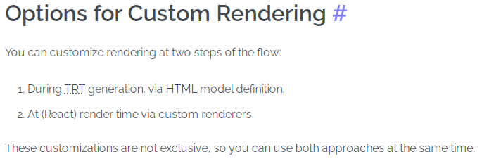

## react-native的第三方组件

### react-native-render-html

主要是想实现阅读文章时，点击其中的图片，可以放大对应的图片。

如果要获得对应的图片，就需要对应的索引index，那么需要给标签img自定义属性index

而这个组件中默认的render已经规定好了从dom到tTree，再到vdom中有哪些标签中的属性会被接收，然后渲染到vdom中。

因此若想自定义，必须得自己处理这两个过程，新增对index属性的接收。



来自 https://meliorence.github.io/react-native-render-html/docs/guides/custom-renderers

**映射**：
```
<RenderHtml  
    contentWidth={screenWidth}  
    source={articleDetailData.content}  
    customHTMLElementModels={customHTMLElementModels}  
    renderers={renderers}  
/>  
const customHTMLElementModels = {  
    img: defaultHTMLElementModels.img.extend({  
        getReactNativeProps(tnode) {  
            const attributes = tnode.attributes;  
            return {  
                native: {  
                    index: attributes["index"]  //可将标签中的index属性映射到rendererProps.containerProps对象中
                },  
            };  
        },  
    })  
};  
```

**获得**：
```
const renderers = {  
    img: CustomImageRenderer  
};  
function CustomImageRenderer(props) {  
    const { Renderer, rendererProps } = useInternalRenderer('img', props);  
    console.log(rendererProps.containerProps.index)  
}  
```

### redux中配置store

```
function rootReducer(state = {}, action) {  
  return {  
    users: usersReducer(state.users, action),  
    posts: postsReducer(state.posts, action),  
    comments: commentsReducer(state.comments, action)  
  }  
}  
  
//上面等价于  
const rootReducer = combineReducers({  
  users: usersReducer,  
  posts: postsReducer,  
  comments: commentsReducer  
})  
  
//传递rootReducer给store  
const store = configureStore({  
  reducer: rootReducer  
})  
  
//而事实上，上面所有的操作等价于下面这个，简化了上面繁琐的操作  
export default configureStore({  
  reducer: {  
    users: usersReducer,  
    posts: postsReducer,  
    comments: commentsReducer  
  }  
})  
```