# 计算机基础篇

## cpu的运算过程

ALU和CU是制造成本最高的

## cpu的性能指标

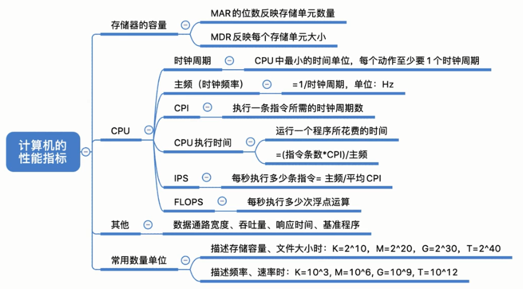

## BCD码表示十进制

binary coded decimal

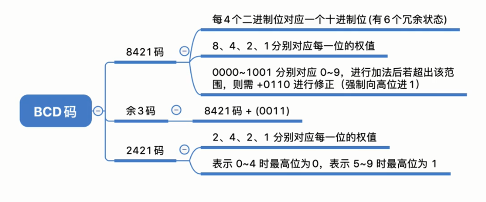

## 字符

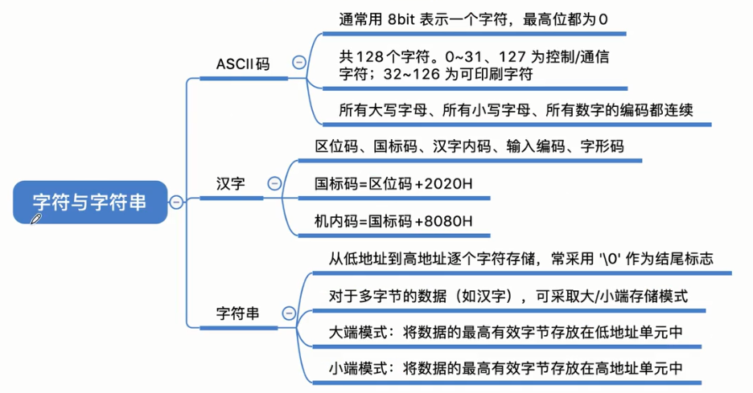

## 奇偶校验

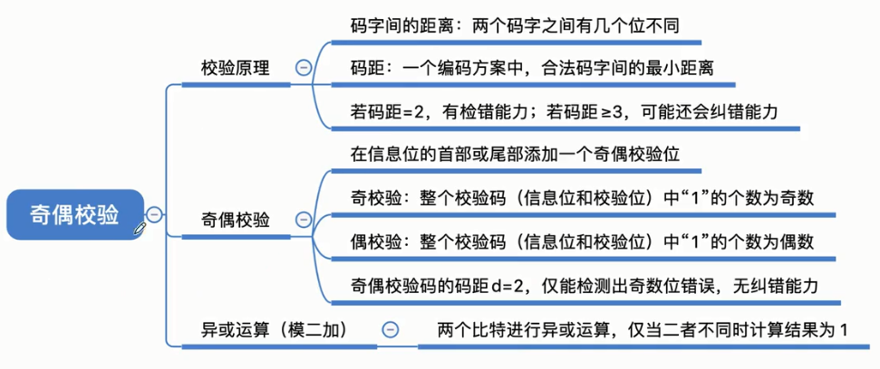

## 海明码

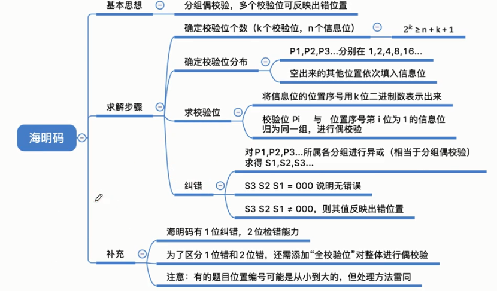

## 循环冗余校验码

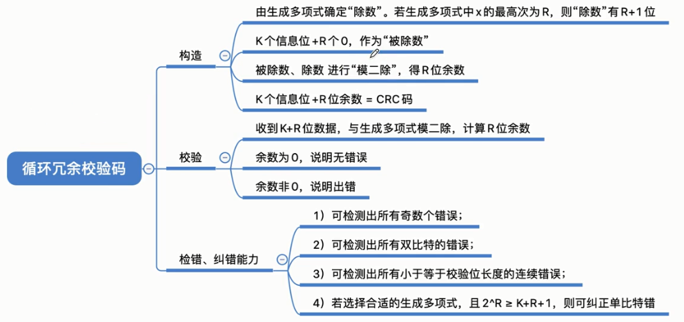

## 原码，反码，补码，移码

利用补码达到将减法转换成加法的操作。

移码就是来比较大小的，1越多，真值越大。

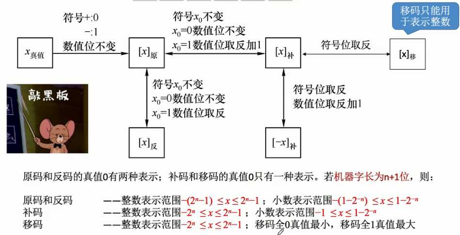

## 定点数移位运算

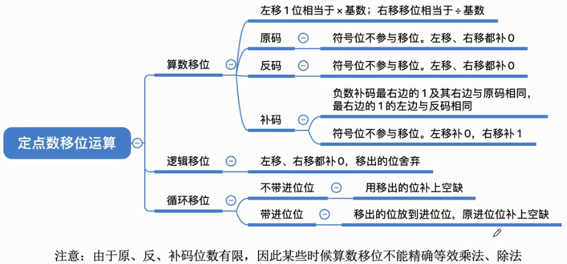

## 补码运算及溢出

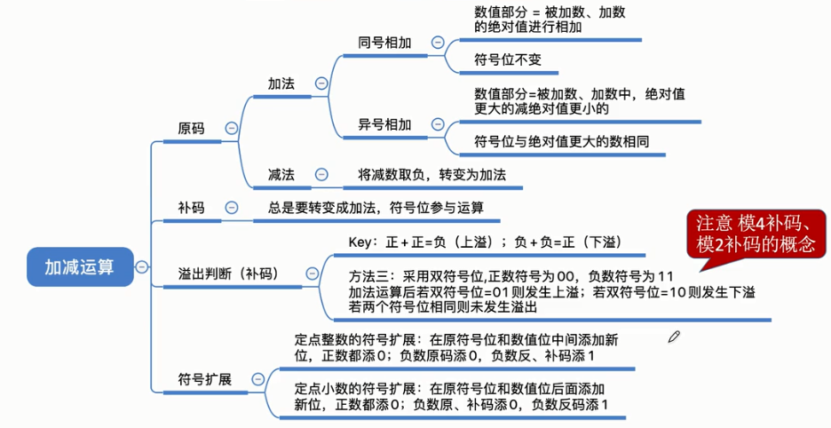

## 原码一位乘法和补码一位乘法

## 原码除法：恢复余数法，加减交替法

定点小数的除法运算，被除数不能大于除数，（定点小数无法表示大于1的数）

## 补码除法：加减交替法

## 强制类型转换

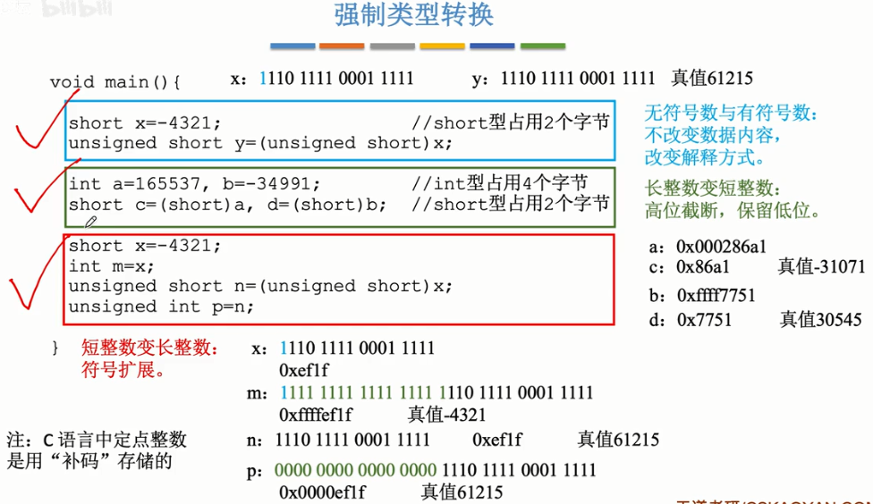

## 浮点数

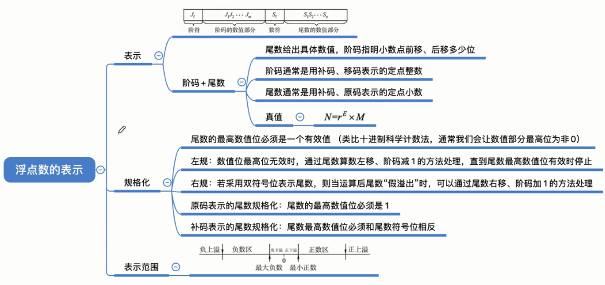

## 加法器

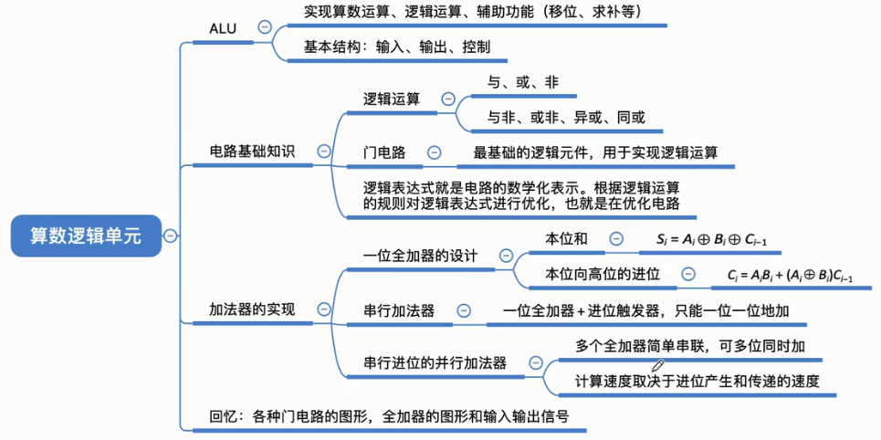

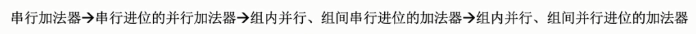

