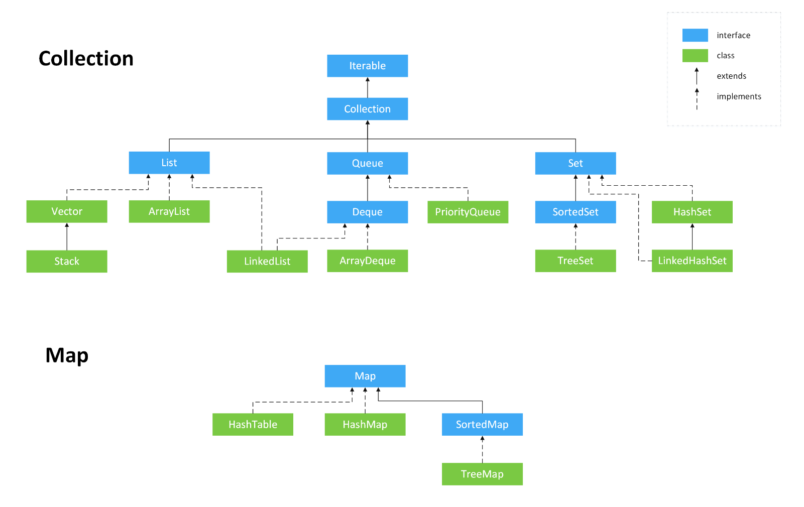

## 总览

* HashSet(无序，唯一): 基于 HashMap 实现。其value为常量值new Object();
* LinkedHashSet: 基于LinkedHashMap 实现。其value为常量值new Object();

* TreeSet(有序，唯一): 红黑树(自平衡的排序二叉树)
* PriorityQueue: Object[] 数组来实现二叉堆
* ArrayQueue: Object[] 数组 + 双指针

