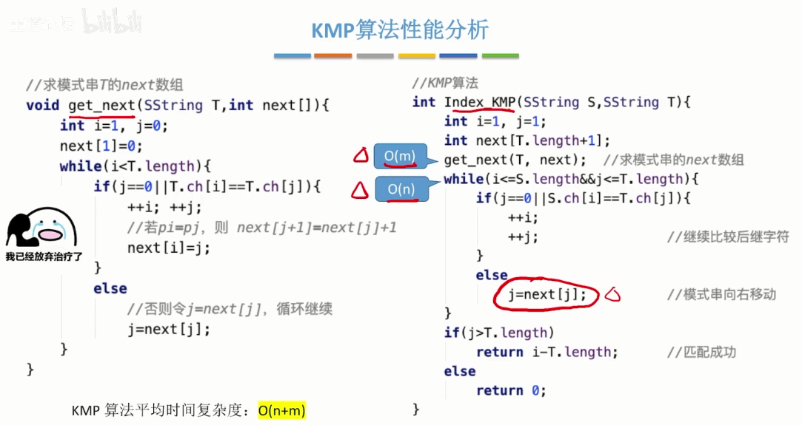

## kmp字符串匹配

主串的指针一直往前移动，不回溯。
只移动模式串的指针。

比较字符不匹配时，重新定位模式串的指针，
通过提前计算：**主串的后缀和模式串的前缀相等的个数**，可以得到模式串重新定位的指针位置。

重新定位的模式串指针位置由一个额外的数组保存：jr = next[j].
j表示当前比较错误的位置
jr表示重新定位的位置

优化next数组—>nextval
在计算next数组时，计算出的重新定位的指针位置jr所对应的字符若是与当前匹配失败位置j指向的字符相同时，则将next[jr]的值赋给next[j]。



实例：
```
public Boolean kmp(List sOrder, List tOrder) {  
    int sLen = sOrder.size(), tLen = tOrder.size();  
    int[] fail = new int[tOrder.size()];  
    Arrays.fill(fail, -1);  
    for (int i = 1, j = -1; i < tLen; ++i) {  
		while (j != -1 && !(tOrder.get(i).equals(tOrder.get(j + 1)))) {  
			j = fail[j];  
		}  
		if (tOrder.get(i).equals(tOrder.get(j + 1))) {  
			++j;  
		}  
		fail[i] = j;  
    }  
    for (int i = 0, j = -1; i < sLen; ++i) {  
		while (j != -1 && !(sOrder.get(i).equals(tOrder.get(j + 1)))) {  
			j = fail[j];  
		}  
		if (sOrder.get(i).equals(tOrder.get(j + 1))) {  
			++j;  
		}  
		if (j == tLen - 1) {  
			return true;  
		}  
    }  
    return false;  
}  
```