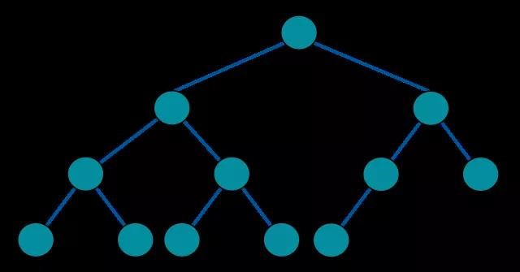
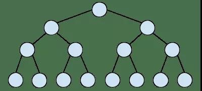
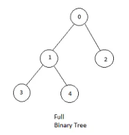
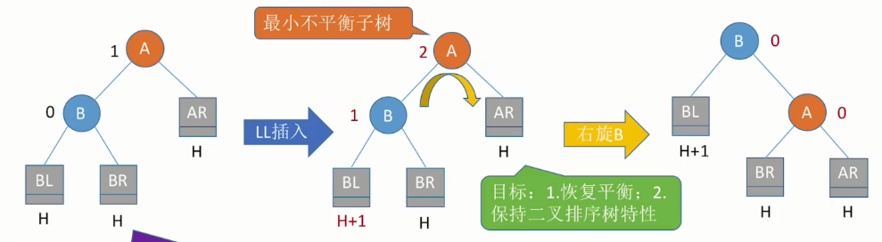
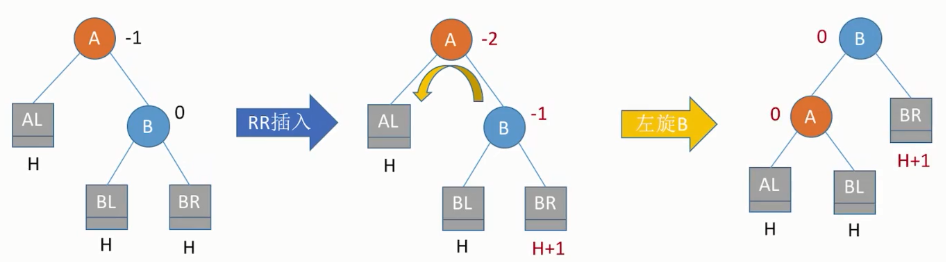
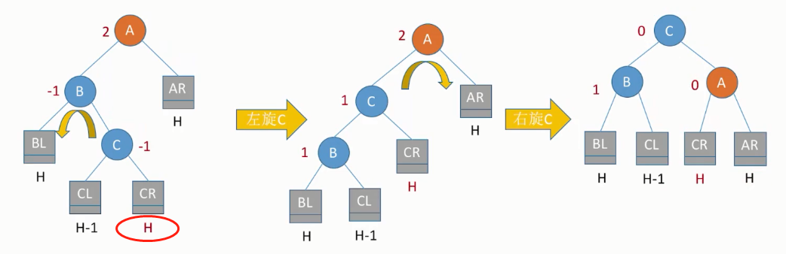
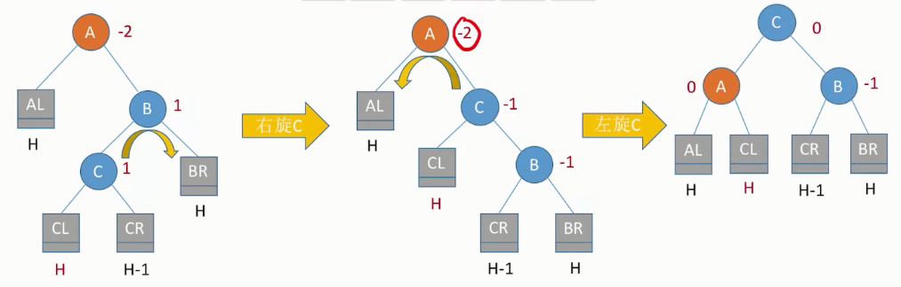

## **二叉树**
### **二叉树的遍历**
二叉树为有序树，即左右子树不可交换。

广度遍历：队列

深度遍历：先序、中序、后序

由遍历造树：两种遍历可确定，必须得有中序，另一种为先序或后序或层序（广度遍历）
### **完全、满二叉树**
1. 完全二叉树（Complete Binary Tree）
1. 满二叉树（Perfect Binary Tree）
1. Full Binary Tree

完全二叉树（Complete Binary Tree）：每一层都是**紧凑靠左**排列

满二叉树（Perfect Binary Tree）：特殊的完全二叉树，**每层都是是满的**

Full Binary Tree 是指一棵二叉树的所有节点要么**没有孩子**节点，要么有**两个孩子**节点

### **线索二叉树**
方便便历（利用前驱、后继）

将树的结点里，其中左右子树指向null的指针利用起来，让它们分别指向前驱和后继。

这里的前驱和后继，指的是遍历时排列出的结点顺序，在某结点前面的一个结点为前驱，后面的一个结点为后继。

遍历可分为先序、中序、后序：不同方法的遍历，前驱后继也不同。

在线索二叉树中，其中空的指针域可以用来指向前驱或后继，在查找时可以很方便地查到当前结点的前驱或后继，但是若结点无空指针域，需要根据不同方法的遍历来找，如：

1. 查找某结点的中序后继，即找到该结点的右子树中最左的结点；
1. 查找某结点的中序前驱，即找到该结点的左子树中最右的结点；

### **二叉树分别和树、森林之间的转换**
树：不限定分支数量。

森林：多棵树。

树转二叉树：二叉树的左指针指向树的最左边的第一个孩子，该孩子的右指针接着指向自己的兄弟结点。

森林转二叉树：先把每棵树转成二叉树，然后每棵树的根结点当成兄弟结点，因此，根结点的右指针依次指向兄弟结点。

### **二叉排序树（bst）**

从而有了平衡二叉树。
#### **调整最小不平衡子树**
这个与排序树有关，因为排序树的构造会因为不同的序列造成树的结构不同，也就可能导致查找或插入时的时间复杂度增大。

而平衡二叉树的时间复杂度能保证时间复杂度最低【log2(n)】，因此如何在插入结点时保证构造的二叉树一直是平衡二叉树至关重要。

##### **LL（右旋）**

**BL<B<BR<A<AR**

##### **RR（左旋）**
**AL<A<BL<B<BR**

##### **LR（先左旋后右旋）**

**BL<B<CL<C<CR<A<AR**

##### **RL（先右旋后左旋）**
**AL<A<CL<C<CR<B<BR**

