## **红黑树**
### **需要红黑树的理由**

从二叉搜索树（AVL&bst）到红黑树。

因为二叉搜索树要保证平衡二叉树的特性，所以在插入删除时，容易破坏平衡，所以需要经常地对树进行旋转操作（但查找效率高），因此引进了红黑树处理这种情况。

红黑树的特性保证了对红黑树进行插入删除时不会经常对树进行旋转操作，提高了时间效率。

### **红黑树的性质**

红黑树性质（树上的结点要么是黑色，要么是红色）：

1. 根结点必须是黑色结点；
1. 红色结点的子结点必须是黑色结点（红色结点不能相连）；
1. 从任一结点到其下最底部的任意NIL结点（设为黑色）的黑色结点数量是相等的（NIL结点是叶子结点的左右指针指向的虚拟结点，其不存储数据）。

### **满足红黑树的性质**
满足红黑树的性质，就能满足对红黑树进行查找时能达到最高的效率。而不像二叉查找树一样需要保持平衡才能达到查找最高效率。

新插入的结点的颜色必须是红色的。

当新插入的结点不满足红黑树的性质时，则需要对红黑树进行处理：改变结点颜色，旋转子树。

例：以下是一棵红黑树。

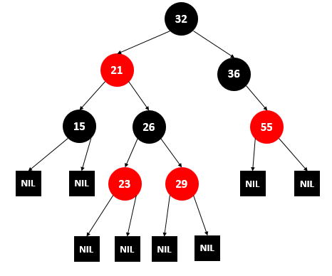

#### **插入（主要处理当前结点为红色）**
去除NIL虚拟结点，方便查看，并且此时要插入一个新的结点。

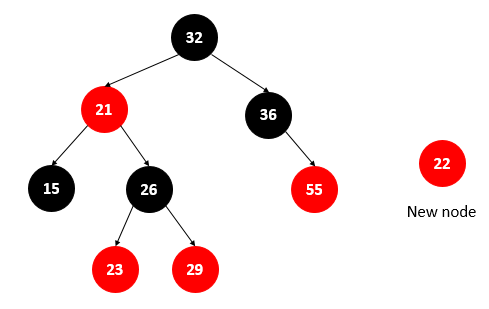

将新的结点插入树中，却不满足红黑树的性质2。

##### **步骤1**
条件：如果插入的当前结点的父亲结点与叔叔结点均为红色，

操作：则将当前结点的**父亲结点**、**叔叔结点**、**祖父结点**均反转颜色（红变黑，黑变红），再令当前结点指向为祖父结点。

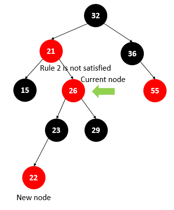
##### **步骤2**
条件：如果当前结点的父结点为红色，而叔叔结点为黑色，且当前结点为父结点的右子结点时；

操作：将**当前结点**与其**父结点**进行左旋操作，并将当前结点指向为父结点。

##### **步骤3**
条件：如果当前结点的父结点为红色，而叔叔结点为黑色，且当前结点为父结点的左子结点时；

操作：将当前结点的**父亲结点**、**祖父结点**进行反转颜色，再让**父亲结点**和**祖父结点**进行右旋操作。

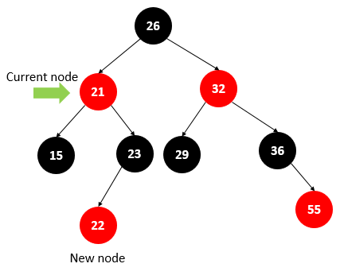

#### **删除（主要处理当前结点为黑色）**
分情况有：

1. 被删结点为红色，且无子结点（最简单）；
1. 被删结点为黑色，且无子结点（最复杂）；
1. 被删结点为黑色，且有一个子结点；
1. 被删除点为红色或黑色，且有两个子结点；

##### **1.删除无子结点的红色结点**
直接删掉。
##### **2.删除无子结点的黑色结点**
###### **约定：**
N为被删除结点。

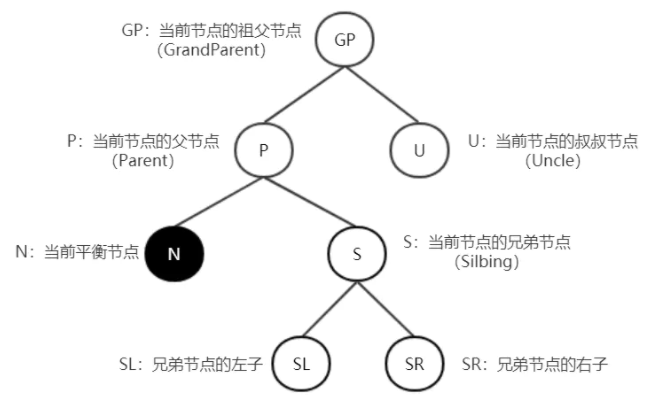
###### **分析：**
 **1）当前结点为根结点，直接删除**
 **2）兄弟节点为黑色（S=黑）**
 2.1）兄弟的子节点全黑（SL=SR=黑）
将兄弟结点变成红色，再看父结点是红色还是黑色。

2.1.1）父节点为黑色（P=黑）

此时将S涂红，父节点作为新的平衡节点N，递归上去处理（从分析最开始判断）。

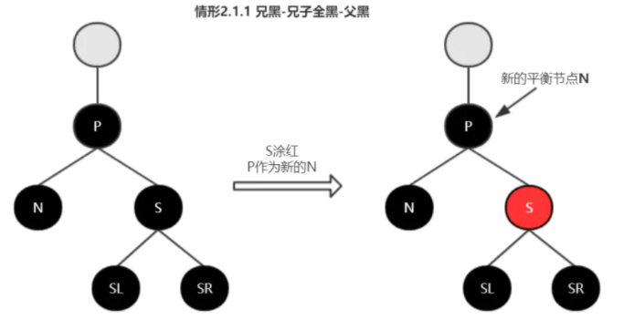

2.1.2）父节点为红色（P=红）

此时将S涂红，P涂黑，平衡结束。

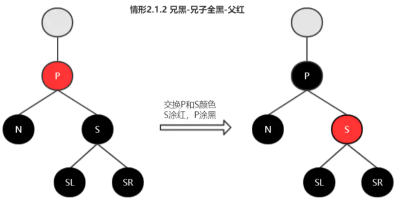
 2.2）兄弟的子节点不全黑
2.2.1）S为左子，SL红；S为右子，SR红

①S为左子，SL红

以P为支点右旋；交换P和S颜色，SL涂黑；平衡结束。

②S为右子，SR红

以P为支点左旋；交换P和S颜色，SR涂黑；平衡结束。

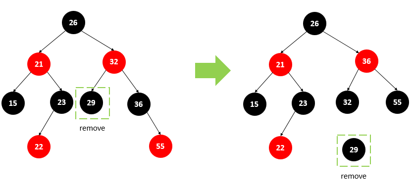

2.2.2）S为左子，SL黑；S为右子，SR黑

①S为黑色，S为左子，SL黑

以S为支点左旋，交换S和SR颜色（SR涂黑，S涂红） ，此时转至情形2.2.1-① S左-SL红 进行处理。

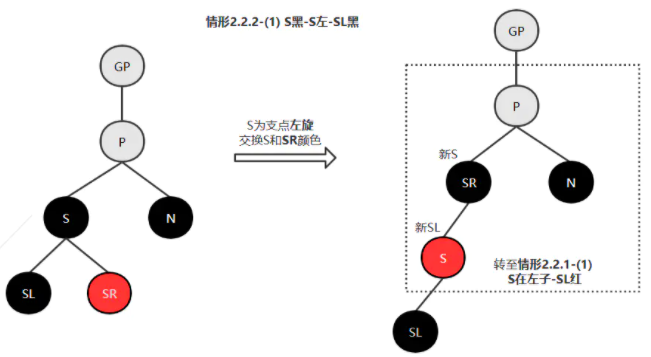

②S为右子，SR黑

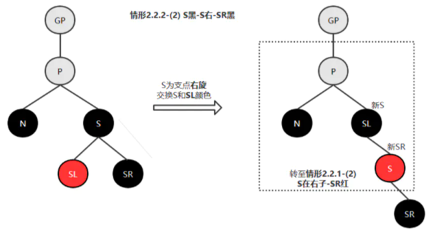
 **3）兄弟节点为红色（S=红）**
①S为左子时，以P进行右旋；

②S为右子时，以P进行左旋；

分别旋转后交换P和S的颜色（S涂黑，P涂红），N兄弟节点变为黑色，进入情形2-兄弟节点为黑色进行处理。

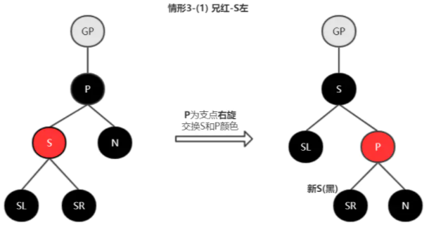 
###### **总结：**
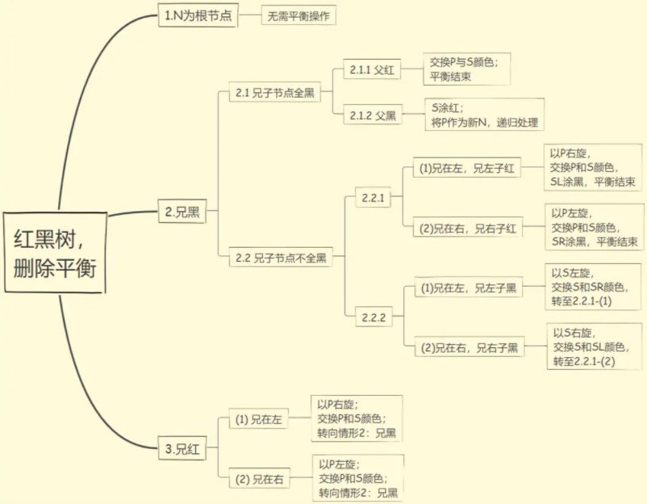
##### **3.删除有一个子结点的黑色结点**
将该结点的子结点变黑，然后让其与该结点的父结点相连，最后删除该结点。

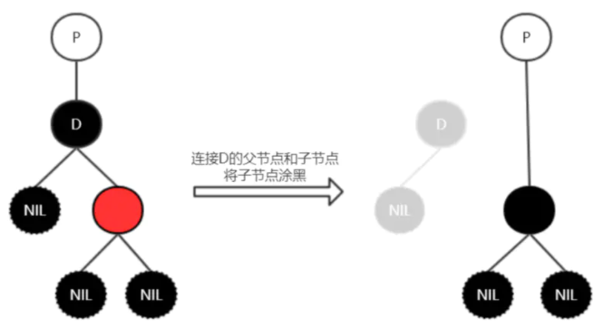
##### **4.删除有两个子结点的红色或黑色结点**
用删除结点的中序后继结点中的值替换被删除结点的值，然后删除中序后继结点，此问题转化为情形1、2或情形3。

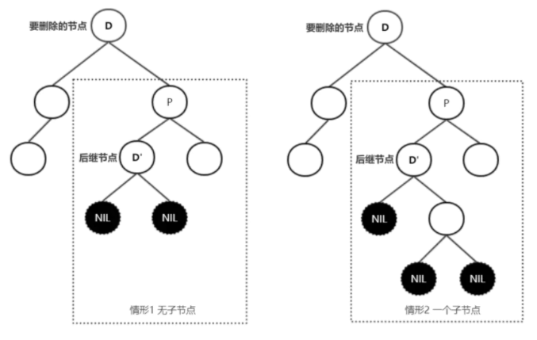

