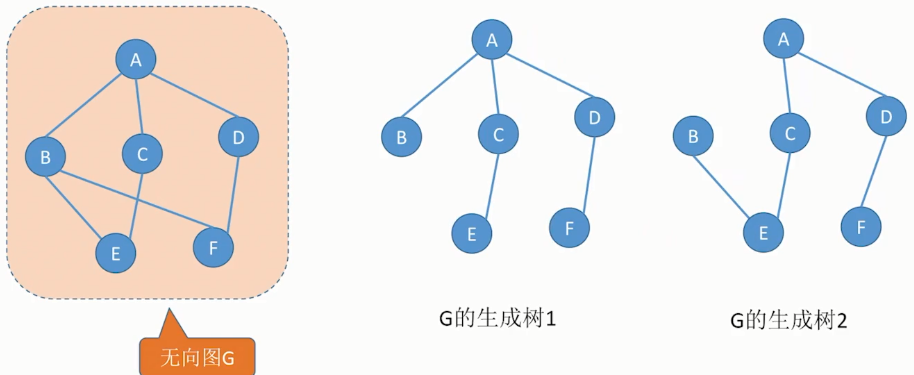
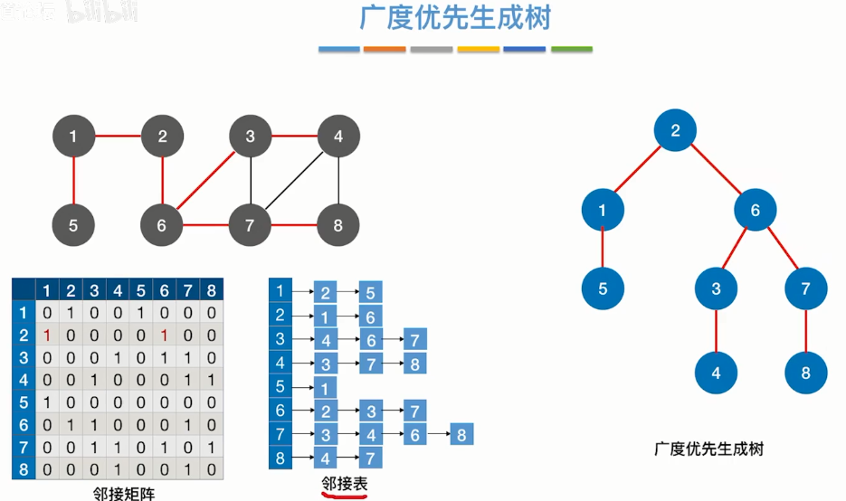
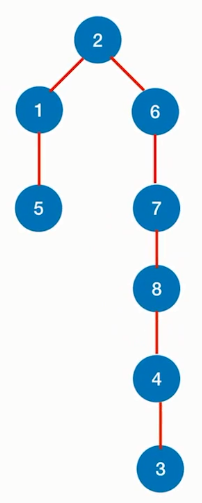
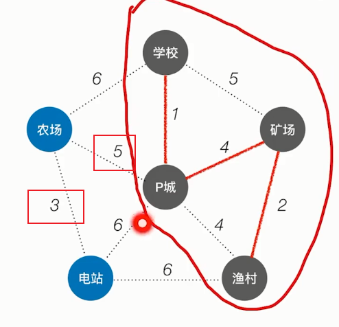
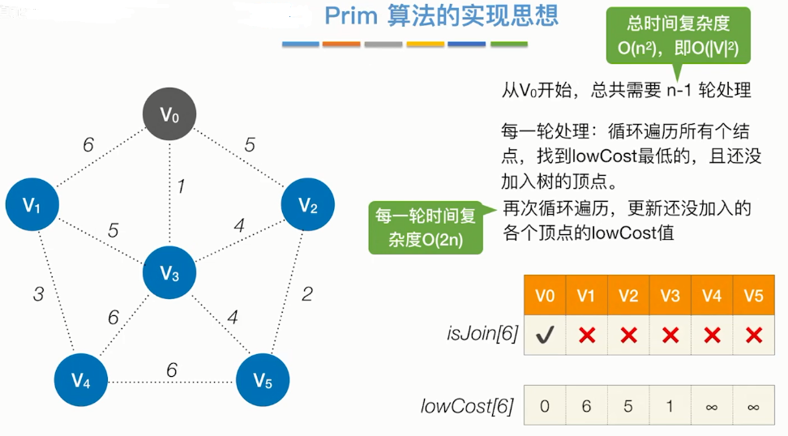
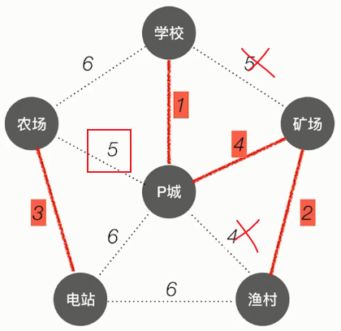

## **生成树**
图中有n个顶点，它的生成树有n-1条边，即连通图的生成树是包含图中全部顶点的一个极小连通子图。

对生成树来说：

- 若删去一条边，则会变成非连通图。
- 若增加一条边，则会形成回路。

### **广度优先生成树**
使用bfs得到的生成树

邻接表的生成树可能因为链表中结点的顺序会不一样，但邻接矩阵的生成树保持不变。

### **深度优先生成树**
dfs生成的树

### **最小生成树（图）**
边有权值，所有的结点都连接，但代价最小。同一个图可能有多个最小生成树。

代价边权和值最小

1. prim算法（算法实现有点像dijkstra算法）【适合边稠密图】

原理：从某一个顶点开始构建生成树，每次将代价最小的新顶点加入生成树。

如从p城开始：

isjoin保存的是哪些结点已经加入了当前的生成树中。

lowCost保存的是还没有加入的结点能够加入当前生成树，直接相连的边的最小权值。

1. kruskal算法（克鲁斯卡尔）【适合边稀疏图】

每次选择一条权值最小的边，使这条边的两头进行连通，原本已经连通的不选。

