## **题目**
### **动态规划**
#### **斐波那契数列**

```
int fib(int N) {  
    if (N < 1) return 0;  
    // 备忘录全初始化为 0  
    vector<int> memo(N + 1, 0);  
    // 初始化最简情况  
    return helper(memo, N);  
}  
  
int helper(vector<int>& memo, int n) {  
    // base case   
    if (n == 1 || n == 2) return 1;  
    // 已经计算过  
    if (memo[n] != 0) return memo[n];  
    memo[n] = helper(memo, n - 1) +   
		helper(memo, n - 2);  
    return memo[n];  
}  
```

#### **凑零钱问题**

```
def coinChange(coins: List[int], amount: int):  
    # 备忘录  
    memo = dict()  
    def dp(n):  
	# 查备忘录，避免重复计算  
	if n in memo: return memo[n]  
  
	if n == 0: return 0  
	if n < 0: return -1  
	res = float('INF')  
	for coin in coins:  
	    subproblem = dp(n - coin)  
	    if subproblem == -1: continue  
	    res = min(res, 1 + subproblem)  
  
	# 记入备忘录  
	memo[n] = res if res != float('INF') else -1  
	return memo[n]  
  
    return dp(amount) 
```

#### **股票买卖**
一次交易由买入和卖出构成，至少需要两天。所以说有效的限制次数 k 应该不超过 n/2，如果超过，就没有约束作用了，相当于 k = +infinity。

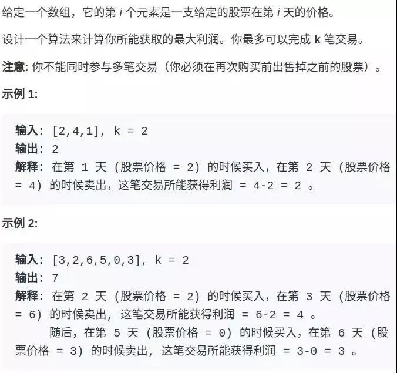

第一题是只进行一次交易，相当于 k = 1；

第二题是不限交易次数，相当于 k = +infinity（正无穷）；

第三题是只进行 2 次交易，相当于 k = 2；

剩下两道也是不限交易次数，但是加了交易「冷冻期」和「手续费」的额外条件，其实就是第二题的变种，都很容易处理。

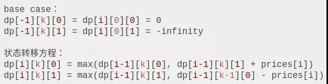

dp[3][2][1] 的含义就是：今天是第三天，我现在手上持有着股票，至今已经进行了 2 次交易。

```
int maxProfit_k_any(int max_k, int[] prices) {  
    int n = prices.length;  
    if (max_k > n / 2)  
	return maxProfit_k_inf(prices);  
    int[][][] dp = new int[n][max_k + 1][2];  
    for (int i = 0; i < n; i++)  
	for (int k = max_k; k >= 1; k--) {  
	    if (i - 1 == -1) {   
		dp[i][k][0] = 0;  
		dp[i][k][1] = - prices[i];  
	    }  
	    dp[i][k][0] = max(dp[i-1][k][0], dp[i-1][k][1] + prices[i]);  
	    dp[i][k][1] = max(dp[i-1][k][1], dp[i-l][k-1][0] - prices[i]);   
	}  
    return dp[n - 1] [max_k] [0];   
}  
```


#### **打家劫舍**
198
```
class Solution {  
    public int rob(int[] nums) {  
	if(nums.length == 1){  
	    return nums[0];  
	}else if(nums.length == 2){  
	    return Math.max(nums[0],nums[1]);  
	}  
	int[] dp = new int[nums.length];  
	dp[0] = nums[0];  
	dp[1] = Math.max(nums[0],nums[1]);  
	for(int i = 2; i < nums.length; i++){  
	    dp[i] = Math.max(dp[i-1],dp[i-2]+nums[i]);  
	}  
	return dp[nums.length-1];  
    }  
} 
```


#### **背包**
##### **0-1 背包**
给你一个可装载重量为W的背包和N个物品，每个物品有重量和价值两个属性。其中第i个物品的重量为wt[i]，价值为val[i]，现在让你用这个背包装物品，最多能装的价值是多少？

举个简单的例子，输入如下：

N = 3, W = 4

wt = [2, 1, 3]

val = [4, 2, 3]

算法返回 6，选择前两件物品装进背包，总重量 3 小于W，可以获得最大价值 6。

dp[i][w]的定义如下：对于前i个物品，当前背包的总容量为w，这种情况下可以装的最大价值是dp[i][w]。

```
int knapsack(int W, int N, vector<int>& wt, vector<int>& val) {  
    // vector 全填入 0，base case 已初始化  
    vector<vector<int>> dp(N + 1, vector<int>(W + 1, 0));  
    for (int i = 1; i <= N; i++) {  
	for (int w = 1; w <= W; w++) {  
	    if (w - wt[i-1] < 0) {  
		// 当前背包容量装不下，只能选择不装入背包  
		dp[i][w] = dp[i - 1][w];  
	    } else {  
		// 装入或者不装入背包，择优, i是从 1 开始的，而数组索引是从 0 开始的，所以第i个物品的重量应该是wt [i-1] 
		dp[i][w] = max(dp[i - 1][w - wt[i-1]] + val[i-1],   
			       dp[i - 1][w]);  
	    }  
	}  
    }  
    return dp[N][W];  
}  
```


##### **部分背包**
力扣第416：将一个数组分割成两个等和的子集。

假设背包只能装一半，能否刚好装齐

dp[i][j] = x表示，对于前i个物品，当前背包的容量为j时，若x为true，则说明可以恰好将背包装满，若x为false，则说明不能恰好将背包装满。

**base case 为true**：当容量为0时，某种含义表示已被装满，因此为true
```
bool canPartition(vector<int>& nums) {  
    int sum = 0;  
    for (int num : nums) sum += num;  
    // 和为奇数时，不可能划分成两个和相等的集合  
    if (sum % 2 != 0) return false;  
    int n = nums.size();  
    sum = sum / 2;  
    vector<vector<bool>>   
	dp(n + 1, vector<bool>(sum + 1, false));  
    // base case  
    for (int i = 0; i <= n; i++)  
	dp[i][0] = true;  
  
    for (int i = 1; i <= n; i++) {  
	for (int j = 1; j <= sum; j++) {  
	    if (j - nums[i - 1] < 0) {  
	       // 背包容量不足，不能装入第 i 个物品  
		dp[i][j] = dp[i - 1][j];   
	    } else {  
		// 装入或不装入背包  
		dp[i][j] = dp[i - 1][j] | dp[i - 1][j-nums[i-1]];  
	    }  
	}  
    }  
    return dp[n][sum];  
} 
```

状态压缩后：注意到dp[i][j]都是通过上一行dp[i-1][..]转移过来的，也就是说，实际上一直是两行的数据在轮替。

**j要反着遍历**：dp数组其实是起着一个备忘录的作用，解决重叠子问题，

如果正着遍历，某一个dp[j]【A】通过上一行的数据计算过后，之后若有别的dp[j]【B】要通过上一行的A来更新的话，但实际上获得的却是这一行重新更新后的A，与题意不符，

但如果是反着遍历，那么当前行的更新永远都是通过上一行的数据进行的更新。

``` 
bool canPartition(vector<int>& nums) {  
    int sum = 0, n = nums.size();  
    for (int num : nums) sum += num;  
    if (sum % 2 != 0) return false;  
    sum = sum / 2;  
    vector<bool> dp(sum + 1, false);  
    // base case  
    dp[0] = true;  
  
    for (int i = 0; i < n; i++)   
	for (int j = sum; j >= 0; j--)   
	    if (j - nums[i] >= 0)   
		dp[j] = dp[j] || dp[j - nums[i]];  
  
    return dp[sum];  
}  
```


##### **完全背包**
LeetCode 第 518 题，凑零钱2

给定不同面额的硬币和一个总金额。写出函数来计算可以凑成总金额的硬币组合数，假设每一种面额的硬币有无限个。

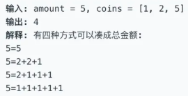

换句话说，有一个背包，最大容量为amount，有一系列物品coins，每个物品的重量为coins[i]，每个物品的数量无限。请问有多少种方法，能够把背包恰好装满？

和之前的两个背包问题，有一个最大的区别就是，**每个物品的数量是无限的**，这也就是传说中的「**完全背包问题**」

**dp[i][j]的定义**如下：

若只使用前i个物品，当背包容量为j时，有dp[i][j]种方法可以装满背包。

换句话说，翻译回我们题目的意思就是：

**若只使用coins中的前i个硬币的面值，若想凑出金额j，有dp[i][j]种凑法**。

经过以上的定义，可以得到：

**base case** 为：

dp[0][..] = 0，如果不使用任何硬币面值，就无法凑出任何金额；

dp[..][0] = 1，如果凑出的目标金额为 0，那么“无为而治”就是唯一的一种凑法。

我们最终想得到的答案就是dp[N][amount]，其中N为coins数组的大小。

```
int change(int amount, int[] coins) {  
    int n = coins.length;  
    int[][] dp = amount int[n + 1][amount + 1];  
    // base case  
    for (int i = 0; i <= n; i++)   
	dp[i][0] = 1;  
  
    for (int i = 1; i <= n; i++) {  
	for (int j = 1; j <= amount; j++)  
	    if (j - coins[i-1] >= 0)  
		dp[i][j] = dp[i - 1][j]   
			 + dp[i][j - coins[i-1]];  
	    else   
		dp[i][j] = dp[i - 1][j];  
    }  
    return dp[n][amount];  
}  
```

状态压缩：

```
int change(int amount, int[] coins) {  
    int n = coins.length;  
    int[] dp = new int[amount + 1];  
    dp[0] = 1; // base case  
    for (int i = 0; i < n; i++)  
	for (int j = 1; j <= amount; j++)  
	    if (j - coins[i] >= 0)  
		dp[j] = dp[j] + dp[j-coins[i]];  
  
    return dp[amount];  
}  
```

#### **下降路径最小和**
力扣第 931 题

从第一行matrix[0][..]向下落，落到位置matrix[i][j]的最小路径和为dp(matrix, i, j)。

```
public int minFallingPathSum(int[][] matrix) {  
    int n = matrix.length;  
    int res = Integer.MAX_VALUE;  
    // 备忘录里的值初始化为 66666  
    memo = new int[n][n];  
    for (int i = 0; i < n; i++) {  
	Arrays.fill(memo[i], 66666);  
    }  
    // 终点可能在 matrix[n-1] 的任意一列  
    for (int j = 0; j < n; j++) {  
	res = Math.min(res, dp(matrix, n - 1, j));  
    }  
    return res;  
}  
  
// 备忘录  
int[][] memo;  
  
int dp(int[][] matrix, int i, int j) {  
    // 1、索引合法性检查  
    if (i < 0 || j < 0 ||  
	i >= matrix.length ||  
	j >= matrix[0].length) {  
  
	return 99999;  
    }  
    // 2、base case  
    if (i == 0) {  
	return matrix[0][j];  
    }  
    // 3、查找备忘录，防止重复计算  
    if (memo[i][j] != 66666) {  
	return memo[i][j];  
    }  
    // 进行状态转移  
    memo[i][j] = matrix[i][j] + min(  
	    dp(matrix, i - 1, j),   
	    dp(matrix, i - 1, j - 1),  
	    dp(matrix, i - 1, j + 1)  
	);  
  
    return memo[i][j];  
}  
  
int min(int a, int b, int c) {  
    return Math.min(a, Math.min(b, c));  
}  
```

#### **最小编辑距离**
`dp[i-1][j-1]   # 存储 s1[0..i] 和 s2[0..j] 的最小编辑距离`


```
int minDistance(String s1, String s2) {  
    int m = s1.length(), n = s2.1ength();  
    int[][] dp = new int[m + 1][n + 1];  
    // base case  
    for(int i = 1; i <= m; i++) dp[i][0] = i; //删除s1的i个字符  
    for(int j = 1; j <= n; j++) dp[0][j] = j; //往s1插入j个字符  
    for(int i = 1; i <= m; i++)  
	for(int j = 1; j <= n; j++)  
	    if(s1.charAt(i - 1) = s2.charAt(j - 1)) dp[i][j] = dp[i - 1][j - 1];//相等，不做操作  
	    else dp[i][j] = min(  
			      dp[i - 1][j] + 1, //删除s1中i对应的字符  
			      dp[i][j - 1] + 1, //往s1插入s2中j对应的字符  
			      dp[i - 1][j - 1] + 1//把s1中i的字符替换为s2中j对应的字符  
			    );  
    //存的整个s1到s2的最小修改距离  
    return dp[m][n];  
}  
int min(int a, int b, int c) {  
    return Math.min(a, Math.min(b, c));  
}  
```

```
// int[][] dp;
Node[][] dp;

class Node {
    int val;
    int choice;
    // 0 代表啥都不做
    // 1 代表插入
    // 2 代表删除
    // 3 代表替换
}

```

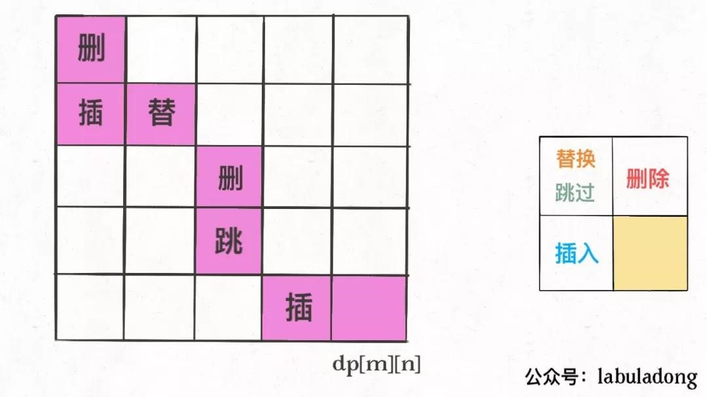

#### **最大子数组**
以nums[i]为结尾的「最大子数组和」为dp[i]

dp[i]有两种「选择」，

要么与前面的相邻子数组连接，形成一个和更大的子数组；

要么不与前面的子数组连接，自成一派，自己作为一个子数组。

```
int maxSubArray(int[] nums) {  
    int n = nums.length;  
    if (n == 0) return 0;  
    int[] dp = new int[n];  
    // base case  
    // 第一个元素前面没有子数组  
    dp[0] = nums[0];  
    // 状态转移方程  
    for (int i = 1; i < n; i++) {  
	dp[i] = Math.max(nums[i], nums[i] + dp[i - 1]);  
    }  
    // 得到 nums 的最大子数组  
    int res = Integer.MIN_VALUE;  
    for (int i = 0; i < n; i++) {  
	res = Math.max(res, dp[i]);  
    }  
    return res;  
}  
```

### **回溯**
#### **全排列**
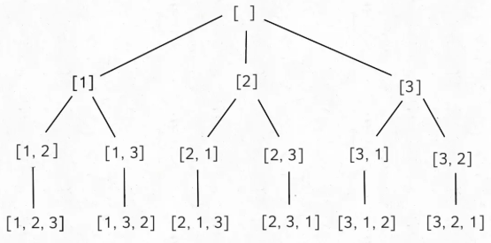

```
// 路径：记录在 track 中  
// 选择列表：nums 中不存在于 track 的那些元素  
// 结束条件：nums 中的元素全都在 track 中出现  
void backtrack(int[] nums, LinkedList<Integer> track) {  
    // 触发结束条件  
    if (track.size() == nums.length) {  
	res.add(new LinkedList(track));  
	return;  
    }  
  
    for (int i = 0; i < nums.length; i++) {  
	// 排除不合法的选择  
	if (track.contains(nums[i]))  
	    continue;  
	// 做选择  
	track.add(nums[i]);  
	// 进入下一层决策树  
	backtrack(nums, track);  
	// 取消选择  
	track.removeLast();  
    }  
}  
```

#### **组合：求子集**
①数学归纳：在之前的每一个子集中加入当前元素，然后添加到之前的子集的集合中。

②回溯

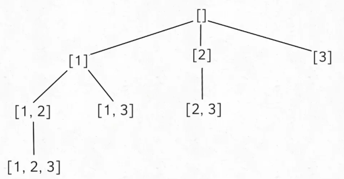

```
vector<vector<int>> res;  
  
vector<vector<int>> subsets(vector<int>& nums) {  
    // 记录走过的路径  
    vector<int> track;  
    backtrack(nums, 0, track);  
    return res;  
}  
  
void backtrack(vector<int>& nums, int start, vector<int>& track) {  
    res.push_back(track);  
    // 注意 i 从 start 开始递增  
    for (int i = start; i < nums.size(); i++) {  
	// 做选择  
	track.push_back(nums[i]);  
	// 回溯  
	backtrack(nums, i + 1, track);  
	// 撤销选择  
	track.pop_back();  
    }  
} 
```

#### **N皇后**
给你一个 N×N 的棋盘，让你放置 N 个皇后，使得它们不能互相攻击。

PS：皇后可以攻击同一行、同一列、左上左下右上右下四个方向的任意单位。

```
// 路径：board 中小于 row 的那些行都已经成功放置了皇后  
// 选择列表：第 row 行的所有列都是放置皇后的选择  
// 结束条件：row 超过 board 的最后一行  
void backtrack(vector<string>& board, int row) {  
    // 触发结束条件  
    if (row == board.size()) {  
	res.push_back(board);  
	return;  
    }  
  
    int n = board[row].size();  
    for (int col = 0; col < n; col++) {  
	// 排除不合法选择  
	if (!isValid(board, row, col))   
	    continue;  
	// 做选择  
	board[row][col] = 'Q';  
	// 进入下一行决策  
	backtrack(board, row + 1);  
	// 撤销选择  
	board[row][col] = '.';  
    }  
}  
/* 是否可以在 board[row][col] 放置皇后？ */  
bool isValid(vector<string>& board, int row, int col) {  
    int n = board.size();  
    // 检查列是否有皇后互相冲突  
    for (int i = 0; i < n; i++) {  
	if (board[i][col] == 'Q')  
	    return false;  
    }  
    // 检查右上方是否有皇后互相冲突  
    for (int i = row - 1, j = col + 1;   
	    i >= 0 && j < n; i--, j++) {  
	if (board[i][j] == 'Q')  
	    return false;  
    }  
    // 检查左上方是否有皇后互相冲突  
    for (int i = row - 1, j = col - 1;  
	    i >= 0 && j >= 0; i--, j--) {  
	if (board[i][j] == 'Q')  
	    return false;  
    }  
    return true;  
}  
```

### **bfs**
#### **二叉树的最小高度**
LeetCode 第 111 题

```
int minDepth(TreeNode root) {  
    if (root == null) return 0;  
    Queue<TreeNode> q = new LinkedList<>();  
    q.offer(root);  
    // root 本身就是一层，depth 初始化为 1  
    int depth = 1;  
  
    while (!q.isEmpty()) {  
	int sz = q.size();  
	/* 将当前队列中的所有节点向四周扩散 */  
	for (int i = 0; i < sz; i++) {  
	    TreeNode cur = q.poll();  
	    /* 判断是否到达终点 */  
	    if (cur.left == null && cur.right == null)   
		return depth;  
	    /* 将 cur 的相邻节点加入队列 */  
	    if (cur.left != null)  
		q.offer(cur.left);  
	    if (cur.right != null)   
		q.offer(cur.right);  
	}  
	/* 这里增加步数 */  
	depth++;  
    }  
    return depth;  
}  
```

#### **解开密码锁的最少次数**
LeetCode 题目是第 752 题

```
int openLock(String[] deadends, String target) {  
    // 记录需要跳过的死亡密码  
    Set<String> deads = new HashSet<>();  
    for (String s : deadends) deads.add(s);  
    // 记录已经穷举过的密码，防止走回头路  
    Set<String> visited = new HashSet<>();  
    Queue<String> q = new LinkedList<>();  
    // 从起点开始启动广度优先搜索  
    int step = 0;  
    q.offer("0000");  
    visited.add("0000");  
  
    while (!q.isEmpty()) {  
	int sz = q.size();  
	/* 将当前队列中的所有节点向周围扩散 */  
	for (int i = 0; i < sz; i++) {  
	    String cur = q.poll();  
  
	    /* 判断是否到达终点 */  
	    if (deads.contains(cur))  
		continue;  
	    if (cur.equals(target))  
		return step;  
  
	    /* 将一个节点的未遍历相邻节点加入队列 */  
	    for (int j = 0; j < 4; j++) {  
		String up = plusOne(cur, j);  
		if (!visited.contains(up)) {  
		    q.offer(up);  
		    visited.add(up);  
		}  
		String down = minusOne(cur, j);  
		if (!visited.contains(down)) {  
		    q.offer(down);  
		    visited.add(down);  
		}  
	    }  
	}  
	/* 在这里增加步数 */  
	step++;  
    }  
    // 如果穷举完都没找到目标密码，那就是找不到了  
    return -1;  
}
// 将 s[j] 向上拨动一次  
String plusOne(String s, int j) {  
    char[] ch = s.toCharArray();  
    if (ch[j] == '9')  
	ch[j] = '0';  
    else  
	ch[j] += 1;  
    return new String(ch);  
}  
// 将 s[i] 向下拨动一次  
String minusOne(String s, int j) {  
    char[] ch = s.toCharArray();  
    if (ch[j] == '0')  
	ch[j] = '9';  
    else  
	ch[j] -= 1;  
    return new String(ch);  
}    
```

### **滑动窗口**
#### **最小覆盖子串**
LeetCode 76 题

```
string minWindow(string s, string t) {  
    unordered_map<char, int> need, window;  
    for (char c : t) need[c]++;  
  
    int left = 0, right = 0;  
    int valid = 0;  
    // 记录最小覆盖子串的起始索引及长度  
    int start = 0, len = INT_MAX;  
    while (right < s.size()) {  
	// c 是将移入窗口的字符  
	char c = s[right];  
	// 右移窗口  
	right++;  
	// 进行窗口内数据的一系列更新  
	if (need.count(c)) {  
	    window[c]++;  
	    if (window[c] == need[c])  
		valid++;  
	}  
  
	// 判断左侧窗口是否要收缩  
	while (valid == need.size()) {  
	    // 在这里更新最小覆盖子串  
	    if (right - left < len) {  
		start = left;  
		len = right - left;  
	    }  
	    // d 是将移出窗口的字符  
	    char d = s[left];  
	    // 左移窗口  
	    left++;  
	    // 进行窗口内数据的一系列更新  
	    if (need.count(d)) {  
		if (window[d] == need[d])  
		    valid--;  
		window[d]--;  
	    }                      
	}  
    }  
    // 返回最小覆盖子串  
    return len == INT_MAX ?  
	"" : s.substr(start, len);  
}  
```

#### **字符串排列**
LeetCode 567 题

```
// 判断 s 中是否存在 t 的排列  
bool checkInclusion(string t, string s) {  
    unordered_map<char, int> need, window;  
    for (char c : t) need[c]++;  
  
    int left = 0, right = 0;  
    int valid = 0;  
    while (right < s.size()) {  
	char c = s[right];  
	right++;  
	// 进行窗口内数据的一系列更新  
	if (need.count(c)) {  
	    window[c]++;  
	    if (window[c] == need[c])  
		valid++;  
	}  
  
	// 判断左侧窗口是否要收缩  
	while (right - left >= t.size()) {  
	    // 在这里判断是否找到了合法的子串  
	    if (valid == need.size())  
		return true;  
	    char d = s[left];  
	    left++;  
	    // 进行窗口内数据的一系列更新  
	    if (need.count(d)) {  
		if (window[d] == need[d])  
		    valid--;  
		window[d]--;  
	    }  
	}  
    }  
    // 未找到符合条件的子串  
    return false;  
}  
```

#### **找所有字母异位词**
LeetCode 第 438 题

```
vector<int> findAnagrams(string s, string t) {  
    unordered_map<char, int> need, window;  
    for (char c : t) need[c]++;  
  
    int left = 0, right = 0;  
    int valid = 0;  
    vector<int> res; // 记录结果  
    while (right < s.size()) {  
	char c = s[right];  
	right++;  
	// 进行窗口内数据的一系列更新  
	if (need.count(c)) {  
	    window[c]++;  
	    if (window[c] == need[c])   
		valid++;  
	}  
	// 判断左侧窗口是否要收缩  
	while (right - left >= t.size()) {  
	    // 当窗口符合条件时，把起始索引加入 res  
	    if (valid == need.size())  
		res.push_back(left);  
	    char d = s[left];  
	    left++;  
	    // 进行窗口内数据的一系列更新  
	    if (need.count(d)) {  
		if (window[d] == need[d])  
		    valid--;  
		window[d]--;  
	    }  
	}  
    }  
    return res;  
} 
```

#### **最长无重复子串**
LeetCode 第 3 题

```
int lengthOfLongestSubstring(string s) {  
    unordered_map<char, int> window;  
  
    int left = 0, right = 0;  
    int res = 0; // 记录结果  
    while (right < s.size()) {  
	char c = s[right];  
	right++;  
	// 进行窗口内数据的一系列更新  
	window[c]++;  
	// 判断左侧窗口是否要收缩  
	while (window[c] > 1) {  
	    char d = s[left];  
	    left++;  
	    // 进行窗口内数据的一系列更新  
	    window[d]--;  
	}  
	// 在这里更新答案  
	res = max(res, right - left);  
    }  
    return res;  
}  
```

### **树**
#### **最近公共祖先**
LeetCode 上第 236 题

```
//找结点p或q是否在以root为根的树中
TreeNode lowestCommonAncestor(TreeNode root, TreeNode p, TreeNode q) {  
    // base case  
    if (root == null) return null;  
    if (root == p || root == q) return root;  
  
    TreeNode left = lowestCommonAncestor(root.left, p, q);  
    TreeNode right = lowestCommonAncestor(root.right, p, q);  
    // 情况 1  
    if (left != null && right != null) {  
	return root;  
    }  
    // 情况 2  
    if (left == null && right == null) {  
	return null;  
    }  
    // 情况 3  
    return left != null ? left : right;  
}  
```

#### **翻转二叉树**
力扣第 226 题

```
// 将整棵树的节点翻转  
TreeNode invertTree(TreeNode root) {  
    // base case  
    if (root == null) {  
	return null;  
    }  
  
    /**** 前序遍历位置 ****/  
    // root 节点需要交换它的左右子节点  
    TreeNode tmp = root.left;  
    root.left = root.right;  
    root.right = tmp;  
  
    // 让左右子节点继续翻转它们的子节点  
    invertTree(root.left);  
    invertTree(root.right);  
  
    return root;  
}  
```

#### **填充二叉树节点的右侧next指针**
力扣第 116 题

```
// 主函数  
Node connect(Node root) {  
    if (root == null) return null;  
    connectTwoNode(root.left, root.right);  
    return root;  
}  
  
// 定义：输入两个节点，将它俩连接起来  
void connectTwoNode(Node node1, Node node2) {  
    if (node1 == null || node2 == null) {  
	return;  
    }  
    /**** 前序遍历位置 ****/  
    // 将传入的两个节点连接  
    node1.next = node2;  
  
    // 连接相同父节点的两个子节点  
    connectTwoNode(node1.left, node1.right);  
    connectTwoNode(node2.left, node2.right);  
    // 连接跨越父节点的两个子节点  
    connectTwoNode(node1.right, node2.left);  
}
```

#### **将二叉树展开为链表**
力扣第 114 题

```
// 定义：将以 root 为根的树拉平为链表  
void flatten(TreeNode root) {  
    // base case  
    if (root == null) return;  
  
    flatten(root.left);  
    flatten(root.right);  
  
    /**** 后序遍历位置 ****/  
    // 1、左右子树已经被拉平成一条链表  
    TreeNode tmpLeft = root.left;  
    TreeNode tmpRight = root.right;  
  
    // 2、将左子树作为右子树  
    root.left = null;  
    root.right = tmpLeft;  
  
    // 3、将原先的右子树接到当前右子树的末端  
    TreeNode p = root;  
    while (p.right != null) {  
	p = p.right;  
    }  
    p.right = tmpRight;  
}  
```

#### **构造最大二叉树**
力扣第 654 题

```
/* 将 nums[lo..hi] 构造成符合条件的树，返回根节点 */  
TreeNode build(int[] nums, int lo, int hi) {  
    // base case  
    if (lo > hi) {  
	return null;  
    }  
  
    // 找到数组中的最大值和对应的索引  
    int index = -1, maxVal = Integer.MIN_VALUE;  
    for (int i = lo; i <= hi; i++) {  
	if (maxVal < nums[i]) {  
	    index = i;  
	    maxVal = nums[i];  
	}  
    }  
  
    TreeNode root = new TreeNode(maxVal);  
    // 递归调用构造左右子树  
    root.left = build(nums, lo, index - 1);  
    root.right = build(nums, index + 1, hi);  
  
    return root;  
}  
```

#### **中序和先序构造二叉树**
```
TreeNode build(int[] preorder, int preStart, int preEnd,   
	       int[] inorder, int inStart, int inEnd) {  
  
    if (preStart > preEnd) {  
	return null;  
    }  
  
    // root 节点对应的值就是前序遍历数组的第一个元素  
    int rootVal = preorder[preStart];  
    // rootVal 在中序遍历数组中的索引  
    int index = 0;  
    for (int i = inStart; i <= inEnd; i++) {  
	if (inorder[i] == rootVal) {  
	    index = i;  
	    break;  
	}  
    }  
  
    int leftSize = index - inStart;  
  
    // 先构造出当前根节点  
    TreeNode root = new TreeNode(rootVal);  
    // 递归构造左右子树  
    root.left = build(preorder, preStart + 1, preStart + leftSize,  
		      inorder, inStart, index - 1);  
  
    root.right = build(preorder, preStart + leftSize + 1, preEnd,  
		       inorder, index + 1, inEnd);  
    return root;  
}  
```


#### **寻找重复子树**
主要是要通过“后序”的方式把一棵树描述下来。才好用字符串对比。

```
// 记录所有子树以及出现的次数  
HashMap<String, Integer> memo = new HashMap<>();  
// 记录重复的子树根节点  
LinkedList<TreeNode> res = new LinkedList<>();  
  
/* 主函数 */  
List<TreeNode> findDuplicateSubtrees(TreeNode root) {  
    traverse(root);  
    return res;  
}  
  
/* 辅助函数 */  
String traverse(TreeNode root) {  
    if (root == null) {  
	return "#";  
    }  
  
    String left = traverse(root.left);  
    String right = traverse(root.right);  
  
    String subTree = left + "," + right+ "," + root.val;  
  
    int freq = memo.getOrDefault(subTree, 0);  
    // 多次重复也只会被加入结果集一次  
    if (freq == 1) {  
	res.add(root);  
    }  
    // 给子树对应的出现次数加一  
    memo.put(subTree, freq + 1);  
    return subTree;  
}  
```

#### **二叉搜索树中第K小的元素**
力扣第 230 题

```
int kthSmallest(TreeNode root, int k) {  
    // 利用 BST 的中序遍历特性  
    traverse(root, k);  
    return res;  
}  
  
// 记录结果  
int res = 0;  
// 记录当前元素的排名  
int rank = 0;  
void traverse(TreeNode root, int k) {  
    if (root == null) {  
	return;  
    }  
    traverse(root.left, k);  
    /* 中序遍历代码位置 */  
    rank++;  
    if (k == rank) {  
	// 找到第 k 小的元素  
	res = root.val;  
	return;  
    }  
    /*****************/  
    traverse(root.right, k);  
}  
```

#### **BST 转化累加树**
力扣第 538 题和 1038 题

```
// 记录累加和  
int sum = 0;  
void traverse(TreeNode root) {  
    if (root == null) {  
	return;  
    }  
    traverse(root.right);  
    // 维护累加和  
    sum += root.val;  
    // 将 BST 转化成累加树  
    root.val = sum;  
    traverse(root.left);  
}  
```

#### **验证bst的合法性**

```
public boolean isValidBST(TreeNode root) {  
    return isValid(root, null, null);  
}  
    //左子树中最大的值 < node.val < 右边的最小值  
public boolean isValid(TreeNode node, TreeNode max, TreeNode min) {  
    if(node == null) return true;  
    if(max != null && node.val <= max.val) return false;  
    if(min != null && node.val >= min.val) return false;  
    return isValid(node.left, max, node) && isValid(node.right, node, min);  
}  
```

#### **bst 中插入一个数**

```
TreeNode insertIntoBST(TreeNode root, int val) {  
    // 找到空位置插入新节点  
    if (root == null) return new TreeNode(val);  
    // if (root.val == val)  
    //     BST 中一般不会插入已存在元素  
    if (root.val < val)   
	root.right = insertIntoBST(root.right, val);  
    if (root.val > val)   
	root.left = insertIntoBST(root.left, val);  
    return root;  
}  
```
 
#### **bst删除一个数**
情况 3：A有两个子节点，麻烦了，为了不破坏 BST 的性质，A必须找到左子树中最大的那个节点，或者右子树中最小的那个节点来接替自己。我们以第二种方式讲解。

```
TreeNode deleteNode(TreeNode root, int key) {  
    if (root == null) return null;  
    if (root.val == key) {  
	// 这两个 if 把情况 1 和 2 都正确处理了  
	if (root.left == null) return root.right;  
	if (root.right == null) return root.left;  
	// 处理情况 3,找右子树中最小的那个节点来接替自己  
	TreeNode minNode = getMin(root.right);  
	root.val = minNode.val;  
	root.right = deleteNode(root.right, minNode.val);  
    } else if (root.val > key) {  
	root.left = deleteNode(root.left, key);  
    } else if (root.val < key) {  
	root.right = deleteNode(root.right, key);  
    }  
    return root;  
}  
  
TreeNode getMin(TreeNode node) {  
    // BST 最左边的就是最小的  
    while (node.left != null) node = node.left;  
    return node;  
} 
```

#### **不同的二叉搜索树1**
力扣第 96 题，只用计算数量。


n=5时，以3为根能构造成的个数

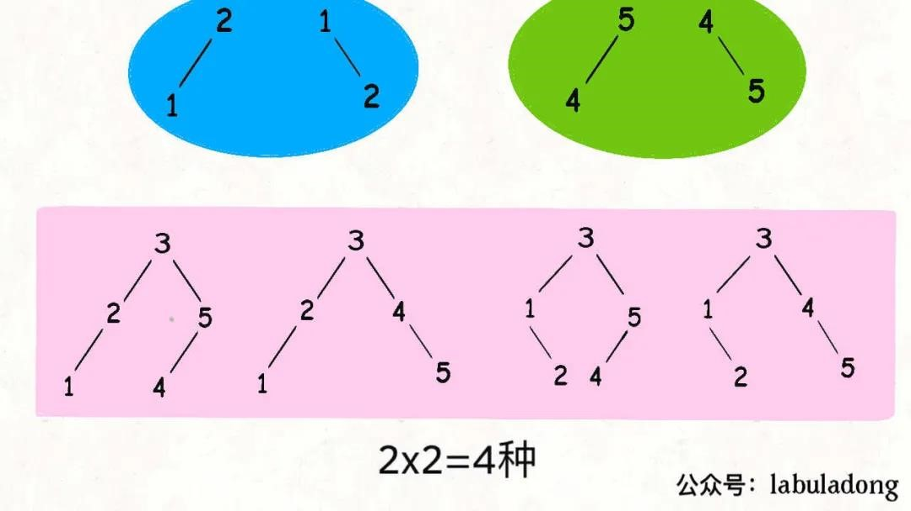

```
// 备忘录  
int[][] memo;  
  
int numTrees(int n) {  
    // 备忘录的值初始化为 0  
    memo = new int[n + 1][n + 1];  
    return count(1, n);  
}  
  
int count(int lo, int hi) {  
    if (lo > hi) return 1;  
    // 查备忘录  
    if (memo[lo][hi] != 0) {  
	return memo[lo][hi];  
    }  
  
    int res = 0;  
    for (int mid = lo; mid <= hi; mid++) {  
	int left = count(lo, mid - 1);  
	int right = count(mid + 1, hi);  
	res += left * right;  
    }  
    // 将结果存入备忘录  
    memo[lo][hi] = res;  
  
    return res;  
}  
```

#### **不同的二叉搜索树2**
力扣第 95 题，返回构成的不同的树的列表

```
/* 主函数 */  
public List<TreeNode> generateTrees(int n) {  
    if (n == 0) return new LinkedList<>();  
    // 构造闭区间 [1, n] 组成的 BST   
    return build(1, n);  
}  
  
/* 构造闭区间 [lo, hi] 组成的 BST */  
List<TreeNode> build(int lo, int hi) {  
    List<TreeNode> res = new LinkedList<>();  
    // base case  
    if (lo > hi) {  
	res.add(null);  
	return res;  
    }  
  
    // 1、穷举 root 节点的所有可能。  
    for (int i = lo; i <= hi; i++) {  
	// 2、递归构造出左右子树的所有合法 BST。  
	List<TreeNode> leftTree = build(lo, i - 1);  
	List<TreeNode> rightTree = build(i + 1, hi);  
	// 3、给 root 节点穷举所有左右子树的组合。  
	for (TreeNode left : leftTree) {  
	    for (TreeNode right : rightTree) {  
		// i 作为根节点 root 的值  
		TreeNode root = new TreeNode(i);  
		root.left = left;  
		root.right = right;  
		res.add(root);  
	    }  
	}  
    }  
  
    return res;  
}  
```

#### **二叉搜索子树的最大键值和**
力扣第 1373 题

算法返回20

任何一个单独的节点肯定是 BST，也就是说，再不济，二叉树最下面的叶子节点肯定是 BST。

traverse(root)返回一个大小为 4 的 int 数组，我们暂且称它为res，其中：

- res[0]记录以root为根的二叉树是否是 BST，若为 1 则说明是 BST，若为 0 则说明不是 BST；

- res[1]记录以root为根的二叉树所有节点中的最小值；

- res[2]记录以root为根的二叉树所有节点中的最大值；

- res[3]记录以root为根的二叉树所有节点值之和。

```
int[] traverse(TreeNode root) {  
    // base case  
    if (root == null) {  
	return new int[] {  
	    1, Integer.MAX_VALUE, Integer.MIN_VALUE, 0  
	};  
    }  
  
    // 递归计算左右子树  
    int[] left = traverse(root.left);  
    int[] right = traverse(root.right);  
  
    /******* 后序遍历位置 *******/  
    int[] res = new int[4];  
    // 这个 if 在判断以 root 为根的二叉树是不是 BST  
    if (left[0] == 1 && right[0] == 1 &&  
	root.val > left[2] && root.val < right[1]) {  
	// 以 root 为根的二叉树是 BST  
	res[0] = 1;  
	// 计算以 root 为根的这棵 BST 的最小值，考虑base case,需要比较  
	res[1] = Math.min(left[1], root.val);  
	// 计算以 root 为根的这棵 BST 的最大值，考虑base case,需要比较
	res[2] = Math.max(right[2], root.val);  
	// 计算以 root 为根的这棵 BST 所有节点之和  
	res[3] = left[3] + right[3] + root.val;  
	// 更新全局变量  
	maxSum = Math.max(maxSum, res[3]);  
    } else {  
	// 以 root 为根的二叉树不是 BST  
	res[0] = 0;  
	// 其他的值都没必要计算了，因为用不到  
    }  
    /**************************/  
  
    return res;  
}  
```


#### **二叉树的序列化与反序列化**
中序遍历无法反序列化

```
String SEP = ",";  
String NULL = "#";  
  
/* 主函数，将二叉树序列化为字符串 */  
String serialize(TreeNode root) {  
    StringBuilder sb = new StringBuilder();  
    serialize(root, sb);  
    return sb.toString();  
}  
  
/* 辅助函数，将二叉树存入 StringBuilder */  
void serialize(TreeNode root, StringBuilder sb) {  
    if (root == null) {  
	sb.append(NULL).append(SEP);  
	return;  
    }  
  
    /****** 前序遍历位置 ******/  
    sb.append(root.val).append(SEP);  
    /***********************/  
  
    serialize(root.left, sb);  
    serialize(root.right, sb);  
}  
/* 主函数，将字符串反序列化为二叉树结构 */  
TreeNode deserialize(String data) {  
    // 将字符串转化成列表  
    LinkedList<String> nodes = new LinkedList<>();  
    for (String s : data.split(SEP)) {  
	nodes.addLast(s);  
    }  
    return deserialize(nodes);  
}  
  
/* 辅助函数，通过 nodes 列表构造二叉树 */  
TreeNode deserialize(LinkedList<String> nodes) {  
    if (nodes.isEmpty()) return null;  
  
    /****** 前序遍历位置 ******/  
    // 列表最左侧就是根节点  
    String first = nodes.removeFirst();  
    if (first.equals(NULL)) return null;  
    TreeNode root = new TreeNode(Integer.parseInt(first));  
    /***********************/  
  
    root.left = deserialize(nodes);  
    root.right = deserialize(nodes);  
  
    return root;  
}  
```

#### **扁平化嵌套列表迭代器**
LeetCode 第 341 题

```
public class NestedInteger {  
    private Integer val;  
    private List<NestedInteger> list;  
  
    public NestedInteger(Integer val) {  
	this.val = val;  
	this.list = null;  
    }  
    public NestedInteger(List<NestedInteger> list) {  
	this.list = list;  
	this.val = null;  
    }  
  
    // 如果其中存的是一个整数，则返回 true，否则返回 false  
    public boolean isInteger() {  
	return val != null;  
    }  
  
    // 如果其中存的是一个整数，则返回这个整数，否则返回 null  
    public Integer getInteger() {  
	return this.val;  
    }  
  
    // 如果其中存的是一个列表，则返回这个列表，否则返回 null  
    public List<NestedInteger> getList() {  
	return this.list;  
    }  
}  
public class NestedIterator implements Iterator<Integer> {  
    private LinkedList<NestedInteger> list;  
  
    public NestedIterator(List<NestedInteger> nestedList) {  
	// 不直接用 nestedList 的引用，是因为不能确定它的底层实现  
	// 必须保证是 LinkedList，否则下面的 addFirst 会很低效  
	list = new LinkedList<>(nestedList);  
    }  
  
    public Integer next() {  
	// hasNext 方法保证了第一个元素一定是整数类型  
	return list.remove(0).getInteger();  
    }  
  
    public boolean hasNext() {  
	// 循环拆分列表元素，直到列表第一个元素是整数类型  
	while (!list.isEmpty() && !list.get(0).isInteger()) {  
	    // 当列表开头第一个元素是列表类型时，进入循环  
	    List<NestedInteger> first = list.remove(0).getList();  
	    // 将第一个列表打平并按顺序添加到开头  
	    for (int i = first.size() - 1; i >= 0; i--) {  
		list.addFirst(first.get(i));  
	    }  
	}  
	return !list.isEmpty();  
    }  
}  
```

#### **完全二叉树的结点个数**
关键点在于，这两个递归只有一个会真的递归下去，另一个一定会触发hl == hr而立即返回，不会递归下去。

一棵完全二叉树的两棵子树，至少有一棵是满二叉树：

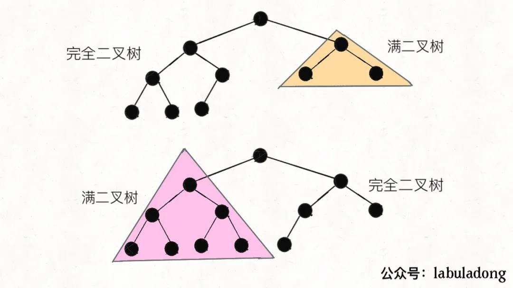

```
public int countNodes(TreeNode root) {  
    TreeNode l = root, r = root;  
    // 记录左、右子树的高度  
    int hl = 0, hr = 0;  
    while (l != null) {  
	l = l.left;  
	hl++;  
    }  
    while (r != null) {  
	r = r.right;  
	hr++;  
    }  
    // 如果左右子树的高度相同，则是一棵满二叉树  
    if (hl == hr) {  
	return (int)Math.pow(2, hl) - 1;  
    }  
    // 如果左右高度不同，则按照普通二叉树的逻辑计算  
    return 1 + countNodes(root.left) + countNodes(root.right);  
}  
```


### **图**
#### **所有可能路径**
力扣第 797 题

输入的图是无环的，不需要visited数组辅助

```
// 记录所有路径  
List<List<Integer>> res = new LinkedList<>();  
  
public List<List<Integer>> allPathsSourceTarget(int[][] graph) {  
    LinkedList<Integer> path = new LinkedList<>();  
    traverse(graph, 0, path);  
    return res;  
}  
  
/* 图的遍历框架 */  
void traverse(int[][] graph, int s, LinkedList<Integer> path) {  
  
    // 添加节点 s 到路径  
    path.addLast(s);  
  
    int n = graph.length;  
    if (s == n - 1) {  
	// 到达终点  
	res.add(new LinkedList<>(path));  
	path.removeLast();  
	return;  
    }  
  
    // 递归每个相邻节点  
    for (int v : graph[s]) {  
	traverse(graph, v, path);  
    }  
  
    // 从路径移出节点 s  
    path.removeLast();  
}  
```
 
#### **课程表（有向图中是否存在环）**
力扣第 207 题：判断是否能完成所有课程

- visited数组是用来剪枝的，在代码中是全局变量，并且只赋值true，而没有像onPath一样有回溯操作（即onPath【s】=false），举个例值，有a，b两个节点都有一条到c的路径，那么a判断之后被标记了visited【s】=true，b再去遍历的时候可以直接返回。
- onPath是记录回溯的路径的，是检查环是否存在的重要标志！

经过测试，只有OnPath没有visited，在100个节点的时候就会超时。

```
// 记录一次 traverse 递归经过的节点  
boolean[] onPath;  
// 记录遍历过的节点，防止走回头路  
boolean[] visited;  
// 记录图中是否有环  
boolean hasCycle = false;  
  
boolean canFinish(int numCourses, int[][] prerequisites) {  
    List<Integer>[] graph = buildGraph(numCourses, prerequisites);  
  
    visited = new boolean[numCourses];  
    onPath = new boolean[numCourses];  
  
    for (int i = 0; i < numCourses; i++) {  
	// 遍历图中的所有节点  
	traverse(graph, i);  
    }  
    // 只要没有循环依赖可以完成所有课程  
    return !hasCycle;  
}  
  
void traverse(List<Integer>[] graph, int s) {  
    if (onPath[s]) {  
	// 出现环  
	hasCycle = true;  
    }  
  
    if (visited[s] || hasCycle) {  
	// 如果之前已经遍历过了，或找到了环，也不用再遍历了  
	return;  
    }  
    // 前序遍历代码位置  
    visited[s] = true;  
    onPath[s] = true;  
    for (int t : graph[s]) {  
	traverse(graph, t);  
    }  
    // 后序遍历代码位置  
    onPath[s] = false;  
}  
List<Integer>[] buildGraph(int numCourses, int[][] prerequisites) {  
    // 图中共有 numCourses 个节点  
    List<Integer>[] graph = new LinkedList[numCourses];  
    for (int i = 0; i < numCourses; i++) {  
	graph[i] = new LinkedList<>();  
    }  
    for (int[] edge : prerequisites) {  
	int from = edge[1];  
	int to = edge[0];  
	// 修完课程 from 才能修课程 to  
	// 在图中添加一条从 from 指向 to 的有向边  
	graph[from].add(to);  
    }  
    return graph;  
}  
```

#### **课程表 II（拓扑排序）**
力扣第 210 题：完成所有课程完排的学习顺序

**后序遍历的结果进行反转，就是拓扑排序的结果**

```
boolean[] visited;  
// 记录后序遍历结果，存的是to->from，因此要反转  
List<Integer> postorder = new ArrayList<>();  
  
int[] findOrder(int numCourses, int[][] prerequisites) {  
    // 先保证图中无环  
    if (!canFinish(numCourses, prerequisites)) {  
	return new int[]{};  
    }  
    // 建图  
    List<Integer>[] graph = buildGraph(numCourses, prerequisites);  
    // 进行 DFS 遍历  
    visited = new boolean[numCourses];  
    for (int i = 0; i < numCourses; i++) {  
	traverse(graph, i);  
    }  
    // 将后序遍历结果反转，转化成 int[] 类型  
    Collections.reverse(postorder);  
    int[] res = new int[numCourses];  
    for (int i = 0; i < numCourses; i++) {  
	res[i] = postorder.get(i);  
    }  
    return res;  
}  
  
void traverse(List<Integer>[] graph, int s) {  
    if (visited[s]) {  
	return;  
    }  
  
    visited[s] = true;  
    for (int t : graph[s]) {  
	traverse(graph, t);  
    }  
    // 后序遍历位置  
    postorder.add(s);  
}  
  
// 参考上一题的解法  
boolean canFinish(int numCourses, int[][] prerequisites);  
  
// 参考前文代码  
List<Integer>[] buildGraph(int numCourses, int[][] prerequisites);  
```

#### **名流问题**
力扣第 277 题

所谓「名人」的定义：

1、所有其他人都认识名人。

2、名人不认识任何其他人。

```
int findCelebrity(int n) {  
    // 先假设 cand 是名人  
    int cand = 0;  
    // 循环一次，两两进行比较，淘汰不可能是名人的人  
    for (int other = 1; other < n; other++) {  
	if (!knows(other, cand) || knows(cand, other)) {  
	    // cand 不可能是名人，排除  
	    // 假设 other 是名人  
	    cand = other;  
	} else {  
	    // other 不可能是名人，排除  
	    // 什么都不用做，继续假设 cand 是名人  
	}  
    }  
  
    // 现在的 cand 是排除的最后结果，但不能保证一定是名人  
    for (int other = 0; other < n; other++) {  
	if (cand == other) continue;  
	// 需要保证其他人都认识 cand，且 cand 不认识任何其他人  
	if (!knows(other, cand) || knows(cand, other)) {  
	    return -1;  
	}  
    }  
  
    return cand;  
}  
```

### **链表**
#### **递归反转链表**

```
ListNode reverse(ListNode head) {  
    if (head.next == null) return head;  
    ListNode headAfterReverse = reverse(head.next);  
    head.next.next = head;  
    head.next = null;  
    return headAfterReverse;  
}  
```

反转一部分：

```
ListNode successor = null; // 后驱节点  
  
// 反转以 head 为起点的 n 个节点，返回新的头结点  
ListNode reverseN(ListNode head, int n) {  
    if (n == 1) {   
	// 记录第 n + 1 个节点  
	successor = head.next;  
	return head;  
    }  
    // 以 head.next 为起点，需要反转前 n - 1 个节点  
    ListNode last = reverseN(head.next, n - 1);  
  
    head.next.next = head;  
    // 让反转之后的 head 节点和后面的节点连起来  
    head.next = successor;  
    return last;  
}    
ListNode reverseBetween(ListNode head, int m, int n) {  
    // base case  
    if (m == 1) {  
	return reverseN(head, n);  
    }  
    // 前进到反转的起点触发 base case  
    head.next = reverseBetween(head.next, m - 1, n - 1);  
    return head;  
}  
```

#### **k个一组反转链表**

```
ListNode reverseKGroup(ListNode head, int k) {  
    if (head == null) return null;  
    // 区间 [a, b) 包含 k 个待反转元素  
    ListNode a, b;  
    a = b = head;  
    for (int i = 0; i < k; i++) {  
	// 不足 k 个，不需要反转，base case  
	if (b == null) return head;  
	b = b.next;  
    }  
    // 反转前 k 个元素  
    ListNode newHead = reverse(a, b);  
    // 递归反转后续链表并连接起来  
    a.next = reverseKGroup(b, k);  
    return newHead;  
}
```

#### **判断回文单链表**
第一种方法：递归

```
// 左侧指针  
ListNode left;  
  
boolean isPalindrome(ListNode head) {  
    left = head;  
    return traverse(head);  
}  
  
boolean traverse(ListNode right) {  
    if (right == null) return true;  
    boolean res = traverse(right.next);  
    // 后序遍历代码  
    res = res && (right.val == left.val);  
    left = left.next;  
    return res;  
}  
```

第二种方法：快慢指针找中点，然后反转中点后的链表，再进行比较

```
boolean isPalindrome(ListNode head) {  
    ListNode left = head;  
    ListNode right = reverse(slow);  
    while(right != null) {  
	if(left.val != right.val) return false;  
	left = left.next;  
	right = right.next;  
    }  
    return true;  
}  
ListNode reverse(ListNode head) {  
    ListNode pre = null, cur = head;  
    while (cur != null) {  
	ListNode next = cur.next;  
	cur.next = pre;  
	pre = cur;  
	cur = next;  
    }  
    return pre;  
}  
```

### **子序列（动态规划）**
#### **最长递增子序列**
①动态规划：在子数组array[0..i]中，以array[i]结尾的目标子序列（最长递增子序列）的长度是dp[i]。

```
public int lengthofLIS(int[] nums) {  
    int[] dp = new int[nums.length];  
    // base case 全部初始化为1  
    Arrays.fill(dp, 1);  
    for(int i = 0; i < nums.length; i++) {  
	for(int j = 0; j < i; j++) {  
	    if(nums[j] < nums[i]) dp[i] = Math.max(dp[i], dp[j] + 1);  
	}  
    }  
    int res = 0;  
    for(int i = 0; i < dp.length; i++) {  
	res = Math.max(res, dp[i]);  
    }  
    return res;  
}
```

②扑克牌游戏解释了二分查找解法
#### **信封嵌套**
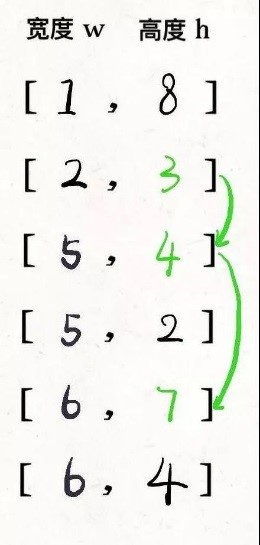

```
// envelopes = [[w, h], [w, h]...]  
public int maxEnvelopes(int[][] envelopes) {  
    int n = envelopes.length;  
    //按宽度升序排列，如果宽度一样，则按高度降序排列   
    Arrays.sort(envelopes, new Comparator<int[]>(){  
	public int compare(int[] a, int[] b) {  
	    return a[0] == b[0] ? b[1] - a[1] : a[0] - b[0];  
	}  
    })；  
    //对高度数组寻找LIS  
    int[] height = new int[n];  
    for (int i = 0; i < n; i++)  
	height[i] = envelopes[i][1];  
    return lengthOfLIS(height);  
}  
```

#### **最长公共子序列**
在子数组arr1[0..i]和子数组arr2[0..j]中，我们要求的子序列（最长公共子序列）长度为dp[i][j]。

dp[0][..]和dp[..][0]都应该初始化为 0，这就是 base case。

```
int[][] longestCommonSubsequence(String str1, String str2) {  
    int m = str1.length(), n = str2.length();  
    //DP table base case  
    int[][] dp = new int[m + 1][n + 1];  
    for(int i = 1; i < m + 1; i++)  
	for(int j = 1; j < n + 1; j++)  
	    if(str1.charAt(i - 1) == str2.charAt(j - 1))   
		dp[i][j] = dp[i - 1][j - 1] + 1;  
	    else   
		dp[i][j] = Math.max(dp[i - 1][j], dp[i][j - 1]);  
    return dp[m][n];  
}  
```

#### **最长回文子序列**
在子数组array[i..j]中，我们要求的子序列（最长回文子序列）的长度为dp[i][j]。

base case，如果只有一个字符，显然最长回文子序列长度是 1，也就是dp[i][j] = 1,(i == j)

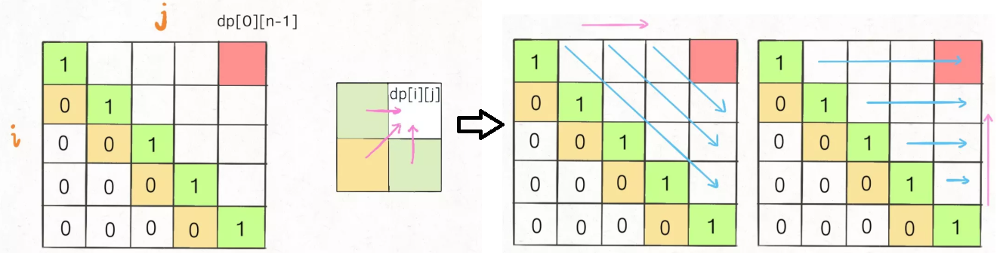

为了保证每次计算dp[i][j]，左、下、左下三个方向的位置已经被计算出来，只能**斜着遍历**或者**反着遍历**：

【斜着遍历】:
```
// 斜着遍历数组  
for (int l = 2; l <= n; l++) {  
    for (int i = 0; i <= n - l; i++) {  
	int j = l + i - 1;  
	// 计算 dp[i][j]  
    }  
}  
```


【反着遍历】：

```
int longestPalindromeSubseq(string s) {  
    int n = s.size();  
    // dp 数组全部初始化为 0  
    vector<vector<int>> dp(n, vector<int>(n, 0));  
    // base case  
    for (int i = 0; i < n; i++)  
	dp[i][i] = 1;  
    // 反着遍历保证正确的状态转移  
    for (int i = n - 1; i >= 0; i--) {  
	for (int j = i + 1; j < n; j++) {  
	    // 状态转移方程  
	    if (s[i] == s[j])  
		dp[i][j] = dp[i + 1][j - 1] + 2;  
	    else  
		dp[i][j] = max(dp[i + 1][j], dp[i][j - 1]);  
	}  
    }  
    // 整个 s 的最长回文子串长度  
    return dp[0][n - 1];  
}  
```

状态压缩：

base case: 投影

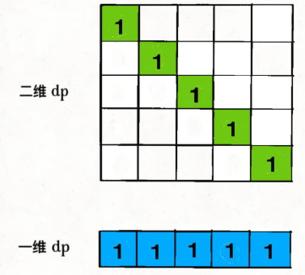

状态转移：从二维到一维

dp[j]赋新值之前：

- dp[j]的值就是外层 for 循环上一次迭代算出来的值，也就是对应二维dp数组中dp[i+1][j]的位置。

- dp[j-1]的值就是内层 for 循环上一次迭代算出来的值，也就是对应二维dp数组中dp[i][j-1]的位置。

- 只要保存dp[j]的值即dp[i+1][j]，到下一轮内层循环时，即j++了，不就变成dp[i+1][j+1]了。

```
int longestPalindromeSubseq(string s) {  
    int n = s.size();  
    // base case：一维 dp 数组全部初始化为 1  
    vector<int> dp(n, 1);  
  
    for (int i = n - 2; i >= 0; i--) {  
	int pre = 0;  
	for (int j = i + 1; j < n; j++) {  
	    int temp = dp[j];  
	    // 状态转移方程  
	    if (s[i] == s[j])  
		// dp[i][j] = dp[i+1][j-1] + 2;  
		dp[j] = pre + 2;  
	    else  
		// dp[i][j] = max(dp[i+1][j], dp[i][j-1]);  
		dp[j] = max(dp[j], dp[j - 1]);  
	    pre = temp;  
	}  
    }  
    return dp[n - 1];  
}  
```


### **数据结构**
#### **Union-Find（并查集算法）**
解决图论中「**动态连通性**」问题的

动态连通性：给一幅图中的结点连线

「连通」是一种等价关系，也就是说具有如下三个性质：

1、自反性：节点p和p是连通的。

2、对称性：如果节点p和q连通，那么q和p也连通。

3、传递性：如果节点p和q连通，q和r连通，那么p和r也连通。

连通后的结点形成的组合称为一个连通分量，通过“自反性”知：独立的，出入度皆为0的一个结点也是一个连通分量。

使用森林（若干棵树）来表示图的动态连通性，用**数组**来具体**实现**这个【**森林**】。

应用场景：

1. 编译器判断同一个变量的不同引用，
1. 社交网络中的朋友圈计算等等。

```
class UF {  
    // 连通分量个数  
    private int count;  
    // 存储一棵树  
    private int[] parent;  
    // 记录树的“重量”  
    private int[] size;  
  
    public UF(int n) {  
	this.count = n;  
	parent = new int[n];  
	size = new int[n];  
	for (int i = 0; i < n; i++) {  
	    parent[i] = i;  
	    size[i] = 1;  
	}  
    }  
  
    public void union(int p, int q) {  
	int rootP = find(p);  
	int rootQ = find(q);  
	if (rootP == rootQ)  
	    return;  
  
	// 小树接到大树下面，较平衡  关键点1
	if (size[rootP] > size[rootQ]) {  
	    parent[rootQ] = rootP;  
	    size[rootP] += size[rootQ];  
	} else {  
	    parent[rootP] = rootQ;  
	    size[rootQ] += size[rootP];  
	}  
	count--;  
    }  
    /* 判断 p 和 q 是否互相连通 */  
    public boolean connected(int p, int q) {  
	int rootP = find(p);  
	int rootQ = find(q);  
	// 处于同一棵树上的节点，相互连通  
	return rootP == rootQ;  
    }  
  
    private int find(int x) {  
	while (parent[x] != x) {  
	    // 进行路径压缩，每次调用都会提高找到parent的速度，并且改变parent的指向  关键点2保证了树高为常数（不超过 3）
	    parent[x] = parent[parent[x]];  
	    x = parent[x];  
	}  
	return x;  
    }  
} 
```


如果带有重量平衡优化，一定会得到情况一，

而去掉重量优化，可能出现情况二。而此时高度为3，会触发路径压缩那个while循环，会多执行很多次路径压缩，将第三层节点压缩到第二层。

而情况一根本不会触发路径压缩， 也就是说，去掉重量平衡，虽然对于单个的find函数调用，时间复杂度依然是 O(1)，但是对于 API 调用的整个过程，效率会有一定的下降。

##### **删去被包围的O**
力扣第 130 题

将矩阵中完全被X围住的O替换成X，

边角上的O一定不会被围，进一步，与边角上的O相连的O也不会被X围四面，也不会被替换

传统解法：

①先用 for 循环遍历棋盘的四边，用 DFS 算法把那些与边界相连的O换成一个特殊字符，比如#


②然后再遍历整个棋盘，把剩下的O换成X，把#恢复成O


二维坐标映射到一维的常用技巧：索引从0开始： (x,y) à x\*n+y 【m行n列】

使用union-find:


```
void solve(char[][] board) {  
    if (board.length == 0) return;  
  
    int m = board.length;  
    int n = board[0].length;  
    // 给 dummy 留一个额外位置  
    UF uf = new UF(m * n + 1);  
    int dummy = m * n;  
    // 将首列和末列的 O 与 dummy 连通  
    for (int i = 0; i < m; i++) {  
	if (board[i][0] == 'O')  
	    uf.union(i * n, dummy);  
	if (board[i][n - 1] == 'O')  
	    uf.union(i * n + n - 1, dummy);  
    }  
    // 将首行和末行的 O 与 dummy 连通  
    for (int j = 0; j < n; j++) {  
	if (board[0][j] == 'O')  
	    uf.union(j, dummy);  
	if (board[m - 1][j] == 'O')  
	    uf.union(n * (m - 1) + j, dummy);  
    }  
    // 方向数组 d 是上下左右搜索的常用手法  
    int[][] d = new int[][]{ {1,0}, {0,1}, {0,-1}, {-1,0} };  
    for (int i = 1; i < m - 1; i++)   
	for (int j = 1; j < n - 1; j++)   
	    if (board[i][j] == 'O')  
		// 将此 O 与上下左右的 O 连通  
		for (int k = 0; k < 4; k++) {  
		    int x = i + d[k][0];  
		    int y = j + d[k][1];  
		    if (board[x][y] == 'O')  
			uf.union(x * n + y, i * n + j);  
		}  
    // 以上是将所有与边界相连的O都连在一棵dummy树上  
    // 如果不和 dummy 连通的 O，都要被替换  
    for (int i = 1; i < m - 1; i++)   
	for (int j = 1; j < n - 1; j++)   
	    if (!uf.connected(dummy, i * n + j))  
		board[i][j] = 'X';  
}  
```

##### **判定合法算式**
```
boolean equationsPossible(String[] equations) {  
    // 26 个英文字母  
    UF uf = new UF(26);  
    // 先让相等的字母形成连通分量  
    for (String eq : equations) {  
	if (eq.charAt(1) == '=') {  
	    char x = eq.charAt(0);  
	    char y = eq.charAt(3);  
	    uf.union(x - 'a', y - 'a');  
	}  
    }  
    // 检查不等关系是否打破相等关系的连通性  
    for (String eq : equations) {  
	if (eq.charAt(1) == '!') {  
	    char x = eq.charAt(0);  
	    char y = eq.charAt(3);  
	    // 如果相等关系成立，就是逻辑冲突  
	    if (uf.connected(x - 'a', y - 'a'))  
		return false;  
	}  
    }  
    return true;  
}
```

#### **LRU**
力扣第 146 题

需要数据结构：LinkedHashMap【put时，是插入尾部】


```
class LRUCache {  
    int cap;  
    LinkedHashMap<Integer, Integer> linkedHashMap = new LinkedHashMap<>();  
    public LRUCache(int capacity) {   
	this.cap = capacity;  
    }  
  
    public int get(int key) {  
	if (!linkedHashMap.containsKey(key)) {  
	    return -1;  
	}  
	// 将 key 变为最近使用  
	makeRecently(key);  
	return linkedHashMap.get(key);  
    }  
  
    public void put(int key, int val) {  
	if (linkedHashMap.containsKey(key)) {  
	    // 修改 key 的值，插入的是双向链表的尾部  
	    linkedHashMap.put(key, val);  
	    // 将 key 变为最近使用  
	    makeRecently(key);  
	    return;  
	}  
  
	if (linkedHashMap.size() >= this.cap) {  
	    // 链表头部就是最久未使用的 key  
	    int oldestKey = linkedHashMap.keySet().iterator().next();  
	    linkedHashMap.remove(oldestKey);  
	}  
	// 将新的 key 添加链表尾部  
	linkedHashMap.put(key, val);  
    }  
  
    private void makeRecently(int key) {  
	int val = linkedHashMap.get(key);  
	// 删除 key，重新插入到队尾  
	linkedHashMap.remove(key);  
	linkedHashMap.put(key, val);  
    }  
}  
```


#### **LFU**
淘汰访问频次最低的数据，如果访问频次最低的数据有多条，需要淘汰最旧的数据。

```
class LFUCache {
    // key 到 val 的映射，我们后文称为 KV 表  
    HashMap<Integer, Integer> keyToVal;
    // key 到 freq 的映射，我们后文称为 KF 表  
    HashMap<Integer, Integer> keyToFreq;
    // freq 到 key 列表的映射，我们后文称为 FK 表，freq对key是一对多的关系  
    HashMap<Integer, LinkedHashSet<Integer>> freqToKeys;
    // 记录最小的频次，避免遍历一遍去找  
    int minFreq;
    // 记录 LFU 缓存的最大容量  
    int cap;
    public LFUCache(int capacity) {
        keyToVal = new HashMap<>();
        keyToFreq = new HashMap<>();
        freqToKeys = new HashMap<>();
        this.cap = capacity;
        this.minFreq = 0;
    }
    public int get(int key) {
        if (!keyToVal.containsKey(key)) {
            return -1;
        }
        // 增加 key 对应的 freq  
        increaseFreq(key);
        return keyToVal.get(key);
    }
    public void put(int key, int val) {
        if (this.cap <= 0) return;
        /* 若 key 已存在，修改对应的 val 即可 */
        if (keyToVal.containsKey(key)) {
            keyToVal.put(key, val);
            // key 对应的 freq 加一  
            increaseFreq(key);
            return;
        }
        /* key 不存在，需要插入 */
        /* 容量已满的话需要淘汰一个 freq 最小的 key */
        if (this.cap <= keyToVal.size()) {
            removeMinFreqKey();
        }
        /* 插入 key 和 val，对应的 freq 为 1 */
        // 插入 KV 表  
        keyToVal.put(key, val);
        // 插入 KF 表  
        keyToFreq.put(key, 1);
        // 插入 FK 表  
        freqToKeys.putIfAbsent(1, new LinkedHashSet<>());
        freqToKeys.get(1).add(key);
        // 插入新 key 后最小的 freq 肯定是 1  
        this.minFreq = 1;
    }
    private void increaseFreq(int key) {
        int freq = keyToFreq.get(key);
        /* 更新 KF 表 */
        keyToFreq.put(key, freq + 1);
        /* 更新 FK 表 */
        // 将 key 从 freq 对应的列表中删除  
        freqToKeys.get(freq).remove(key);
        // 将 key 加入 freq + 1 对应的列表中  
        freqToKeys.putIfAbsent(freq + 1, new LinkedHashSet<>());
        freqToKeys.get(freq + 1).add(key);
        // 如果 freq 对应的列表空了，移除这个 freq  
        if (freqToKeys.get(freq).isEmpty()) {
            freqToKeys.remove(freq);
            // 如果这个 freq 恰好是 minFreq，更新 minFreq  
            if (freq == this.minFreq) {
                this.minFreq++;
            }
        }
    }
    private void removeMinFreqKey() {
        // freq 最小的 key 列表  
        LinkedHashSet<Integer> keyList = freqToKeys.get(this.minFreq);
        // 其中最先被插入的那个 key 即最旧的key，就是该被淘汰的 key  
        int deletedKey = keyList.iterator().next();
        /* 更新 FK 表 */
        keyList.remove(deletedKey);
        if (keyList.isEmpty()) {
            freqToKeys.remove(this.minFreq);
            // 问：这里需要更新 minFreq 的值吗？
        }
        /* 更新 KV 表 */
        keyToVal.remove(deletedKey);
        /* 更新 KF 表 */
        keyToFreq.remove(deletedKey);
    }
}
```


#### **最大频率栈**
力扣第 895 题

```
class FreqStack {  
    // 记录 FreqStack 中元素的最大频率  
    int maxFreq = 0;  
    // 记录 FreqStack 中每个 val 对应的出现频率，后文就称为 VF 表  
    HashMap<Integer, Integer> valToFreq = new HashMap<>();  
    // 记录频率 freq 对应的 val 列表，后文就称为 FV 表  
    HashMap<Integer, Stack<Integer>> freqToVals = new HashMap<>();  
    // 在栈中加入一个元素 val  
    public void push(int val) {  
	// 修改 VF 表：val 对应的 freq 加一  
	int freq = valToFreq.getOrDefault(val, 0) + 1;  
	valToFreq.put(val, freq);  
	// 修改 FV 表：在 freq 对应的列表加上 val  
	freqToVals.putIfAbsent(freq, new Stack<>());  
	freqToVals.get(freq).push(val);  
	// 更新 maxFreq  
	maxFreq = Math.max(maxFreq, freq);  
    }  
    // 从栈中删除并返回出现频率最高的元素  
    // 如果频率最高的元素不止一个，  
    // 则返回最近添加的那个元素  
    public int pop() {  
	// 修改 FV 表：pop 出一个 maxFreq 对应的元素 v  
	Stack<Integer> vals = freqToVals.get(maxFreq);  
	int v = vals.pop();  
	// 修改 VF 表：v 对应的 freq 减一  
	int freq = valToFreq.get(v) - 1;  
	valToFreq.put(v, freq);  
	// 更新 maxFreq  
	if (vals.isEmpty()) {  
	    // 如果 maxFreq 对应的元素空了  
	    maxFreq--;  
	}  
	return v;  
    }  
}  
```

#### **数据流的中位数**
力扣第 295 题

维护：

```
class MedianFinder {  
    private PriorityQueue<Integer> large;  
    private PriorityQueue<Integer> small;  
    public MedianFinder() {  
	// 小顶堆，存的是较大的数据  
	large = new PriorityQueue<>();  
	// 大顶堆，存的是较小的数据，使用的是Comparator将其变为大根堆  
	small = new PriorityQueue<>((a, b) -> {  
	    return b - a;  
	}  
	);  
    }  
    public double findMedian() {  
	// 如果元素不一样多，多的那个堆的堆顶元素就是中位数  
	if (large.size() < small.size()) {  
	    return small.peek();  
	} else if (large.size() > small.size()) {  
	    return large.peek();  
	}  
	// 如果元素一样多，两个堆堆顶元素的平均数是中位数  
	return (large.peek() + small.peek()) / 2.0;  
    }  
    public void addNum(int num) {  
	if (small.size() >= large.size()) {  
	    small.offer(num);  
	    large.offer(small.poll());  
	} else {  
	    large.offer(num);  
	    small.offer(large.poll());  
	}  
    }  
}  
```

添加元素，假设向large中插入元素：

如果插入的num小于small的堆顶元素，那么num就会留在small堆里，为了保证两个堆的元素数量之差不大于 1，作为交换，把small堆顶部的元素再插到large堆里。

如果插入的num大于small的堆顶元素，那么num就会成为samll的堆顶元素，最后还是会被插入large堆中。

反之，向small中插入元素是一个道理，

#### **朋友圈时间线**
LeetCode 上第 335 道题

刚加到女神的微信，然后我去刷新一下我的朋友圈动态，那么女神的动态就会出现在我的动态列表，而且会和其他动态按时间排好序。

就是搞个大根堆，然后合并k个有序链表。
#### **单调栈**
##### **下一个更大元素 I**
力扣第 496 题：从后面找比当前索引指向的元素更大的元素

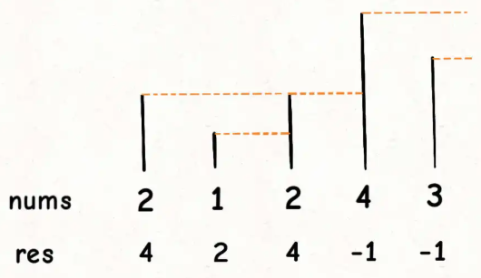

O(n)：总共有n个元素，每个元素都被push入栈了一次，而最多会被pop一次，没有任何冗余操作。所以总的计算规模是和元素规模n成正比的。

```
vector<int> nextGreaterElement(vector<int>& nums) {  
    vector<int> res(nums.size()); // 存放答案的数组  
    stack<int> s;  
    // 倒着往栈里放  
    for (int i = nums.size() - 1; i >= 0; i--) {  
	// 判定个子高矮  
	while (!s.empty() && s.top() <= nums[i]) {  
	    // 矮个起开，反正也被挡着了。。。  
	    s.pop();  
	}  
	// nums[i] 身后的 next great number  
	res[i] = s.empty() ? -1 : s.top();  
	//   
	s.push(nums[i]);  
    }  
    return res;  
}  
```

##### **更暖和的气温**
力扣第 1118 题：从后面找比当前索引指向的元素更大的元素

```
vector<int> dailyTemperatures(vector<int>& T) {  
    vector<int> res(T.size());  
    // 这里放元素索引，而不是元素  
    stack<int> s;   
    /* 单调栈模板 */  
    for (int i = T.size() - 1; i >= 0; i--) {  
	while (!s.empty() && T[s.top()] <= T[i]) {  
	    s.pop();  
	}  
	// 得到索引间距  
	res[i] = s.empty() ? 0 : (s.top() - i);   
	// 将索引入栈，而不是元素  
	s.push(i);   
    }  
    return res;  
}  
```

##### **下一个更大元素 II**
如果是循环数组，常用套路就是将数组长度翻倍：

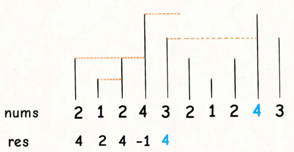

``` 
vector<int> nextGreaterElements(vector<int>& nums) {  
    int n = nums.size();  
    vector<int> res(n);  
    stack<int> s;  
    // 假装这个数组长度翻倍了  
    for (int i = 2 * n - 1; i >= 0; i--) {  
	// 索引要求模，其他的和模板一样  
	while (!s.empty() && s.top() <= nums[i % n])  
	    s.pop();  
	res[i % n] = s.empty() ? -1 : s.top();  
	s.push(nums[i % n]);  
    }  
    return res;  
} 
```


#### **单调队列**
##### **滑动窗口最大值**
力扣第 239 题

push操作中含有 while 循环，复杂度确实不是O(1)，但是算法整体的复杂度依然是O(N)线性时间。要这样想，nums中的每个元素最多被push\_back和pop\_back一次，没有任何多余操作，所以整体的复杂度还是O(N)


```
/* 单调队列的实现 */  
class MonotonicQueue {  
    LinkedList<Integer> q = new LinkedList<>();  
    public void push(int n) {  
	// 将小于 n 的元素全部删除  
	while (!q.isEmpty() && q.getLast() < n) {  
	    q.pollLast();  
	}  
	// 然后将 n 加入尾部  
	q.addLast(n);  
    }  
  
    public int max() {  
	return q.getFirst();  
    }  
  
    public void pop(int n) {  
	if (n == q.getFirst()) {  
	    q.pollFirst();  
	}  
    }  
}  
  
/* 解题函数的实现 */  
int[] maxSlidingWindow(int[] nums, int k) {  
    MonotonicQueue window = new MonotonicQueue();  
    List<Integer> res = new ArrayList<>();  
  
    for (int i = 0; i < nums.length; i++) {  
	if (i < k - 1) {  
	    //先填满窗口的前 k - 1  
	    window.push(nums[i]);  
	} else {  
	    // 窗口向前滑动，加入新数字  
	    window.push(nums[i]);  
	    // 记录当前窗口的最大值  
	    res.add(window.max());  
	    // 移出旧数字  
	    window.pop(nums[i - k + 1]);  
	}  
    }  
    // 需要转成 int[] 数组再返回  
    int[] arr = new int[res.size()];  
    for (int i = 0; i < res.size(); i++) {  
	arr[i] = res.get(i);  
    }  
    return arr;  
}  
```

#### **栈实现队列**
```
class MyQueue {
    private Stack<Integer> s1, s2;
    public MyQueue() {
        s1 = new Stack<>();
        s2 = new Stack<>();
    }
    /** 添加元素到队尾 */
    public void push(int x) {
        s1.push(x);
    }
    /** 返回队头元素 */
    public int peek() {
        if (s2.isEmpty())  
            // 把 s1 元素压入 s2  
            while (!s1.isEmpty())  
                s2.push(s1.pop());
        return s2.peek();
    }
    /** 删除队头的元素并返回 */
    public int pop() {
        // 先调用 peek 保证 s2 非空  
        peek();
        return s2.pop();
    }
    /** 判断队列是否为空 */
    public Boolean empty() {
        return s1.isEmpty() && s2.isEmpty();
    }
}
```

#### **队列实现栈**
```
class MyStack {  
    Queue<Integer> q = new LinkedList<>();  
    int top_elem = 0;  
  
    /** 添加元素到栈顶 */  
    public void push(int x) {  
	// x 是队列的队尾，是栈的栈顶  
	q.offer(x);  
	top_elem = x;  
    }  
  
    /** 返回栈顶元素 */  
    public int top() {  
	return top_elem;  
    }  

    /** 删除栈顶的元素并返回 */  
    public int pop() {  
        int size = q.size();  
        // 留下队尾 2 个元素  
        while (size > 2) {  
        q.offer(q.poll());  
        size--;  
        }  
        // 记录新的队尾元素  
        top_elem = q.peek();  
        q.offer(q.poll());  
        // 删除之前的队尾元素  
        return q.poll();  
    }  
    /** 判断栈是否为空 */  
    public boolean empty() {  
        return q.isEmpty();  
    } 
}  
 
```

### **二分搜索**
#### **吃香蕉**
力扣第 875 题

```
// 定义：速度为 x 时，需要 f(x) 小时吃完所有香蕉  
// f(x) 随着 x 的增加单调递减  
int f(int[] piles, int x) {  
    int hours = 0;  
    for (int i = 0; i < piles.length; i++) {  
	hours += piles[i] / x;  
	if (piles[i] % x > 0) {  
	    hours++;  
	}  
    }  
    return hours;  
}  
public int minEatingSpeed(int[] piles, int H) {  
    int left = 1;  
    //题目说了1 <= piles[i] <= 10^9，也就是速度最快可以一小时内吃10^9  
    //开区间，需要加1  
    int right = 1000000000 + 1;  
    while (left < right) {  
	int mid = left + (right - left) / 2;  
	if (f(piles, mid) == H) {  
	    // 搜索左侧边界，则需要收缩右侧边界  
	    right = mid;  
	} else if (f(piles, mid) < H) {  
	    // 需要让 f(x) 的返回值大一些  
	    right = mid;  
	} else if (f(piles, mid) > H) {  
	    // 需要让 f(x) 的返回值小一些  
	    left = mid + 1;  
	}  
    }  
    return left;  
}  
```


#### **运送货物**
力扣第 1011 题

```
// 定义：当运载能力为 x 时，需要 f(x) 天运完所有货物  
// f(x) 随着 x 的增加单调递减  
int f(int[] weights, int x) {  
    int days = 0;  
    for (int i = 0; i < weights.length; ) {  
	// 尽可能多装货物  
	int cap = x;  
	while (i < weights.length) {  
	    if (cap < weights[i]) break; else cap -= weights[i];  
	    i++;  
	}  
	days++;  
    }  
    return days;  
}  
public int shipWithinDays(int[] weights, int days) {  
    int left = 0;  
    // 注意，right 是开区间，所以额外加一  
    //最大载重显然就是weights数组所有元素之和，也就是一次把所有货物都装走。  
    int right = 1;  
    for (int w : weights) {  
	left = Math.max(left, w);  
	right += w;  
    }  
    while (left < right) {  
	int mid = left + (right - left) / 2;  
	if (f(weights, mid) == days) {  
	    // 搜索左侧边界，则需要收缩右侧边界  
	    right = mid;  
	} else if (f(weights, mid) < days) {  
	    // 需要让 f(x) 的返回值大一些  
	    right = mid;  
	} else if (f(weights, mid) > days) {  
	    // 需要让 f(x) 的返回值小一些  
	    left = mid + 1;  
	}  
    }  
    return left;  
}  
```

#### **分割数组的最大值**
力扣第 410 题

①回溯暴力穷举可以在哪几个地方进行分割的组合个数，根据穷举结果去计算每种方案的最大子数组和。

②

```
/* 辅助函数，若限制最大子数组和为 max， 
计算 nums 至少可以被分割成几个子数组 */  
int split(int[] nums, int max) {  
    // 至少可以分割的子数组数量  
    int count = 1;  
    // 记录每个子数组的元素和  
    int sum = 0;  
    for (int i = 0; i < nums.length; i++) {  
	if (sum + nums[i] > max) {  
	    // 如果当前子数组和大于 max 限制  
	    // 则这个子数组不能再添加元素了  
	    count++;  
	    sum = nums[i];  
	} else {  
	    // 当前子数组和还没达到 max 限制  
	    // 还可以添加元素  
	    sum += nums[i];  
	}  
    }  
    return count;  
}  
int splitArray(int[] nums, int m) {  
    // 一般搜索区间是左开右闭的，所以 hi 要额外加一  
    //最大子数组和max的取值范围显然是，子数组至少包含一个元素，或至多包含整个数组，  
    int lo = getMax(nums), hi = getSum(nums) + 1;  
    while (lo < hi) {  
	int mid = lo + (hi - lo) / 2;  
	// 根据分割子数组的个数收缩搜索区间  
	int n = split(nums, mid);  
	if (n == m) {  
	    // 收缩右边界，达到搜索左边界的目的  
	    hi = mid;  
	} else if (n < m) {  
	    // 最大子数组和上限高了，减小一些  
	    hi = mid;  
	} else if (n > m) {  
	    // 最大子数组和上限低了，增加一些  
	    lo = mid + 1;  
	}  
    }  
    return lo;  
}  
int getMax(int[] nums) {/* 计算数组中的最大值 */}  
int getSum(int[] nums) {/* 计算数组元素和 */}  
```

### **随机**
#### **实现O(1)随机集合**
增、删、随机获得一个值，都是O(1)

```
class RandomizedSet {  
public:  
    // 存储元素的值  
    vector<int> nums;  
    // 记录每个元素对应在 nums 中的索引  
    unordered_map<int,int> valToIndex;  
  
    bool insert(int val) {  
	// 若 val 已存在，不用再插入  
	if (valToIndex.count(val)) {  
	    return false;  
	}  
	// 若 val 不存在，插入到 nums 尾部，  
	// 并记录 val 对应的索引值  
	valToIndex[val] = nums.size();  
	nums.push_back(val);  
	return true;  
    }  
  
    bool remove(int val) {  
	// 若 val 不存在，不用再删除  
	if (!valToIndex.count(val)) {  
	    return false;  
	}  
	// 先拿到 val 的索引  
	int index = valToIndex[val];  
	// 将最后一个元素对应的索引修改为 index  
	valToIndex[nums.back()] = index;  
	// 交换 val 和最后一个元素  
	swap(nums[index], nums.back());  
	// 在数组中删除元素 val  
	nums.pop_back();  
	// 删除元素 val 对应的索引  
	valToIndex.erase(val);  
	return true;  
    }  
  
    int getRandom() {  
	// 随机获取 nums 中的一个元素  
	return nums[rand() % nums.size()];  
    }  
}; 
```

#### **避开黑名单的随机数**
将黑名单的索引映射到白名单中，这样就算获得了黑名单的索引，其实引用的是白名单的。

```
class Solution {  
public:  
    int sz;  
    unordered_map<int, int> mapping;  
  
    Solution(int N, vector<int>& blacklist) {  
	sz = N - blacklist.size();  
	for (int b : blacklist) {  
	    mapping[b] = 666;  
	}  
  
	int last = N - 1;  
	for (int b : blacklist) {  
	    // 如果 b 已经在区间 [sz, N)  
	    // 可以直接忽略  
	    if (b >= sz) {  
		continue;  
	    }  
	    //防止映射过后的索引还是黑名单的索引，  
	    //必须将黑名单的索引映射到白名单的索引  
	    while (mapping.count(last)) {  
		last--;  
	    }  
	    mapping[b] = last;  
	    last--;  
	}  
    }  
  
    int pick() {  
	// 随机选取一个索引  
	int index = rand() % sz;  
	// 这个索引命中了黑名单，  
	// 需要被映射到其他位置  
	if (mapping.count(index)) {  
	    return mapping[index];  
	}  
	// 若没命中黑名单，则直接返回  
	return index;  
    }  
};  
```

### **去重**
#### **有序数组去重（快慢指针）**
力扣第26

找到重复的，跳

```
int removeDuplicates(int[] nums) {  
    int n = nums.length;  
    if (n == 0) return 0;  
    int slow = 0, fast = 1;  
    while (fast < n) {  
	if (nums[fast] != nums[slow]) {  
	    slow++；  
	    //维护nums[0. .slow]无重复   
	    nums[slow] = nums[fast];  
	}  
	fast++;  
    }  
    //长度为索引+ 1  
    return slow + 1;  
}  
```

#### **有序链表去重（快慢指针）**
力扣第83

```
ListNode deleteDuplicates(ListNode head) {  
    if (head == null) return null;  
    ListNode slow = head, fast = head.next;  
    while (fast != null) {  
	if (fast.val != slow.val) {  
	    // nums[slow]= nums[fast];   
	    slow.next = fast;  
	    // slow++；   
	    slow = slow.next;  
	}  
	// fast++   
	fast = fast.next;  
    }  
    //断开与后面重复元素的连接   
    slow.next = null;  
    return head;  
}  
```

#### **去除重复字母**
力扣第 316 题、第 1081 题

字典序最小的作为最终结果：比如说输入字符串s = "babc"，去重且符合相对位置的字符串有两个，分别是"bac"和"abc"，但是我们的算法得返回"abc"，因为它的字典序更小。

``` 
String removeDuplicateLetters(String s) {  
    Stack<Character> stk = new Stack<>();  
  
    // 维护一个计数器记录字符串中字符的数量  
    // 因为输入为 ASCII 字符，大小 256 够用了  
    int[] count = new int[256];  
    for (int i = 0; i < s.length(); i++) {  
	count[s.charAt(i)]++;  
    }  
  
    boolean[] inStack = new boolean[256];  
    for (char c : s.toCharArray()) {  
	// 每遍历过一个字符，都将对应的计数减一  
	count[c]--;  
  
	if (inStack[c]) continue;  
	//单调栈  
	while (!stk.isEmpty() && stk.peek() > c) {  
	    // 若之后不存在栈顶元素了，则停止 pop  
	    if (count[stk.peek()] == 0) {  
		break;  
	    }  
	    // 若之后还有，则可以 pop  
	    inStack[stk.pop()] = false;  
	}  
	stk.push(c);  
	inStack[c] = true;  
    }  
  
    StringBuilder sb = new StringBuilder();  
    while (!stk.empty()) {  
	sb.append(stk.pop());  
    }  
    //反转一次才是最终结果  
    return sb.reverse().toString();  
}  
```


### **双指针技巧**
#### **移除元素（快慢指针）**
力扣第27

找到target，跳

```
int removeElement(int[] nums, int val) {  
    int fast = 0, slow = 0;  
    while (fast < nums.length) {  
	if (nums[fast] != val) {  
	    nums[slow] = nums[fast];  
	    slow++;  
	}  
	fast++;  
    }  
    return slow;  
}  
```

#### **移动0（快慢指针）**
```
void moveZeroes(int[] nums) {  
    // 去除 nums 中的所有 0  
    // 返回去除 0 之后的数组长度  
    int p = removeElement(nums, 0);  
    // 将 p 之后的所有元素赋值为 0  
    for (; p < nums.length; p++) {  
	nums[p] = 0;  
    }  
}  
```

### **最长回文子串**
少有的动态规划非最优解法的问题。

```
String longestPalindrome(String s) {  
    String res;  
    for(int i = 0; i < s.size(); i++) {  
	String s1 = palindrome(s, i, i);  //返回以s[l]和s[r]为中心的最长回文串
	String s2 = palindrome(s, i, i + 1);  
	// res = longest(res, s1, s2)  
	res = res.size() > s1.size() ? res : s1;  
	res = res.size() > s2.size() ? res : s2;  
    }  
    return res;  
}  
```

### **前缀和数组**
如何快速得到某个⼦数组的和，主要适用的场景是原始数组不会被修改的情况下，频繁查询某个区间的累加和。


```
int subarraySum(int[] nums, int k) {  
    int n = nums.length;  
    // map：前缀和 -> 该前缀和出现的次数  
    HashMap<Integer, Integer> preSum = new HashMap<>();  
    // base case  
    preSum.put(0, 1);  
    int ans = 0, sum0_i = 0;  
    for (int i = 0; i < n; i++) {  
	sum0_i += nums[i];  
	// 这是我们想找的前缀和 nums[0..j]  
	int sum0_j = sum0_i - k;  
	// 如果前⾯有这个前缀和，则直接更新答案  
	if (preSum.containsKey(sum0_j))  
	ans += preSum.get(sum0_j);  
	// 把前缀和 nums[0..i] 加⼊并记录出现次数  
	preSum.put(sum0_i,  
	preSum.getOrDefault(sum0_i, 0) + 1);  
    }  
    return ans;  
}  
```

### **差分数组**

主要适用场景是频繁对原始数组的**某个区间**的元素进行**增减**。

比如说，我给你输入一个数组nums，然后又要求给区间nums[2..6]全部加 1，再给nums[3..9]全部减 3，再给nums[0..4]全部加 2，再给…

一通操作猛如虎，然后问你，最后nums数组的值是什么？

构造一个diff差分数组：**diff[i]=nums[i]-nums[i-1]**：

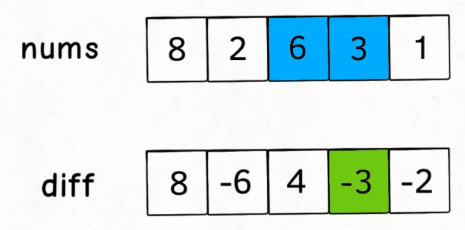

diff差分数组反推原始数组nums：**nums[i]=nums[i-1]+diff[i]**。

```
int[] nums = new int[diff.length];  
// 根据差分数组反推结果数组  
nums[0] = diff[0];  
for (int i = 1; i < diff.length; i++) {  
    nums[i] = nums[i - 1] + diff[i];  
}  
```

如果你想对区间nums[i..j]的元素全部加 3，那么只需要让diff[i] += 3，然后再让diff[j+1] -= 3即可：

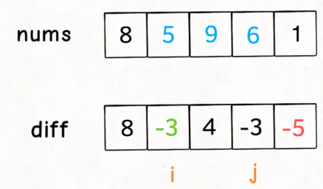

```
diff[i] += val;  
if (j + 1 < diff.length) {  
    diff[j + 1] -= val;  
} 
```

【力扣第 1109 题】「航班预订统计」

```
int[] corpFlightBookings(int[][] bookings, int n) {  
    // nums 初始化为全 0  
    int[] nums = new int[n];  
    // 构造差分解法  
    Difference df = new Difference(nums);  
  
    for (int[] booking : bookings) {  
	// 注意转成数组索引要减一哦  
	int i = booking[0] - 1;  
	int j = booking[1] - 1;  
	int val = booking[2];  
	// 对区间 nums[i..j] 增加 val  
	df.increment(i, j, val);  
    }  
    // 返回最终的结果数组  
    return df.result();  
}  
```


### **2Sum**
```
vector<vector<int>> twoSumTarget(vector<int>& nums, int target) {  
    // nums 数组必须有序  
    sort(nums.begin(), nums.end());  
    int lo = 0, hi = nums.size() - 1;  
    vector<vector<int>> res;  
    while (lo < hi) {  
	int sum = nums[lo] + nums[hi];  
	int left = nums[lo], right = nums[hi];  
	if (sum < target) {  
	    while (lo < hi && nums[lo] == left) lo++;  
	} else if (sum > target) {  
	    while (lo < hi && nums[hi] == right) hi--;  
	} else {  
	    res.push_back({left, right});  
	    while (lo < hi && nums[lo] == left) lo++;  
	    while (lo < hi && nums[hi] == right) hi--;  
	}  
    }  
    return res;  
}  
```

### **田忌赛马**
\870. 优势洗牌

打得过就打，打不过就拿自己的垃圾和对方的精锐互换。

根据这个思路，我们需要对两个数组排序，但是nums2中元素的顺序不能改变，因为计算结果的顺序依赖nums2的顺序，所以不能直接对nums2进行排序，而是利用其他数据结构来辅助。

```
int[] advantageCount(int[] nums1, int[] nums2) {  
    int n = nums1.length;  
    // 给 nums2 降序排序  
    PriorityQueue<int[]> maxpq = new PriorityQueue<>(  
	(int[] pair1, int[] pair2) -> {   
	    return pair2[1] - pair1[1];  
	}  
    );  
    for (int i = 0; i < n; i++) {  
	maxpq.offer(new int[]{i, nums2[i]});  
    }  
    // 给 nums1 升序排序  
    Arrays.sort(nums1);  
  
    // nums1[left] 是最小值，nums1[right] 是最大值  
    int left = 0, right = n - 1;  
    int[] res = new int[n];  
  
    while (!maxpq.isEmpty()) {  
	int[] pair = maxpq.poll();  
	// maxval 是 nums2 中的最大值，i 是对应索引  
	int i = pair[0], maxval = pair[1];  
	if (maxval < nums1[right]) {  
	    // 如果 nums1[right] 能胜过 maxval，那就自己上  
	    res[i] = nums1[right];  
	    right--;  
	} else {  
	    // 否则用最小值混一下，养精蓄锐  
	    res[i] = nums1[left];  
	    left++;  
	}  
    }  
    return res;  
}  
```

### **丑数**
<https://www.nowcoder.com/practice/6aa9e04fc3794f68acf8778237ba065b?tpId=117>

```
int GetUglyNumber_Solution(int idx) {  
      int i=0,j=0,k=0,now;//i,j,k分别为指向下一个*2,*3,*5可能成为下一个丑数的数的位置的指针  
      vector<int> v(1,1);//放入1个1  
      while(v.size()<idx){//v中的数量为为idx时候，停止循环  
	  now=min(v[i]*2,min(v[j]*3,v[k]*5));//三个指针运算的结果中找，下一个丑数  
	  v.push_back(now);//将下一个丑数入队  
	  if(v[i]*2==now)i++;//下一个丑数可以由v[i]*2得到，则i指针后移  
	  if(v[j]*3==now)j++;//下一个丑数可以由v[j]*3得到，则j指针后移  
	  if(v[k]*5==now)k++;//下一个丑数可以由v[k]*5得到，则k指针后移  
	  //此处不能写if -else ，因为可能存在v[i]*2==v[j]*3这种情况  
	  //那么在下一次循环中，v[j]*3就会被再次选中，这样就会造成v中有重复元素出现  
      }  
      return v[idx-1];//此处元素不能写now,当idx==1时被hack  
  }  
```