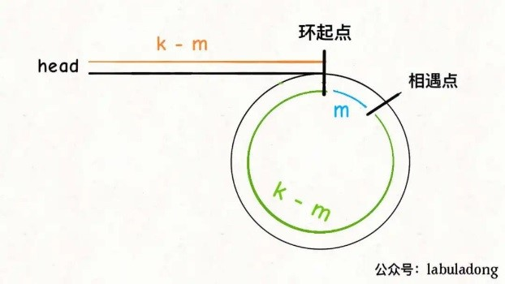

## 双指针

1、合并两个有序链表

双指针分别指向两个有序链表，使用带头结点的新链表保存新的合并链表，然后比较各指向的大小，比较完后，把剩下的指针不为空的结点再存到新的合并链表上。

2、合并k个有序链表

利用PriorityQueue，默认是小根堆，先存放进k个链表的第一个结点，然后取根结点，再重新往小根堆里添加取出结点的下一个结点，循环得到合并链表。

3、寻找单链表的倒数第k个节点

双指针，让第一个指针先走k步，然后第二个指针从头开始走，和第一个指针保持相同的速度，当第一个指针走到链尾时，则第二个指针指向倒数第k个结点。

4、寻找单链表的中点

快慢指针，第一个指针走两步，第二个指针走一步，当第一个指针走到链尾时，则第二个指针指向中间结点。

5、判断单链表是否包含环并找出环起点

快慢指针，第一个指针走两步，第二个指针走一步，当两个指针相遇时，则为有环，第一个指针走了2k,第二个指针走了k,
相遇之后，将第二个指针移到链头，假设相遇点离环起点为m步，表示，第二个指针从相遇点走k-m步则为环起点，而第一个指针也要走k-m也到环起点，也就是说，只要在两个指针相遇后，将第二个指针移到链头，然后再和第一个指针一起走，当再次相遇时就是环起点。



6、判断两个单链表是否相交并找出交点

假设第一个链表: 1->5->6
第一个链表: 3->4->5->7

让双指针分别指向两个链表，当走完各自的链表后，再移动到下一个链表，那么当两个指针所指向的结点相等时，则证明有交点。

156->3457
3457->156

7、反转数组

左右指针分别指向头和尾，然后交换，再++、--。

### 滑动窗口

```
/* 滑动窗口算法框架 */  
void slidingWindow(string s, string t) {  
    unordered_map<char, int> need, window;  
    for (char c : t) need[c]++;  
  
    int left = 0, right = 0;  
    int valid = 0;   
    while (right < s.size()) {  
	// c 是将移入窗口的字符  
	char c = s[right];  
	// 右移窗口  
	right++;  
	// 进行窗口内数据的一系列更新  
	...  
  
	/*** debug 输出的位置 ***/  
	printf("window: [%d, %d)\n", left, right);  
	/********************/  
  
	// 判断左侧窗口是否要收缩  
	while (window needs shrink) {  
	    // d 是将移出窗口的字符  
	    char d = s[left];  
	    // 左移窗口  
	    left++;  
	    // 进行窗口内数据的一系列更新  
	    ...  
	}  
    }  
}  
```