## **应用**
### **nacos**
### **openFeign**
### **rocketMQ**
使用场景：<https://www.cnblogs.com/leeego-123/p/10900256.html> 

资料:

-ordinary-rocketmq: <https://github.com/apache/rocketmq/blob/master/docs/cn/RocketMQ_Example.md>【已实现】

-springboot-rocketmq: https://blog.csdn.net/zxl646801924/article/details/105659481 【已实现，还是使用的原生api】

-rocketmq-spring-boot-starter:【官网找的demo: rocketmq-spring-boot-samples，qgao项目参考的这个】

-springcloud-rocketmq: <https://github.com/alibaba/spring-cloud-alibaba/blob/master/spring-cloud-alibaba-examples/rocketmq-example/readme-zh.md>

springcloud stream对rocketmq的相关配置属性：<https://github.com/alibaba/spring-cloud-alibaba/wiki/RocketMQ-en>

#### **启动rocketMQ**
开始下的4.9.0的服务端，结果启动mqnamesrv时报错找不到主类Files，解决不了问题，于是降低了版本，下了4.6.1的，成功启动。

在启动broker时又报找不到主类，这时将runbroker.cmd的classpath加上双引号就行了，但在之前的4.9是行不通的。

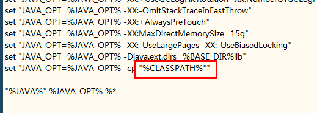

rocketmq服务端启动命令：

mqnamesrv.cmd

mqbroker.cmd -n localhost:9876 autoCreateTopicEnable=true

更改堆大小，默认是2g,2g,1g（我这个8g内存可受不了）

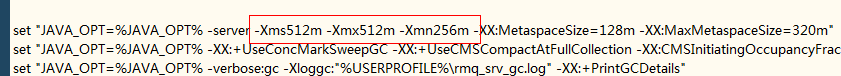

rocketMQ的控制台：<https://github.com/apache/rocketmq-externals>

改一下端口

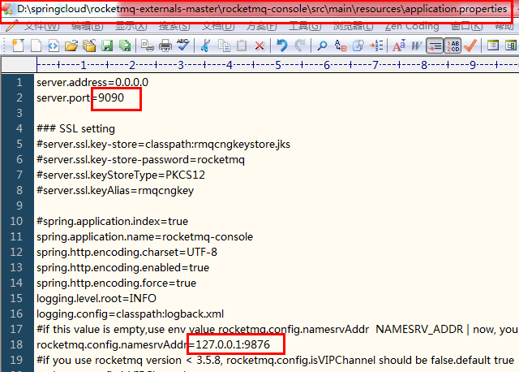

打包console:

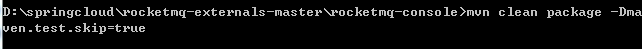

打包完成后，找到target目录里的jar包，java –jar rocketmq-console-ng-2.0.0.jar

一个消费者同时订阅多个topic：

https://blog.csdn.net/weixin\_30844301/article/details/112814966

#### **作用**
异步：解决传统rpc同步调用带来的高延迟。

解耦：解决传统的方法内部调用多个方法的强耦合，改用生产者消费者模型，生产者只需要把消息发到特定的主题，自然有相应的消费者去获得该消息，进而改善业务方法内部的调用臃肿，也便于后期代码的维护。

削峰：类似于限流，即使有再多的qps，消费者通过恒定的速率从消息队列中取消息，降低了系统的压力，比如短信系统等不需要响应即时的系统。

#### **副作用**
系统可用性降低：mq挂了。

系统复杂度提高：保证高可用，集群。

重复消费：发送方以为发送失败了（其实并没有，网络波动或Broker意外重启等等导致响应接收失败），然后执行重试，这样就可能产生重复的消息，消费端则消费重复的消息，比如增加积分，带来麻烦。

顺序消费：严格要求消息的顺序执行，否则带来麻烦，如涉及到金额的操作。

分步式事务：不能这个系统我扣钱成功了你那积分系统积分没加吧。

消息堆积：削峰的场景在生产快，消费慢，也就意味着大量的消息堆积在队列中。

#### **模型选择**
主题模型解决队列模型产生的弊端（未完全解耦）

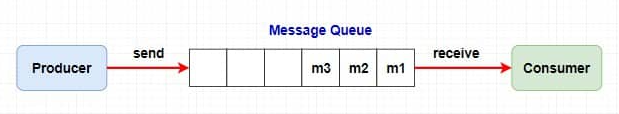

在队列模型中，生产者若将一个消息发送给多个消费者（广播），需要让 Producer 生产消息放入多个队列中，然后每个队列去对应每一个消费者。导致生产者需要知道具体消费者个数然后去复制对应数量的消息队列，这就违背我们消息中间件的 解耦 这一原则。

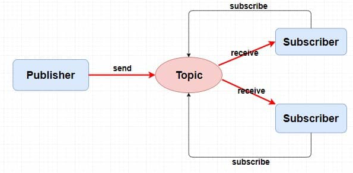

在主题模型中（发布订阅模型），存放消息的容器称为主题。

#### **rocketMQ模型**
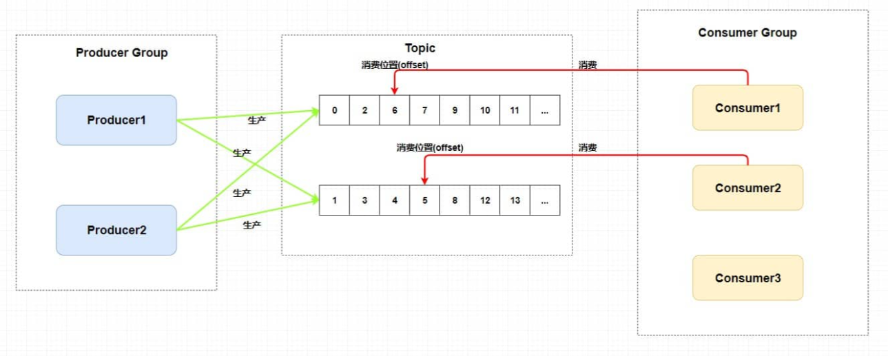

生产者组，一般生产相同的消息。

消费者组，一般消费相同的消息。

主题中存在多个队列：提高并发。

集群消费模式下，一个队列只会被一个消费者组中的一个消费者消费。

消费者组中的消费者个数大于等于主题中队列个数：多的消费者是替补。

每个消费组在每个队列上维护一个消费位置：多个消费者组，那么消息被一个消费者组消费完之后是不会删除的(因为其它消费者组也需要呀)。

#### **rocketMQ架构**

Broker就是存储消息的服务器硬件。topic集群分布在多台消息服务器上，而一台服务器当然应该有多个不同类型的topic.

一个 Topic 分布在多个 Broker上，一个 Broker 可以配置多个 Topic ，它们是多对多的关系。

如果某个 Topic 消息量很大，应该给它多配置几个队列(上文中提到了提高并发能力)，并且 尽量多分布在不同 Broker 上，以减轻某个 Broker 的压力 。

NameServer:保证高可用，必然是要集群broker以达到负载均衡的目的，为避免producer(生产者)或consumer(消费者)与众多broker直连导致有可能修改某些broker或宕机时出现的耦合问题，需要用nameServer来管理这些broker，然后接管生产者或消费者到broker的路由方式。

总结：

broker：集群，主从搭建，主挂了，从提供消费，但不支持写入。

nameServer：集群，去中心化搭建，单个broker长连接所有nameServer，30秒一次路由信息心跳。

producer：通过nameServer轮询获得某个broker，然后再轮询当前的topic中的不同队列。

consumer：同上，pull broker中的消息，

<集群>一个队列只会被一个消费者组中的一个消费者消费。

<广播>一个队列中的消息会被一个消费者组中的所有消费者重复消费。

#### **解决副作用**
1. rocketMQ的架构解决了高可用性

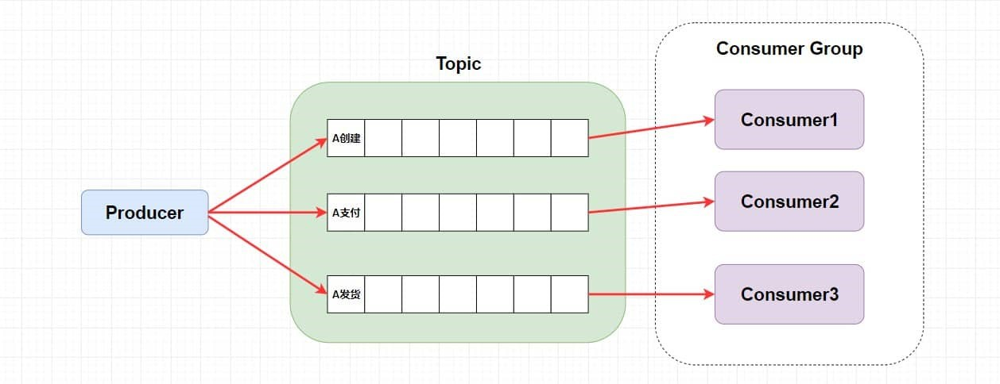

2. 以上是普通顺序模式，为了让以上三条消息严格按顺序消费，可以在业务内使用Hash取模法，来保证同一个订单在同一个队列中就行了。

3. 重复消费

消费者处理业务成功，但响应给队列失败（网络波动或Broker意外重启等等导致响应接收失败）

【幂等】：任意多次执行所产生的影响均与一次执行的影响相同。

对消费者实现幂等，也就是对同一个消息的处理结果，执行多少次都不变。

结合具体的业务，在真正的业务代码前：

①写入 Redis 来保证，因为 Redis 的 key 和 value 就是天然支持幂等的。

②使用 数据库插入法 ，基于数据库的唯一键来保证重复数据不会被插入多条。

4. 分布式事务（本地事务和存储消息到消息队列才是同一个事务。这样也就产生了事务的最终一致性）

事务消息+事务反查机制

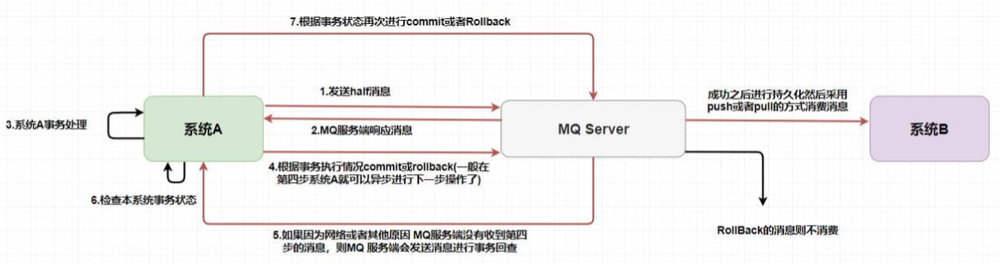

事务反查机制：如果消息是half消息（事务消息），复制原消息的主题与消息消费队列，然后 改变主题 为RMQ\_SYS\_TRANS\_HALF\_TOPIC。由于消费组未订阅该主题，故消费端无法消费half类型的消息（对消费者不可见），然后RocketMQ会开启一个定时任务（上图第5步），从Topic为RMQ\_SYS\_TRANS\_HALF\_TOPIC中拉取消息进行消费，根据生产者组获取一个服务提供者发送回查事务状态请求，根据事务状态来决定是提交或回滚消息。

5. 消息堆积

生产者太快：限流、降级

消费者太慢：水平扩展，增加消费者，提高消费能力（别忘记增加topic的队列）

回溯消费

某种特定业务情况下，需要消费已经重复消费过的消息，而被消费过的消息并未被删除，因此可以通过向前移动指针做到回溯消费。例如由于 Consumer 系统故障，恢复后需要重新消费1小时前的数据，有幂等的情况下不怕存在错误消费的情况。

#### **刷盘策略**
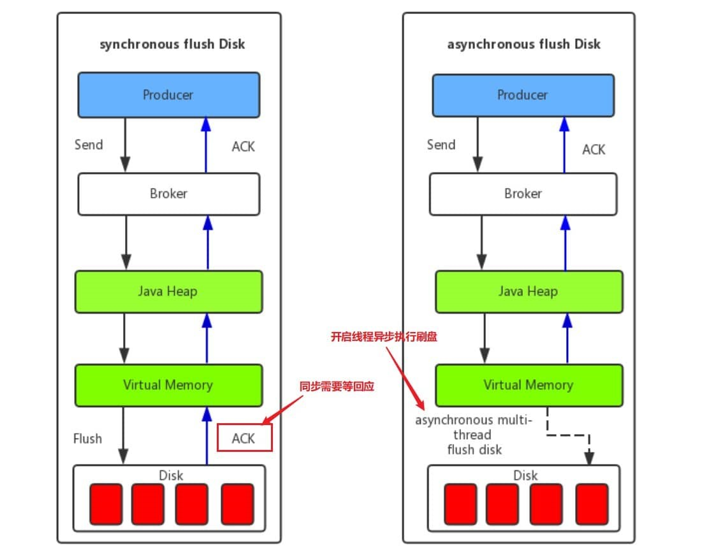

同步刷盘和异步刷盘是在单个结点层面的（保证可靠性）。

- 异步刷盘采用后台异步线程提交的方式进行，只有在 Broker 意外宕机的时候会丢失部分数据，可以设置 Broker 的参数 FlushDiskType 来调整刷盘策略(ASYNC\_FLUSH 或者 SYNC\_FLUSH)。

\--------------------------------

同步复制和异步复制主要是指的 Borker 主从模式下，主节点返回响应给生产者（消息发布者）的时候是否需要同步从节点。（保证可用性）

- 同步复制： 也叫 “同步双写”，也就是说，只有消息同步双写到主从结点上时才返回写入成功 。
- 异步复制： 消息写入主节点之后就直接返回写入成功 。

异步复制时，在主节点broker挂掉之后，消费者可以自动切换到从节点进行消费，但生产者不能给从节点生产消息，只有等主节点重启之后，生产者才给主结点继续生产消息，

而在主结点挂掉期间，主节点和从结点会出现短暂的消息不一致的情况，而消费者会消费从节点的消息，降低了可用性，但主结点恢复后，从节点那部分未来得及复制的消息还会继续复制。

\--------------------------------

在单主从架构中，如果一个主节点挂掉了，那么也就意味着整个系统不能再生产了。

那就多主从架构，当前用的一个主结点挂掉，就切换另外的可用主结点提供写入功能。但这不能保证消息的严格顺序，因为挂掉的主结点中的队列必然和切换后的主结点的队列不同。

rocketMQ采用了Dledger多主从架构，要求写入消息的时候，至少消息复制到半数以上的其它主节点之后，才给客户端返回写⼊成功，并且它是⽀持通过选举来动态切换主节点的。在 Dledger 选举过程中是无法提供服务的，而且他必须要使用三个节点或以上，如果多数节点同时挂掉他也是无法保证可用性的，

要求消息复制半数以上主节点的效率，和直接异步复制还是有一定的差距的。

#### **存储机制**
commitLog：broker刷盘时存储的消息主体以及元数据的存储主体，消息主要是顺序写入日志文件，当文件满了，写入下一个文件。

ConsumeQueue：基于 topic 的 commitlog 索引文件，提高消息消费的性能（Consumer 即可根据 ConsumeQueue 来查找待消费的消息），具体存储路径为：$HOME/store/consumequeue/{topic}/{queueId}/{fileName}。每个 ConsumeQueue文件大小约5.72M，由30W个条目组成，可以像数组一样随机访问每一个条目，每一个条目采取定长设计共20个字节，分别为8字节的 commitlog 物理偏移量、4字节的消息长度、8字节tag hashcode。

IndexFile：提供了一种可以通过key或时间区间来查询到commitLog中消息的方法。（了解即可）

消息是如何存储以及被消费到的：

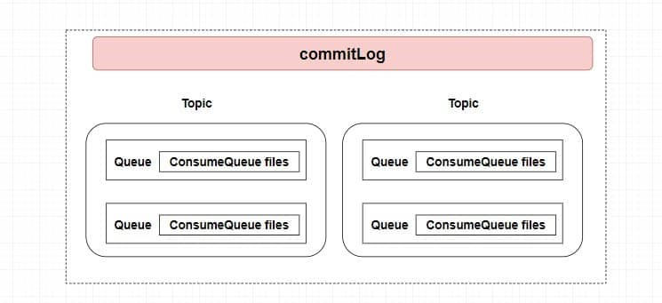

1. 生产者发送到broker的消息会指定 Topic 、QueueId 和具体消息内容，

2. Broker全部顺序存储到了 CommitLog。根据生产者指定的 Topic 和 QueueId 将这条消息本身在 CommitLog 的偏移(offset)，消息本身大小，和tag的hash值存入到该队列对应的 ConsumeQueue 索引文件中。

3. 每个队列中都保存了 ConsumeOffset 即每个消费者组的消费位置（存储的是消费到consumeQueue第几个条目了，只要使用它乘以条目固定长度20字节，就可以获得在consumeQueue中的位置，然后获得下一个20个字节的条目，根据它找到在commitLog中的真正需要被消费的消息内容）。

#### **常见问题**
防止消息丢失，每发送一个消息，同步落盘后才返回生产者消息发送成功。

FileChannel + DirectBuffer 池，使用堆外内存，加快内存拷贝，快速刷盘。

消息堆积时，消息定时转移或采用某种丢弃策略，或者对某些重要的 TAG 型（支付型）消息真正落库（添加到数据库）。

定时消息的原理是：创建特定时间精度的 MessageQueue，例如生产者需要定时1s之后被消费者消费，你只需要将此消息发送到特定的 Topic，例如：MessageQueue-1 表示这个 MessageQueue 里面的消息都会延迟一秒被消费，然后 Broker 会在 1s 后发送到消费者消费此消息，使用 newSingleThreadScheduledExecutor 实现。

顺序消费的前提是：消费者内部是串行的依次消费该 MessageQueue，引入锁来实现串行，前一个消费阻塞时后面都会被阻塞。

分布式事务消息原理：

1. 生产者发送事务消息，假设该事务消息 Topic 为 Topic1-Trans，

1. Broker 得到后首先更改该消息的 Topic 为 Topic1-Prepared，该 Topic1-Prepared 对消费者不可见。

1. 然后定时回调生产者的本地事务A执行状态，根据本地事务A执行状态，来是否将该消息修改为 Topic1-Commit 或 Topic1-Rollback，消费者就可以正常找到该事务消息或者不执行等。

【最后回滚了，事务消息也不会物理删除，只会逻辑删除该消息】

push基于pull模式实现，Broker 定时任务每5s将消息推送到消费者，consumer把轮询过程封装了，并注册MessageListener监听器，取到消息后，唤醒MessageListener的consumeMessage()来消费，对用户而言，感觉消息是被推送过来的。

NameServer 集群间互不通信，它们之间的注册信息可能会不一致。

消息过滤器（Producer 发送消息到 Broker，Broker 存储消息信息，Consumer 消费时请求 Broker 端从磁盘文件查询消息文件时,在 Broker 端就使用过滤服务器进行过滤）。

组件通信间使用 Netty 的自定义协议。

