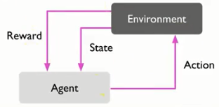
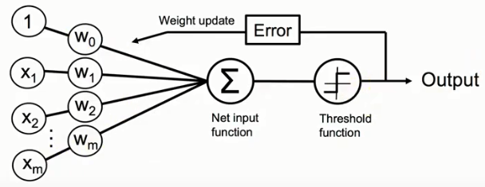
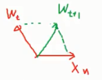
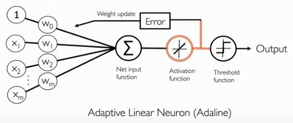
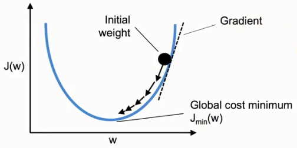
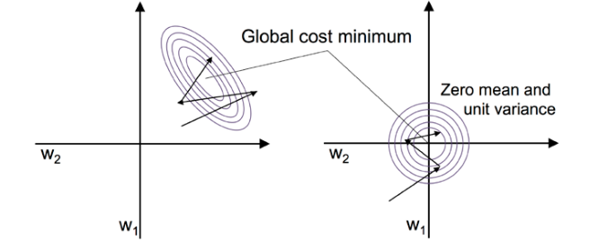

# ai篇

## 机器学习分类

1.监督式学习

2.非监督式学习

3.强化学习

### 监督式学习与非监督式学习的最大不同

前者给答案与反馈去训练算法，后者不给，由自己去找数据里隐藏的结构。

### 强化学习

举例子，去面试，在经过考官一系列的问题后，在这个过程中，考官不给任何反馈，直到最后，考官会根据你的表现给出评分，如果成绩不好，就要自己反思到底是过程的哪一步没做好。（大概像是这样的操作）

## 1.感知机（perceptron）

这是一个简单的二元分类（指只能区分两种种类不同的样本）算法，规定数据必须线性可分，否则训练时无法停下来，该算法希望在一堆数据里面找到一条直线能使其被分成2类。

该直线定义为Z.

Z=w1x1+w2x2+w3x3+w4x4+…+wnxn.

规定：

φ(Z)=1,if Z \>= θ

φ(Z)=-1,otherwise

注:x1,x2,x3…xn为样本的各个特征，w1,w2,w3…wn为各个特征所对应的权重值。

但是θ到底要设多少，有些麻烦，所以改变判断条件变成了：如果Z-θ\>=0，那么新的Z的定义改为

Z=-θ+w1x1+w2x2+w3x3+w4x4+…+wnxn.

这个-θ其实就是截距，为了统一，将-θ改成w0x0，其中x0其实就等于1，而w0则是-θ.

则新的定义式与判断条件则变为以下：

Z=w0x0+w1x1+w2x2+w3x3+w4x4+…+wnxn.

φ(Z)=1,if Z \>= 0

φ(Z)=-1,otherwise

（这里提醒一下，有关二分类φ(Z)到底是分为1和0，还是1或-1，是由算法决定来的，在感知机里，分成1和-1可以成功推导出来。）

为了书写方便，Z的定义用向量表示。

Z=W\^T\*X【左转右不转是为数】

### 怎么估计W

首先得初始化对应每个特征的权重w，可以全部初始化为0，但基本上是将权重值初始化为0附近的随机数。

然后代入各个样本的特征来训练W（向量）。举例如下

因为每个样本都有对应的**标签**（对应上面的“答案”或“反馈”，即该样本到底属一哪一类）。

因此在将某样本的特征（向量）与权重（向量）做内积后，再由上面的判断式来区分到底该样本属于哪一类，如果判断式判断出来的与实际上的标签值不一样，则要更新权重，否则不更新。

在二分类问题中，并且是在该感知机算法中，标签仅为1或-1，而上述算法可由公式描述为：

如果 sign(W_t\^T\*X_n(t))≠y_n(t), ①

则 W_(t+1)=W_t+y_n(t)\*X_n(t); ②

否则不更新权重。

其中t表示某一次的计算，n表示某一个样本，sign()其实就是φ(Z)。其中要注意权重的更新公式②，W为向量，即每次更新都要更新所有特征所对应的权重值。

在②中，W_(t+1)=W_t+W_t; W_t = y_n\*X_n(t)。

而权重的更新公式还有另外一种写法：

W_(t+1)=W_t+W_t; W_t = \*[y(n)-(n)]\*X_n(t)；③

其中为学习速率。

③与②其实本质上是一样的，除开学习速率是新增加的，③相比②只不过多了一点东西，可以通过举例来说明：

假如估计出的判断值为-1，而实际上标签值为1，那么②式的W_t=1\*X_n(t)，那③式的W_t则为1-(-1)\*X_n(t)=2\*X_n(t)，实际上只是更新变更快了，最终的概念是一样的。

### 权重更新的原理

至于为何权重的更新如②所示，概念如下：

和上面的例子一样，如果判断出为-1，而实际上为+1，而根据判断式

φ(Z)=1,if Z \>= 0

φ(Z)=-1,otherwise

其中的判断条件Z为两个向量的数量积，由余弦公式可知

cosθ= , 0\<θ\<180

现在的情况是φ(Z)=-1，即Z\<0,则意味着cosθ\<0,即90\<θ\<180.

则两个向量的夹角为钝角，

这时，使用权重更新公式②：

W\^T+1\*X

原来的权重向量加上真实的标签值1乘以特征向量（该特征向量与矩阵的特征向量不同，注意区分，此处只是刚好名字是这个），可得到新的权重W_(t+1)。

由图可知，新的权重向量与特征向量的夹角变小了，也就意味着两向量的数量积Z将变大(从Z小于0往Z大于0的方向移动，而一旦大于0，那么判断出的φ(Z)就和正确的标签1一样了)，而从趋势上来看，将会把φ(Z)的值朝着正确的标签值靠拢。

### python代码实现

1.  **import** numpy as np

2.  **class** Perceptron(object):

3.  """Perceptron classifier.

4.  Parameters

5.  \------------

6.  eta : float

7.  Learning rate (between 0.0 and 1.0)

8.  n_iter : int

9.  Passes over the training dataset.

10. random_state : int

11. Random number generator seed for random weight

12. initialization.

13. Attributes

14. \-----------

15. w\_ : 1d-array

16. Weights after fitting.

17. errors\_ : list

18. Number of misclassifications (updates) in each epoch.

19. """

20. **def** \__init__(self, eta=0.01, n_iter=50, random_state=1):

21. self.eta = eta

22. self.n_iter = n_iter

23. self.random_state = random_state

24. 

25. **def** fit(self, X, y):

26. """Fit training data.

27. Parameters

28. \----------

29. X : {array-like}, shape = [n_examples, n_features]

30. Training vectors, where n_examples is the number of

31. examples and n_features is the number of features.

32. y : array-like, shape = [n_examples]

33. Target values.

34. Returns

35. \-------

36. self : object

37. """

38. rgen = np.random.RandomState(self.random_state)

39. self.w\_ = rgen.normal(loc=0.0, scale=0.01,

40. size=1 + X.shape[1])

41. self.errors\_ = []

42. **for** \_ **in** range(self.n_iter):

43. errors = 0

44. **for** xi, target **in** zip(X, y):

45. update = self.eta \* (target - self.predict(xi))

46. self.w_[1:] += update \* xi

47. self.w_[0] += update

48. errors += int(update != 0.0)

49. self.errors_.append(errors)

50. **return** self

51. **def** net_input(self, X):

52. """Calculate net input"""

53. **return** np.dot(X, self.w_[1:]) + self.w_[0]

54. **def** predict(self, X):

55. """Return class label after unit step"""

56. **return** np.where(self.net_input(X) \>= 0.0, 1, -1)

## 2.适应性线性神经元（Adaptive linear neurons）

该分类器和感知机最大的不同是，该分类器引进了新的概念：损失函数和梯度下降法，

并且该分类器在训练W（向量）的时候，是一次性丢很多个样本（n），比如说丢100个样本，通过计算每个样本的Z，然后再经过激活函数的转换，得到最终的估计值（判断值）。

之前说过引进了一个新的概念：损失函数。

而在该分类器中，它的损失函数J定义为（形似最小平方法），估计值与标签值的差的平分，然后再累加起来所有的样本，公式表示为：

通过梯度下降法训练调整W，使得损失函数J在之后的计算中能够不停地变小，即最小化损失函数的值，当J达到最小的时候，也就意味着，训练后的W在计算这100个样本时，能够很好地与真实的标签值吻合，也就完成了训练的意义。

上一章的感知机则是一个样本一个样本地测试，来调整W的值。

### 梯度下降原理

由上图，可以看见J其实是关于W的函数，注意W是一个向量，里面包含（w0,w1…wn），对应有多少个特征。

而上图其实是一个简略版的图例，我们现在可以想象成W就是一个变量，一个值，那么假设现在J(W)的值位于图中黑球处，为了让J的值变小，如图中箭头方向，必须让W的值进行改变，那么改变的幅度w为：

W_(j+1)=W_j+w ① 新的W等于旧的W加上变化的幅度

w=-\*(dJ/dW) ②

dJ/dw在上图表示黑球处的斜率。斜率的大小在此处有什么意义我不清楚，但是它的正负值的作用却在这里说的通。

举例说明，当J有关W的函数位于图中黑球处时，此时的斜率为正，而一直为正（学习速率），再加上前面的负号，整个w便变成了负数，从图中看来，刚好可以让W朝着曲线的凹处变小，从而让J值变小。

反过来说，当J有关W的函数位于图中凹线左侧时，斜率为负，为正，加上前面的负号，则负负得正，W同样朝着曲线的凹处变大，从而让J值变小。

回过头来，实际上W是一个向量，所以此处该对其中的每个权重值求偏微分，然后得出的变化幅度再去加上W向量中所对应的那个权重，进而改变每一个不同的权重值。所以公式②变为：

W_j=W_j+w ③W向量中某个权重(W_j)加上对应的变化幅度得到新的W_j

w=-\*() ④

注意③④这里的j和①②的j意思不同。

### 损失函数

由之前的定义，我们知道损失函数是有关W的函数，而为了使损失函数的值达到最小，我们通过梯度下降法来改变W的值，而其中幅度的变化使用到了偏微分，如④所示。如果我们定义损失函数为：

那么在对W求偏微分的时候，会发现二次方会放下来，而之后的运算会始终要多乘一个2，显得比较麻烦，于是为了方便，可以改变损失函数的定义，事先在前面乘以一个1/2，用来抵消掉微分后的2，即新的损失函数的定义式为：

那么对某个特征对应的权重进行偏微分后的式子如下所示：

而某个特征对应的权重的变化幅度为：

### python代码实现

1.  **class** AdalineGD(object):

2.  """ADAptive LInear NEuron classifier.

3.  Parameters

4.  \------------

5.  eta : float

6.  Learning rate (between 0.0 and 1.0)

7.  n_iter : int

8.  Passes over the training dataset.

9.  random_state : int

10. Random number generator seed for random weight initialization.

11. Attributes

12. \-----------

13. w\_ : 1d-array

14. Weights after fitting.

15. cost\_ : list

16. Sum-of-squares cost function value in each epoch.

17. """

18. **def** \__init__(self, eta=0.01, n_iter=50, random_state=1):

19. self.eta = eta

20. self.n_iter = n_iter

21. self.random_state = random_state

22. 

23. **def** fit(self, X, y):

24. """ Fit training data.

25. Parameters

26. \----------

27. X : {array-like}, shape = [n_examples, n_features]

28. Training vectors, where n_examples

29. is the number of examples and

30. n_features is the number of features.

31. y : array-like, shape = [n_examples]

32. Target values.

33. Returns

34. 

35. \-------

36. self : object

37. """

38. rgen = np.random.RandomState(self.random_state)

39. self.w\_ = rgen.normal(loc=0.0, scale=0.01,

40. size=1 + X.shape[1])

41. self.cost\_ = []

42. **for** i **in** range(self.n_iter):

43. net_input = self.net_input(X)

44. output = self.activation(net_input)

45. errors = (y - output)

46. self.w_[1:] += self.eta \* X.T.dot(errors)

47. self.w_[0] += self.eta \* errors.sum()

48. cost = (errors\*\*2).sum() / 2.0

49. self.cost_.append(cost)

50. **return** self

51. **def** net_input(self, X):

52. """Calculate net input"""

53. **return** np.dot(X, self.w_[1:]) + self.w_[0]

54. **def** activation(self, X):

55. """Compute linear activation"""

56. **return** X

57. **def** predict(self, X):

58. """Return class label after unit step"""

59. **return** np.where(self.activation(self.net_input(X)) \>= 0.0, 1, -1)

## 3.通过标准化特征值来优化梯度下降

为什么要对特征值进行标准化呢？

举例，假如A样本的某个特征的数值为1，而B样本的这个特征值却为1000，两个样本的同一特征值相差太远，会造成在使用梯度下降，在调整该特征对应的权重时，变化过于剧烈，从而影响到整个公式的各个权重值。（我也不清楚这个理解到底是不是对的）

标准化定义，由某特征值减去该特征所属集合的期望，再除以该集合的标准差。这样可以使得各个样本的某特征值相差不是太远。
