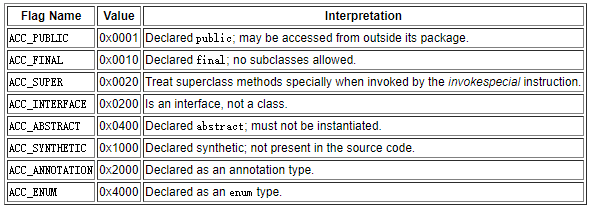
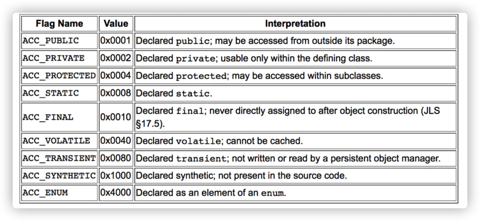

## **类文件结构**
.class 文件可以通过 **javap -v class类名** 指令来看一下其常量池中的信息(javap -v class类名-> temp.txt ：将结果输出到 temp.txt 文件)。

>记录了类的版本、字段、方法、接口等描述信息外，还有常量池表（用于存放编译期生成的各种字面量和符号引用）】

class文件中有关修饰符的access\_flag：各个修饰符都是布尔值，要么有某个修饰符，要么没有，很适合使用标志位来表示。即用16位二进制（2个字节）可以表述出不同的修饰符的意思。

**总结**：修饰符用二进制位表示，不能用二进制表示的需要描述的信息被记录在常量池中的“符号引用”中，因此其它地方通过指针一样的引用指向常量池中的“符号引用”，常量池除符号引用之外就是常量（字符串和被final修饰的）。

>实质上，常量池的字面量和符号引用的内容都是广义上的“字面量”，就是记录在纸上的东西，数字啊，文字啥的

\=============================================

根据 Java 虚拟机规范，Class 文件通过 **ClassFile** 定义，有点类似 C 语言的结构体。

```
ClassFile {  
    u4             magic;                               //Class 文件的标志  值是0xCAFEBABE
    u2             minor_version;                       //Class 的小版本号  
    u2             major_version;                       //Class 的大版本号  
    u2             constant_pool_count;                 //常量池的数量  
    cp_info        constant_pool[constant_pool_count-1];//常量池  
    u2             access_flags;                        //Class 的访问标记  
    u2             this_class;                          //当前类  
    u2             super_class;                         //父类  
    u2             interfaces_count;                    //接口  
    u2             interfaces[interfaces_count];        //一个类可以实现多个接口  
    u2             fields_count;                        //Class 文件的字段属性  
    field_info     fields[fields_count];                //一个类会可以有多个字段  
    u2             methods_count;                       //Class 文件的方法数量  
    method_info    methods[methods_count];              //一个类可以有个多个方法  
    u2             attributes_count;                    //此类的属性表中的属性数  
    attribute_info attributes[attributes_count];        //属性表集合  
}  
```


可通过 IDEA 插件 jclasslib 查看。

### **魔数**
```
u4             magic; //Class 文件的标志  
```
每个 Class 文件的头 4 个字节称为魔数（Magic Number）,它的唯一作用是确定这个文件是否为一个能被虚拟机接收的 Class 文件。 

程序设计者很多时候都喜欢用一些特殊的数字表示固定的文件类型或者其它特殊的含义。

### **Class 文件版本号**
可以使用 javap -v 命令来快速查看 Class 文件的版本号信息。
```
u2             minor_version;//Class 的小版本号  
u2             major_version;//Class 的大版本号  
```
第 5 和第 6 位是次版本号，第 7 和第 8 位是**主版本号**。

每当 Java 发布大版本（比如 Java 8，Java9）的时候，主版本号都会加 1。

高版本的 Java 虚拟机可以执行低版本编译器生成的 Class 文件，反之不行。

### **常量池**
```
u2             constant_pool_count;//常量池的数量  
cp\_info        constant_pool[constant_pool_count-1];//常量池
```

常量池计数器并不是从0，而是从 1 开始计数的，将第 0 项常量空出来是有特殊考虑的，索引值为 0 代表“不引用任何一个常量池项”。

常量池主要存放两大常量：

>- 字面量：字面量比较接近于 Java 语言层面的的常量概念，如文本字符串、声明为 final 的常量值等。
>- 符号引用：属于编译原理方面的概念。包括下面三类常量： 
>>1. 类和接口的全限定名 
>>2. 字段的名称和描述符 
>>3. 方法的名称和描述符

常量池中每一项常量都是一个表，这 14 种表有一个共同的特点：开始的第一位是一个 u1 类型的标志位 -tag 来标识常量的类型，代表当前这个常量属于哪种常量类型．


|**类型**|**标志（tag）**|**描述**|
| :-: | :-: | :-: |
|**CONSTANT\_utf8\_info**|**1**|**UTF-8 编码的字符串**|
|**CONSTANT\_Integer\_info**|**3**|**整形字面量**|
|**CONSTANT\_Float\_info**	|**4**|**浮点型字面量**|
|**CONSTANT\_Long\_info**|**5**|**长整型字面量**|
|**CONSTANT\_Double\_info**|**6**|**双精度浮点型字面量**|
|**CONSTANT\_Class\_info**|**7**|**类或接口的符号引用**|
|**CONSTANT\_String\_info**|**8**|**字符串类型字面量**|
|**CONSTANT\_Fieldref\_info**|**9**|**字段的符号引用**|
|**CONSTANT\_Methodref\_info**|**10**|**类中方法的符号引用**|
|**CONSTANT\_InterfaceMethodref\_info**|**11**|**接口中方法的符号引用**|
|**CONSTANT\_NameAndType\_info**|**12**|**字段或方法的符号引用**|
|**CONSTANT\_MothodType\_info**|**16**|**标志方法类型**|
|**CONSTANT\_MethodHandle\_info**|**15**|**表示方法句柄**|
|**CONSTANT\_InvokeDynamic\_info**|**18**|**表示一个动态方法调用点**|

### **访问标志**
```
u2             access_flags;//Class 的访问标记  
```
用于识别一些类或者接口层次的访问信息，包括：

- 这个 Class 是类还是接口，
- 是否为 public 或者 abstract 类型，
- 如果是类的话是否声明为 final 等等。

类访问和属性修饰符:



### **当前类（This Class）、父类（Super Class）、接口（Interfaces）索引集合**
```
u2             this_class;//当前类  
u2             super_class;//父类  
u2             interfaces_count;//接口  
u2             interfaces[interfaces_count];//一个类可以实现多个接口 
```
- 类索引，用于确定这个类的全限定名，
- 父类索引，用于确定这个类的父类的全限定名，

>由于 Java 语言的单继承，所以父类索引只有一个，除了 java.lang.Object 之外，所有的 java 类都有父类，因此除了 java.lang.Object 外，所有 Java 类的父类索引都不为 0。

- 接口索引集合用来描述这个类实现了那些接口，这些被实现的接口将按 implements (如果这个类本身是接口的话则是extends) 后的接口顺序从左到右排列在接口索引集合中。

### **字段表集合**
```
u2             fields_count;//Class 文件的字段的个数  
field_info     fields[fields_count];//一个类会可以有个字段  
```
字段表（field info）用于描述接口或类中声明的变量。字段包括**类级变量**以及**实例变量**，但不包括在方法内部声明的局部变量。
```
field_info {  
    u2             access_flags;  
    u2             name_index;         //对常量池的引用，表示的字段的名称；  
    u2             descriptor_index;   //对常量池的引用，表示字段和方法的描述符；  
    u2             attributes_count;   //一个字段还会拥有一些额外的属性，attributes_count 存放属性的个数；  
    attribute_info attributes[attributes_count]; //存放具体属性、具体内容。  
}  
```

access\_flags: 字段的作用域（public ,private,protected修饰符），是实例变量还是类变量（static修饰符）,可否被序列化（transient 修饰符）,可变性（final）,可见性（volatile 修饰符，是否强制从主内存读写）。



>上述这些信息中，各个修饰符都是布尔值，要么有某个修饰符，要么没有，很适合使用标志位来表示。即用16位二进制（2个字节）可以表述出不同的修饰符的意思。
>而字段叫什么名字、字段被定义成什么数据类型这些都是无法固定的，只能引用常量池中常量来描述。

### **方法表集合**
```
u2             methods_count;//Class 文件的方法的数量  
method_info    methods[methods_count];//一个类可以有个多个方法（方法表）
```

方法表：
```
method_info {  
    u2             access_flags;  
    u2             name_index;         //对常量池的引用，表示的字段的名称；  
    u2             descriptor_index;   //对常量池的引用，表示字段和方法的描述符；  
    u2             attributes_count;   //一个字段还会拥有一些额外的属性，attributes_count 存放属性的个数；  
    attribute_info attributes[attributes_count]; //存放具体属性、具体内容。  
} 
```

access\_flag：


### **属性表集合**
```
u2             attributes_count;//此类的属性表中的属性数  
attribute_info attributes[attributes_count];//属性表集合 
```
**Class 文件**、**字段表**、**方法表**都可以携带自己的属性表集合，以用于描述某些场景专有的信息。

与 Class 文件中其它的数据项目要求的顺序、长度和内容不同，属性表集合的限制稍微宽松一些，不再要求各个属性表具有严格的顺序，并且只要不与已有的属性名重复，任何人实现的编译器都可以向属性表中写 入自己定义的属性信息，Java 虚拟机运行时会忽略掉它不认识的属性。 

