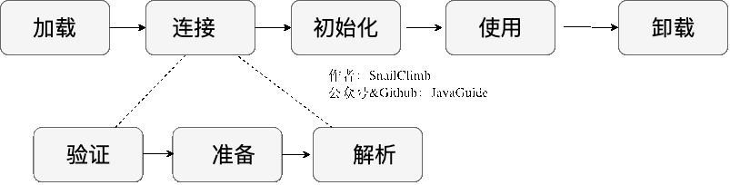
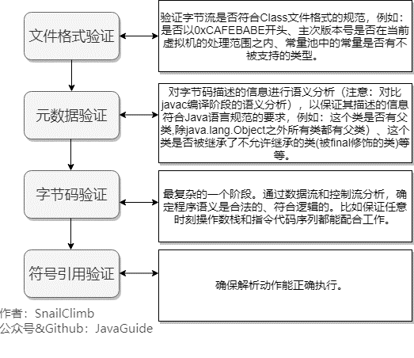
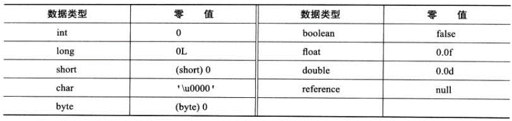

## **类加载过程**

虚拟机加载 Class 类型的文件主要三步：**加载->连接->初始化**。

连接过程又可分为三步：**验证->准备->解析**。

### **加载**
将 .class文件加载到内存。

>加载阶段和连接阶段的部分内容是交叉进行的，加载阶段尚未结束，连接阶段可能就已经开始了。

类加载过程的第一步，主要完成下面 3 件事情： 

1. 通过全类名获取定义此类的二进制字节流;
1. 将字节流所代表的静态存储结构转换为方法区的运行时数据结构;
1. 在内存中生成一个代表该类的 Class 对象（类对象），作为方法区这些数据的访问入口。

虚拟机规范上面这 3 点并不具体，因此是非常灵活的。比如："通过全类名获取定义此类的二进制字节流" 并没有指明具体从哪里获取、怎样获取。比如：

- 比较常见的就是从 ZIP 包中读取（日后出现的 JAR、EAR、WAR 格式的基础）、
- 其他文件生成（典型应用就是 JSP）等等。 

**注**：
>1. 一个**非数组**类的加载阶段（加载阶段获取类的二进制字节流的动作）是可控性最强的阶段，这一步我们可以去完成还可以自定义类加载器去控制字节流的获取方式（重写一个类加载器的 loadClass() 方法）。
>1. **数组**类型不通过类加载器创建，它由 Java 虚拟机直接创建。

### **验证（连接）**

### **准备（连接）**
准备阶段是正式为**类变量分配内存**并设置**类变量初始值**的阶段，这些内存都将在方法区中分配。

需要注意：

>1. 内存分配的仅包括类变量，实例变量会在对象实例化时随着对象一块分配在 Java 堆中。
>2. 从概念上讲，类变量所使用的内存都应当在 **方法区** 中进行分配。不过有一点需要注意的是：
>>- JDK 7 之前，HotSpot 使用永久代来实现方法区的时候，实现是完全符合这种逻辑概念的。 
>>- JDK 7 及之后，HotSpot 已经把原本放在永久代的字符串常量池、静态变量等移动到堆中，这个时候类变量则会随着 Class 对象一起存放在 Java 堆中。
>3. 这里所设置的初始值"通常情况"下是数据类型默认的零值（如 0、0L、null、false 等），比如:我们定义了public static int value=111 ，
>>- 那么 value 变量在**准备阶段**的初始值就是 **0** 而不是 111（初始化阶段才会赋值）。
>>- 特殊情况：比如给 value 变量加上了 **final** 关键字public static final int value=111 ，那么**准备阶段** value 的值就被赋值为 **111**。

基本数据类型的零值 ： (图片来自《深入理解 Java 虚拟机》第 3 版 7.33 )

### **解析（连接）**
将常量池内的**符号引用**替换为**直接引用**的过程。

1. 符号引用就是一组符号来描述目标，可以是任何广义上的字面量。
1. 直接引用就是直接指向目标的指针、相对偏移量或一个间接定位到目标的句柄。

主要针对7 类符号引用进行：

1. 类或接口、
1. 字段、
1. 类方法、
1. 接口方法、
1. 方法类型、
1. 方法句柄
1. 调用限定符

在程序实际运行时，只有符号引用是不够的，举个例子：在程序执行方法时，系统需要明确知道这个方法所在的位置。Java 虚拟机为每个类都准备了一张方法表来存放类中所有的方法。当需要调用一个类的方法的时候，只要知道这个方法在方法表中的偏移量就可以直接调用该方法了。通过解析操作符号引用就可以直接转变为目标方法在类中方法表的位置，从而使得方法可以被调用。

综上，解析阶段是虚拟机将常量池内的符号引用替换为直接引用的过程，也就是得到类或者字段、方法在内存中的指针或者偏移量。
### **初始化**
类加载的最后一步：执行初始化方法 \<clinit\>()方法（编译之后自动生成的）的过程。

JVM 开始真正执行类中定义的 Java 程序代码(字节码)。

对于\<clinit\>()方法的调用，虚拟机会自己确保其在多线程环境中的安全性。因为\<clinit\>()方法是带锁线程安全，所以在多线程环境下进行类初始化的话可能会引起多个进程阻塞，并且这种阻塞很难被发现。

虚拟机严格规范了有且只有 6种情况下，必须对类进行初始化(**只有主动去使用类才会初始化类**)：

>1. 当遇到 new 、 getstatic、putstatic 或 invokestatic 这 4 条直接码指令时，比如 new 一个类，读取一个静态字段(未被 final 修饰)、或调用一个类的静态方法时。
>>- 当 jvm 执行 new 指令时会初始化类。即当程序创建一个类的实例对象。 
>>- 当 jvm 执行 getstatic 指令时会初始化类。即程序访问类的静态变量(不是静态常量，常量会被加载到运行时常量池)。 
>>- 当 jvm 执行 putstatic 指令时会初始化类。即程序给类的静态变量赋值。 
>>- 当 jvm 执行 invokestatic 指令时会初始化类。即程序调用类的静态方法。 
>2. 使用 java.lang.reflect 包的方法对类进行反射调用时如 Class.forname("..."), newInstance() 等等。如果类没初始化，需要触发其初始化。 
>3. 初始化一个类，如果其父类还未初始化，则先触发该父类的初始化。 
>4. 当虚拟机启动时，用户需要定义一个要执行的主类 (包含 main 方法的那个类)，虚拟机会先初始化这个类。 
>5. MethodHandle 和 VarHandle 可以看作是轻量级的反射调用机制，而要想使用这 2 个调用，就必须先使用 findStaticVarHandle 来初始化要调用的类。 
>6. 当一个接口中定义了 JDK8 新加入的默认方法（被 default 关键字修饰的接口方法）时，如果有这个接口的实现类发生了初始化，那该接口要在其之前被初始化。

### **卸载（无用的类）**
卸载类：即该类的 Class 对象（类对象）被 GC。

卸载类需要满足 3 个要求: 

1. 该类的所有的实例对象都已被 GC，也就是说堆不存在该类的实例对象。 
1. 该类没有在其他任何地方被引用 
1. 该类的类加载器的实例已被 GC 

所以，在 JVM 生命周期内，由 jvm 自带的类加载器加载的类是不会被卸载的。但是由我们自定义的类加载器加载的类是可能被卸载的。 

只要想通一点就好了，jdk 自带的 BootstrapClassLoader, ExtClassLoader, AppClassLoader 负责加载 jdk 提供的类，所以它们(类加载器的实例)肯定不会被回收。而我们**自定义的类加载器的实例是可以被回收**的，所以使用我们**自定义加载器加载的类是可以被卸载**掉的。

