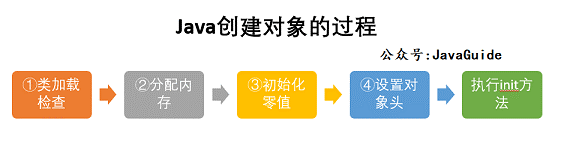
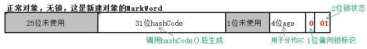
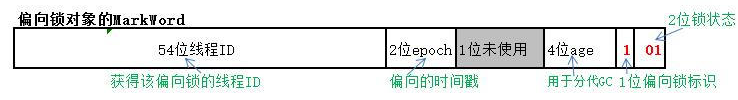
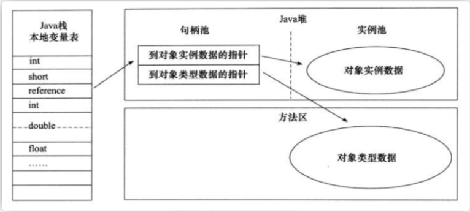
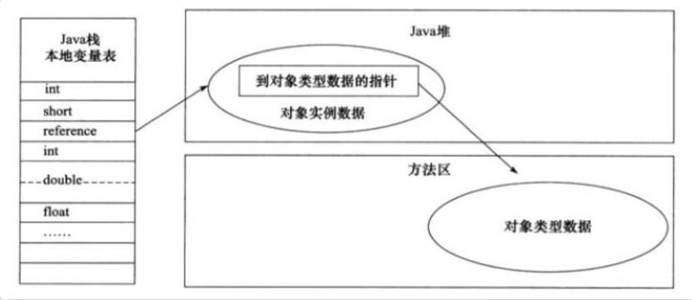

## **创建对象**
### **创建过程**

#### 类加载检查：

>虚拟机遇到一条 new 指令时，首先将去检查这个指令的参数是否能在常量池中定位到这个类的符号引用，并且检查这个符号引用代表的类是否已被加载过、解析和初始化过。如果没有，那必须先执行相应的类加载过程。

#### 分配内存：

>在堆中为对象分配内存，类加载完成后可以确定对象大小，
>分配方式有 “指针碰撞” 和 “空闲列表” 两种，选择哪种分配方式由 Java 堆是否规整决定，而 Java 堆是否规整又由所采用的垃圾收集器是否带有压缩整理功能决定。

**标记整理、标记复制**：

**标记清除**：

分配内存并发问题：

- CAS+失败重试： CAS 是乐观锁的一种实现方式。所谓乐观锁就是，每次不加锁而是假设没有冲突而去完成某项操作，如果因为冲突失败就重试，直到成功为止。虚拟机采用 CAS 配上失败重试的方式保证更新操作的原子性。 
- TLAB： 为每一个线程预先在 Eden 区分配一块儿内存，JVM 在给线程中的对象分配内存时，首先在 TLAB 分配，当对象大于 TLAB 中的剩余内存或 TLAB 的内存已用尽时，再采用上述的 CAS 进行内存分配。

#### 初始化零值:

内存分配完成后，虚拟机需要将分配到的内存空间都初始化为零值（不包括对象头），这一步操作保证了对象的实例字段在 Java 代码中可以不赋初始值就直接使用，程序能访问到这些字段的数据类型所对应的零值。

#### 设置对象头

初始化零值完成之后，虚拟机要对对象进行必要的设置，例如

- 这个对象是哪个类的实例、
- 如何才能找到类的元数据信息、
- 对象的哈希码、
- 对象的 GC 分代年龄等信息。 

这些信息存放在对象头中。 另外，根据虚拟机当前运行状态的不同，如是否启用偏向锁等，对象头会有不同的设置方式。

#### 执行 init 方法 

在上面工作都完成之后，从虚拟机的视角来看，一个新的对象已经产生了，但从 Java 程序的视角来看，对象创建才刚开始，<init> 方法(构造方法)还没有执行，所有的字段都还为零。所以一般来说，执行 new 指令之后会接着执行 <init> 方法，把对象按照程序员的意愿进行初始化，这样一个真正可用的对象才算完全产生出来。

### **对象内存分布**
在 Hotspot 虚拟机中，对象在内存中的布局可以分为 3 块区域：对象头、对象体(实例数据)和对齐填充。

1. 对象头包括两部分信息，

   - 用于存储对象自身的运行时数据（哈希码、GC 分代年龄、锁状态标志等等），
   - 类型指针，即对象指向它的类元数据的指针，虚拟机通过这个指针来确定这个对象是那个类的实例。

2. 实例数据部分是对象真正存储的有效信息，也是在程序中所定义的各种类型的字段内容, 保存对象属性和值的主体部分，占用内存空间取决于对象的属性数量和类型；

3. 起占位作用。 因为 Hotspot 虚拟机的自动内存管理系统要求对象起始地址必须是 8 字节的整数倍，换句话说就是对象的大小必须是 8 字节的整数倍。而对象头部分正好是 8 字节的倍数（1 倍或 2 倍），因此，当对象实例数据部分没有对齐时，就需要通过对齐填充来补全。
   >为了减少堆内存的碎片空间（不一定准确）

#### **对象头**

1. 对象头中的Mark Word（标记字）主要用来表示对象的线程锁状态，另外还可以用来配合GC、存放该对象的hashCode；

2. Klass Word（类指针）是一个指向方法区中Class信息的指针，意味着该对象可随时知道自己是哪个Class的实例，该指针的位长度为JVM的一个字大小，即32位的JVM为32位，64位的JVM为64位；

3. 记录数组长度也为JVM的一个字大小，即32位的JVM为32位，64位的JVM为64位，这是可选的，只有当本对象是一个数组对象时才会有这个部分；该区域长度也可由64位压缩至32位。

#### **指针压缩**
为了节约内存可以使用选项+UseCompressedOops开启指针压缩，其中，oop即ordinary object pointer普通对象指针。

开启该选项后，下列指针将压缩至32位：

- 每个Class的属性指针（即静态变量）
- 每个对象的属性指针（即对象变量）
- 普通对象数组的每个元素指针

当然，也不是所有的指针都会压缩，一些特殊类型的指针JVM不会优化，比如指向PermGen的Class对象指针(JDK8中指向元空间的Class对象指针)、本地变量、堆栈元素、入参、返回值和NULL指针等。
#### **锁升级过程**

epoch[ˈepək]：纪元

|**存储内容**|**biased\_lock**|**lock位**|**mark word含义**|
| - | - | - | - |
|**对象的hashcode，gc分代年龄**|0|01|无锁|
|**偏向线程ID，偏向线程时间戳(epoch)，gc分代年龄**|1|01|偏向锁|
|**指向栈中锁记录的指针**|00|轻量级锁|
|**指向对象监视器Monitor的指针**|10|重量级锁|
|**无**|11|gc标记|

hashcode采用延迟加载技术。调用方法System.identityHashCode()计算，并会将结果写到该对象头中。当对象加锁后（偏向、轻量级、重量级），MarkWord的字节没有足够的空间保存hashCode，因此该值会移动到管程Monitor中。

jvm使用synchronized为了提高效率，不会一开始就使用重量级锁，JVM在内部会根据需要，按如下步骤进行锁的升级：

1. 初期锁对象刚创建时，还没有任何线程来竞争，该对象处于无锁状态。
   

2. 当有一个线程来竞争锁时(54位线程id全是0，表明此前无线程来获得该锁)，先用偏向锁，表示锁对象偏爱这个线程，这个线程要执行这个锁关联的任何代码，不需要再做任何检查和切换，这种竞争不激烈的情况下，效率非常高。
   

3. 当有两个线程开始竞争这个锁对象，情况发生变化了（54位线程ID已经不为0了说明已有线程正持有锁，此时再来线程，产生竞争关系），不再是偏向（独占）锁了，锁会升级为轻量级锁，两个线程公平竞争，哪个线程先占有锁对象并执行代码，锁对象的Mark Word就指向哪个线程的栈帧中的锁记录。
   

4. 如果竞争的这个锁对象的线程更多，导致了更多的切换和等待，JVM会把该锁对象的锁升级为重量级锁，这个就叫做同步锁，这个锁对象Mark Word再次发生变化，会指向一个监视器对象，这个监视器对象用集合的形式，来登记和管理排队的线程。
   

#### **锁优化总结**
https://www.jianshu.com/p/36eedeb3f912

* **自旋锁**

使用-XX:-UseSpinning参数关闭自旋锁优化；
-XX:PreBlockSpin参数修改默认的自旋次数。

前提：锁的持有时间比较短，对于线程而言，因为锁阻塞造成线程切换的时间与锁持有的时间相当，减少线程阻塞造成的线程切换，能得到较大的性能提升，因此出现了自旋锁。

1. 当前线程竞争锁失败时，不直接阻塞自己，而是自旋（空等待，比如一个空的**有限次数**for循环）一会
1. 在自旋的同时重新竞争锁，如果自旋结束前获得了锁，那么锁获取成功；
1. 否则，自旋结束后阻塞自己

自旋锁的目标是**降低线程切换的成本**。

锁持有时间长，且竞争激烈的场景中，此时应主动禁用自旋锁。【因为自旋通常不能获得锁，白白浪费了自旋占用的CPU时间】

* **自适应自旋锁**

自适应意味着自旋的时间不再固定了，它假定不同线程持有同一个锁对象的时间基本相当，竞争程度趋于稳定，因此，可以根据上一次自旋的时间与结果调整下一次自旋的时间。

* **偏向锁**

>无竞争

“偏向”的意思是，偏向锁假定将来只有第一个申请锁的线程会使用锁（不会有任何线程再来申请锁），因此，只需要在Mark Word中CAS记录owner（本质上也是更新，但初始值为空），如果记录成功，则偏向锁获取成功，记录锁状态为偏向锁，以后当前线程等于owner就可以零成本的直接获得锁；否则，说明有其他线程竞争，膨胀为轻量级锁。

>偏向锁无法使用自旋锁优化，因为一旦有其他线程申请锁，就破坏了偏向锁的假定。（因为自旋锁的前提就是有竞争，偏向锁假定就是没有竞争）

* 轻量级锁

>无实际竞争

使用轻量级锁时，不需要申请互斥量（即不需要竞争锁对象），仅仅将Mark Word中的部分字节CAS更新指向线程栈中的Lock Record，如果更新成功，则轻量级锁获取成功，记录锁状态为轻量级锁；
>此时本应有两个线程在竞争，只是刚好另外一个线程的指针指向cas重置了，当前线程cas更新成功

否则，说明已经有线程获得了轻量级锁，目前发生了锁竞争（不适合继续使用轻量级锁），接下来膨胀为重量级锁。

>由于轻量级锁天然瞄准不存在锁竞争的场景，如果存在锁竞争但不激烈，仍然可以用**自旋锁优化**，自旋失败后再膨胀为重量级锁。
### **定位对象的方式**
Java 程序通过栈上的 reference 数据来操作堆上的具体对象。对象的访问方式由虚拟机实现而定，目前主流的访问方式有① **使用句柄**和② **直接指针**两种：

这两种对象访问方式各有优势。

- 使用句柄来访问的最大好处是 reference 中存储的是稳定的句柄地址，在对象被移动时只会改变句柄中的实例数据指针，而 reference 本身不需要修改。
- 使用直接指针访问方式最大的好处就是速度快，它节省了一次指针定位的时间开销。

