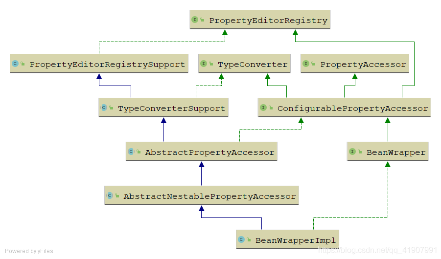
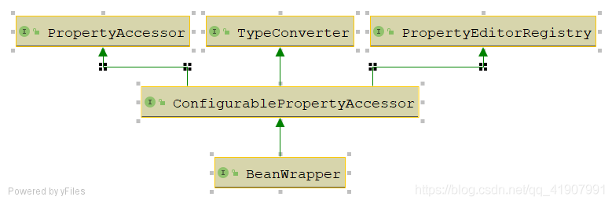

## **BeanWrapper**
<https://blog.csdn.net/qq_41907991/article/details/105214244>

### **BeanWrapper整体UML图：**


### 右边部分

先看BeanWrapper能做啥，有什么功能，即看实现了什么接口（右边部分）：



1. PropertyEditorRegistry（属性编辑器注册器）：注入属性编辑器（PropertyEditor）
1. PropertyAccessor（属性访问器）
1. TypeConverter（类型转换器）
1. ConfigurablePropertyAccessor
1. BeanWrapper：BeanWrapper是Spring中一个很重要的接口，Spring在通过配置信息创建对象时，第一步首先就是创建一个BeanWrapper。
### **PropertyEditorRegistry（属性编辑器注册器）**

```
// 这个接口的功能很简单，就是用来注入属性编辑器（PropertyEditor），那么什么是PropertyEditor呢？  
public interface PropertyEditorRegistry {  
    void registerCustomEditor(Class<?> requiredType, PropertyEditor propertyEditor);  
    void registerCustomEditor(@Nullable Class<?> requiredType, @Nullable String propertyPath, PropertyEditor propertyEditor);  
    @Nullable  
    PropertyEditor findCustomEditor(@Nullable Class<?> requiredType, @Nullable String propertyPath);  
}  
```

**PropertyEditor**是JavaBean规范定义的接口，这是java.beans中一个接口，其设计的意图是图形化编程上，方便对象与String之间的转换工作，

而**Spring将其扩展**，方便各种对象Object与String之间的转换工作。

Spring中对PropertyEditor使用的实例:

>1. 我们在通过XML的方式对Spring中的Bean进行配置时，不管Bean中的属性是何种类型，都是直接通过字面值来设置Bean中的属性。那么是什么在这其中做转换呢？这里用到的就是PropertyEditor
>1. SpringMVC在解析请求参数时，也是使用的PropertyEditor

Spring内置的PropertyEditor (将String转换成各种Object):


### **PropertyAccessor（属性访问器）**

```
public interface PropertyAccessor {  
        
    // 嵌套属性的分隔符,比如"foo.bar"将会调用getFoo().getBar()两个方法  
    String NESTED_PROPERTY_SEPARATOR = ".";  
    char NESTED_PROPERTY_SEPARATOR_CHAR = '.';  
    
    // 代表角标index的符号  如person.addresses[0]  这样就可以把值放进集合/数组/Map里了  
    String PROPERTY_KEY_PREFIX = "[";  
    char PROPERTY_KEY_PREFIX_CHAR = '[';  
    String PROPERTY_KEY_SUFFIX = "]";  
    char PROPERTY_KEY_SUFFIX_CHAR = ']';  
    
    // 该属性是否可读/可写，不存在则返回false  
    boolean isReadableProperty(String propertyName);  
    boolean isWritableProperty(String propertyName);  
        
    // 获取/设置属性的方法，基本见名知意  
    @Nullable  
    Class<?> getPropertyType(String propertyName) throws BeansException;  
    @Nullable  
    TypeDescriptor getPropertyTypeDescriptor(String propertyName) throws BeansException;  
    @Nullable  
    Object getPropertyValue(String propertyName) throws BeansException;  
    void setPropertyValue(String propertyName, @Nullable Object value) throws BeansException;  
    void setPropertyValue(PropertyValue pv) throws BeansException;  
    void setPropertyValues(Map<?, ?> map) throws BeansException;  
    void setPropertyValues(PropertyValues pvs) throws BeansException;  
    void setPropertyValues(PropertyValues pvs, boolean ignoreUnknown)  
            throws BeansException;  
    void setPropertyValues(PropertyValues pvs, boolean ignoreUnknown, boolean ignoreInvalid)  
            throws BeansException;  
    
}  
```

什么是PropertyValue？

当设置属性值时，少不了两样东西：

1. 属性访问表达式：如listMap[0][0]

2. 属性值：ProperyValue对象就是用来封装这些信息的。如果某个值要给赋值给bean属性，Spring都会把这个值包装成ProperyValue对象。
### **TypeConverter（类型转换器）**
```
// 定义了进行类型转换时的一些规范，就像名字定义的那样，主要用来做类型转换  
public interface TypeConverter {  
        
    // 将指定的值转换成指定的类型  
    @Nullable  
    <T> T convertIfNecessary(@Nullable Object value, @Nullable Class<T> requiredType) throws TypeMismatchException;  
    
    // 相对于上面这个方法下面这个三种方法能处理转换过程中的泛型  
    @Nullable  
    <T> T convertIfNecessary(@Nullable Object value, @Nullable Class<T> requiredType,  
            @Nullable MethodParameter methodParam) throws TypeMismatchException;  
    @Nullable  
    <T> T convertIfNecessary(@Nullable Object value, @Nullable Class<T> requiredType, @Nullable Field field)  
            throws TypeMismatchException;  
    default <T> T convertIfNecessary(@Nullable Object value, @Nullable Class<T> requiredType,  
            @Nullable TypeDescriptor typeDescriptor) throws TypeMismatchException {  
    
        throw new UnsupportedOperationException("TypeDescriptor resolution not supported");  
    }  
}  
```
### **ConfigurablePropertyAccessor**
```
public interface ConfigurablePropertyAccessor extends PropertyAccessor, PropertyEditorRegistry, TypeConverter {  
    // ConversionService：进行转换的业务类，转换系统的入口  
    void setConversionService(@Nullable ConversionService conversionService);  
    @Nullable  
    ConversionService getConversionService();  
        
    // 进行属性编辑是是否返回旧的值  
    void setExtractOldValueForEditor(boolean extractOldValueForEditor);  
    boolean isExtractOldValueForEditor();  
        
    // 当设置（dog.name）这种嵌套属性的情况下，如果dog属性为null是否会报错  
    // 为true的话不会，为false会抛出NullValueInNestedPathException  
    void setAutoGrowNestedPaths(boolean autoGrowNestedPaths);  
    boolean isAutoGrowNestedPaths();  
}  
```
### **BeanWrapper**
```
// Spring低级JavaBeans基础设施的中央接口。通常来说并不直接使用BeanWrapper，而是借助BeanFactory或者DataBinder来一起使用,BeanWrapper对Spring中的Bean做了包装，为的是更加方便的操作Bean中的属性  
public interface BeanWrapper extends ConfigurablePropertyAccessor {  
        
    void setAutoGrowCollectionLimit(int autoGrowCollectionLimit);  
    int getAutoGrowCollectionLimit();  
    
    // 获取包装的Bean  
    Object getWrappedInstance();  
    
    // 获取包装的Bean的class  
    Class<?> getWrappedClass();  
    
    // 获取所有属性的属性描述符  
    PropertyDescriptor[] getPropertyDescriptors();  
    
    // 获取指定属性的属性描述符  
    PropertyDescriptor getPropertyDescriptor(String propertyName) throws InvalidPropertyException;  
}  
```

**PropertyDescriptor**：属性描述符，能够描述javaBean中的属性，通过属性描述符我们能知道这个属性的类型，获取到操纵属性的方法（getter/setter）

### **接口功能总结**
1. BeanWrapper接口自身对Bean进行了一层**包装**。
1. 另外它的几个通过间接继承了几个接口，所以它还能对Bean中的属性进行操作。PropertyAccessor赋予了BeanWrapper对**属性进行访问及设置**的能力，
1. 在对Bean中属性进行设置时，不可避免的需要对类型进行转换，而恰好PropertyEditorRegistry，TypeConverter就提供了**类型转换**的统一约束。

### 左边部分

唯一实现类BeanWrapperImpl到底是个啥，看继承关系（左边部分）

### **PropertyEditorRegistrySupport**
这个类最大的作用在于管理PropertyEditor,添加了很多的默认的PropertyEditor。在PropertyEditorRegistry的基础上做了进一步的扩展，提供的还是PropertyEditor注册的功能。

### **TypeConverterSupport**
```
public abstract class TypeConverterSupport extends PropertyEditorRegistrySupport implements TypeConverter {  
        @Nullable  
    TypeConverterDelegate typeConverterDelegate;  
......  
}  
```

这个接口实现了TypeConverter，所以它具有类型转换的能力，而它这种能力的实现，依赖于它所持有的一个TypeConverterDelegate。
```
class TypeConverterDelegate {  
    
    private final PropertyEditorRegistrySupport propertyEditorRegistry;  
    
    @Nullable  
    private final Object targetObject;  
    
    public <T> T convertIfNecessary(@Nullable String propertyName, @Nullable Object oldValue, @Nullable Object newValue,  
            @Nullable Class<T> requiredType, @Nullable TypeDescriptor typeDescriptor) throws IllegalArgumentException {  
    
        // 查看是否为当前这个类型配置了定制的PropertyEditor  
        PropertyEditor editor = this.propertyEditorRegistry.findCustomEditor(requiredType, propertyName);  
    
        ConversionFailedException conversionAttemptEx = null;  
    
        // 获取当前容器中的类型转换业务类  
        ConversionService conversionService = this.propertyEditorRegistry.getConversionService();  
            
        // 在这里可以看出，Spring底层在进行类型转换时有两套机制  
        // 1.首选的是采用PropertyEditor  
        // 2.在没有配置PropertyEditor的情况下，会采用conversionService  
        if (editor == null && conversionService != null && newValue != null && typeDescriptor != null) {  
            TypeDescriptor sourceTypeDesc = TypeDescriptor.forObject(newValue);  
            if (conversionService.canConvert(sourceTypeDesc, typeDescriptor)) {  
                try {  
                    // 通过conversionService进行类型转换  
                    return (T) conversionService.convert(newValue, sourceTypeDesc, typeDescriptor);  
                }  
                catch (ConversionFailedException ex) {  
                    // fallback to default conversion logic below  
                    conversionAttemptEx = ex;  
                }  
            }  
        }  
    
        Object convertedValue = newValue;  
    
        // 配置了定制的属性编辑器，采用PropertyEditor进行属性转换  
        if (editor != null || (requiredType != null && !ClassUtils.isAssignableValue(requiredType, convertedValue))) {  
            if (typeDescriptor != null && requiredType != null && Collection.class.isAssignableFrom(requiredType) &&  
                    convertedValue instanceof String) {  
                TypeDescriptor elementTypeDesc = typeDescriptor.getElementTypeDescriptor();  
                if (elementTypeDesc != null) {  
                    Class<?> elementType = elementTypeDesc.getType();  
                    if (Class.class == elementType || Enum.class.isAssignableFrom(elementType)) {  
                        convertedValue = StringUtils.commaDelimitedListToStringArray((String) convertedValue);  
                    }  
                }  
            }  
            if (editor == null) {  
                // 没有配置定制的属性编辑器，采用默认的属性编辑器  
                editor = findDefaultEditor(requiredType);  
            }  
            // 采用属性编辑器进行转换，需要注意的是，默认情况下PropertyEditor只会对String类型的值进行类型转换  
            convertedValue = doConvertValue(oldValue, convertedValue, requiredType, editor);  
        }  
        // .....  
        return (T) convertedValue;  
    }  
}  
```

PropertyEditor主要进行的是**String到Object的转换**，正因为如此，属性编辑器进行类型转换有很大的**局限性**，所以Spring又推出了一套ConversionService的体系

### **AbstractPropertyAccessor**
```
public abstract class AbstractPropertyAccessor extends TypeConverterSupport implements ConfigurablePropertyAccessor {  
    // 省略部分代码......  
    // 批量设置属性
    @Override  
    public void setPropertyValues(PropertyValues pvs, boolean ignoreUnknown, boolean ignoreInvalid)  
            throws BeansException {  
    
        List<PropertyAccessException> propertyAccessExceptions = null;  
        List<PropertyValue> propertyValues = (pvs instanceof MutablePropertyValues ?  
                ((MutablePropertyValues) pvs).getPropertyValueList() : Arrays.asList(pvs.getPropertyValues()));  
        for (PropertyValue pv : propertyValues) {  
            try {  
                setPropertyValue(pv);  
            }  
            // ....  
        }  
    }  
    
    @Override  
    @Nullable  
    public abstract Object getPropertyValue(String propertyName) throws BeansException;  
    
    @Override  
    public abstract void setPropertyValue(String propertyName, @Nullable Object value) throws BeansException;  
}  
```

这个类继承了TypeConverterSupport,所以它具备了类型转换的能力。同时它也是一个属性访问器，但是它只是实现了**批量设置属性**的方法，真正的setPropertyValue还是留待子类实现。

可以看到，到这个类为止，还没有将属性的设置跟类型转换的能力结合起来。

### **AbstractNestablePropertyAccessor**
这个类开始真正的将属性访问跟类型转换结合到一起，它**真正的实现了setPropertyValue**（访问属性->设置属性->类型转换），具体代码就不看了，非常繁杂，但是整体不难。

### **BeanWrapperImpl**
```
// 这个类我只保留一些关键的代码，其余的琐碎代码都不看了  
public class BeanWrapperImpl extends AbstractNestablePropertyAccessor implements BeanWrapper {  
    // 缓存内省的结果，BeanWrapperImpl就是通过这个对象来完成对包装的Bean的属性的控制  
    @Nullable  
    private CachedIntrospectionResults cachedIntrospectionResults;  
    ......         
    public void setBeanInstance(Object object) {  
        this.wrappedObject = object;  
        this.rootObject = object;  
        // 实际进行类型转换的对象：typeConverterDelegate  
        this.typeConverterDelegate = new TypeConverterDelegate(this, this.wrappedObject);  
        setIntrospectionClass(object.getClass());  
    }  
    ......  
    // 最终调用的就是CachedIntrospectionResults的forClass方法进行内省并缓存，底层调用的就是java的内省机制  
    private CachedIntrospectionResults getCachedIntrospectionResults() {  
        if (this.cachedIntrospectionResults == null) {  
            this.cachedIntrospectionResults = CachedIntrospectionResults.forClass(getWrappedClass());  
        }  
        return this.cachedIntrospectionResults;  
    }  
    .......  
        // 最终进行类型转换的方法  
        private Object convertIfNecessary(@Nullable String propertyName, @Nullable Object oldValue,  
                                            @Nullable Object newValue, @Nullable Class<?> requiredType, @Nullable TypeDescriptor td)  
        throws TypeMismatchException {  
    
        Assert.state(this.typeConverterDelegate != null, "No TypeConverterDelegate");  
        try {  
            // 可以看到，最后就是调用typeConverterDelegate来进行类型转换  
            return this.typeConverterDelegate.convertIfNecessary(propertyName, oldValue, newValue, requiredType, td);  
        }  
        ......  
    }  
}  
```


### **BeanWrapper使用**
BeanWrapper的功能很简单，提供一个设置JavaBean属性的**通用方法**:

```
Object obj = Class.forName("packageAname.subPackage.ClassName").newInstance();  
BeanWrapper bw = new BeanWrapperImpl(obj);  
bw.setPropertyValue("propertyName", "updateValue");//propertyName属性名称，updateValue属性值  
System.out.println(bw.getPropertyValue("propertyName"));  
```


