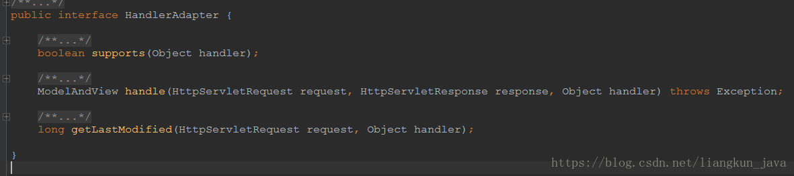

## HandlerAdapter
```
protected HandlerAdapter getHandlerAdapter(Object handler) throws ServletException {  
        if (this.handlerAdapters != null) {  
            for (HandlerAdapter ha : this.handlerAdapters) {  
                if (logger.isTraceEnabled()) {  
                    logger.trace("Testing handler adapter [" + ha + "]");  
                }  
                if (ha.supports(handler)) {  
                    return ha;  
                }  
            }  
        }  
        throw new ServletException("No adapter for handler [" + handler +  
                "]: The DispatcherServlet configuration needs to include a HandlerAdapter that supports this handler");  
}  
```
遍历自身的handlerAdapter链表如果支持该handler则返回该adpter。

这里的逻辑就需要想两个问题:
1. 该adpter链表什么时候填充进来的
   答：这个应该是在9大组件初始化的时候完成：initHandlerAdapters(context);
2. handlerAdapter的support是如何实现？
   答：这里就要分析HandlerAdapter组件


通过 HandlerAdapter 执行这个 Handler 得到 ModelAndView 对象。