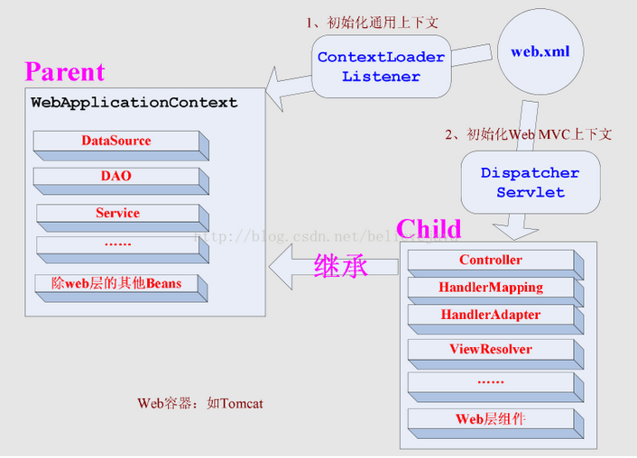

## ContextLoaderListener和DispatcherServlet初始化上下文关系和区别

从上图可以看出，ContextLoaderListener初始化的上下文加载的Bean是对于整个应用程序共享的，一般如：DAO层、Service层Bean；DispatcherServlet初始化的上下文加载的Bean是只对Spring MVC有效的Bean，如：Controller、HandlerMapping、HandlerAdapter等，该初始化上下文只加载Web相关组件。

>注意：用户可以配置多个DispatcherServlet来分别处理不同的url请求，每个DispatcherServlet上下文都对应一个自己的子Spring容器，他们都拥有相同的父Spring容器（业务层，持久（dao）bean所在的容器）。
