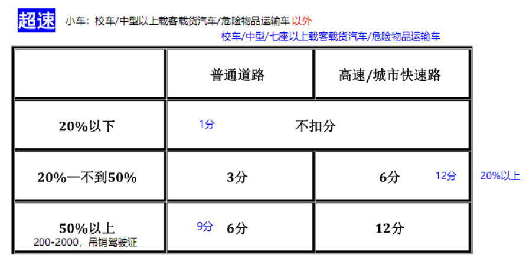

# 易错记录

1. 中型7座客车在普通公路超速50%以上：记9分
1. 机动车找登记地，驾驶证找居住地，
1. 三品找6：有爆炸物品的车，还不挂警示标志，记6分
1. 载货汽车超载30%以下，记1分；30-50%/载客，记3分，50%以上，记6分
1. 红色禁令，黄色警告，蓝色提醒
1. ABS：黄色故障，红色打开
1. 红色茶壶：机油不足/压力过低
1. 红色温度计：发动机温度高/可能冷却液不足
1. 瓶子里的火焰：冷却液不足
1. 分离有横不分无
1. 快处易赔不需要手工输入车牌
1. 迁入找迁出，核发找居住
1. 补核发，换居住，行登记
1. 醉酒驾驶：机动车5年，营运机动车10年
1. 黄虚禁长停，黄实禁停
1. 一条禁长停，两条禁停
1. 驾驶准驾车型不符，记9分；证被扣留后无证驾驶，记6分、200-2000、拘留15天以下
1. 实习：独自上高速、开牵引；补领证仍使用原驾驶证；20-200
1. 未投保，扣车，2倍罚款
1. 打电话，记3分
1. 湿滑别踩刹车
1. 拼装：一罚200-2000，二吊销驾驶证，三拘役
1. 报废：吊销驾驶证
1. 路面：黄色最高，白色最低
1. 路面：双黄禁止，黄虚指示
1. 多于一个的信号灯中其中：黄灯闪烁可以走，黄灯不闪：停前等，停后走
1. 只有一个信号灯且是黄灯表示危险路段：闪烁小心走，黄灯不闪：不能走
1. “机动车产品主管部门”看着车报废
1. 逆行：普通路上记3分；高速路上记12分
1. 停车：普通路上记1分；高速路上记9分
1. 变道：高速3分
1. 会倒掉：普通1分
1. 不按规定**车道**行驶：记3分；不按规定行驶：普通3分（如占道插队超车，罚100）、高速6分
1. 占用应急车道（不按规定）：高速路上记6
1. 高速低于最低速度：记3分
1. 审验：驾驶证审人，机动车审证
1. 不参加审验：200-500
1. Z反向/S连续
1. 拼装、报废、超速50%、车给没驾驶证的人开：200-2000，吊销驾驶证
1. 交通事故逃但不构成犯罪：200-2000，吊销驾驶证，记6分
1. 0146，大中牵大
    > 可以申请：20 大货、21 中客、24 牵引、16 大客
1. 换证：前90天 | 变换：前30天 | 报废机动车：前60天
1. 审验：有效期满、户籍迁出 | 兵役/出国，不超3年
1. 审验：不记分不审，但中大车或事故后**没吊销驾驶证**的在记分周期结束后30天内得接受审验，且一年一次
1. 记12分：酒后驾驶（暂扣6个月驾驶证）、使用假的/别的车的各种证（如行驶证）、高速超速50%
1. 酒驾罚了后又酒驾：10天拘留、1000-2000、吊销驾驶证
1. 带单位的数字（30km/h）：黑色字建议/蓝色字最高/红色字最低
1. 虚线紧急、实线错车、虚实港湾
1. 黄|绿底行人/非机动车，蓝底人行横道/非机动车道
1. 横风：侧向吹来的风
1. 涵洞没有标志：道路下面用来通水的洞
1. 立面：比路面高的地面
1. 路面：横向减速长方形，纵向减速平行四边形
1. 机动车在**抵押/质押**期间，可以转让登记
1. 颠簸路段：低档位、缓抬油门
1. 上坡路段：低档位、踏油门
1. 快处易赔：必须输入车牌号码和驾驶员信息（手动输入）
1. 快处易赔：责任认定结束后，收到信息
1. 快处易赔：远程定责超时响应后，不能再次申请远程定责
1. 快处易赔：生成电子协议后，**无法完全**显示“交强险保单号”
1. 车被扣留，3个月内不去处理的，就被依法处理了
1. **行政强制措施**不包括拘留驾驶人，
    >但不代表其它强制措施不能拘留你
1. 大车驾驶人信息变更后30天内，到**从业单位所在地**车管所备案
1. 机动车**没有暂扣**一说
1. 停车线：蓝色免费、白色收费、黄色专属
1. 不按规定使用灯光、改装记1分；**故障后**，不按规定的，记3分
1. 逾期不审验还开车、证被扣留后**骗补领**驾驶证：200-500
1. 参加减分弄虚作假：1000以下，恢复记分
1. 审验型虚作假：1000以下、重新学习
1. 代替审验：2000以下
1. 组织谋利：**审验**3倍2万，**瞒骗获得驾驶证**5倍10万
1. 他人代替接受处理：3倍5万
1. 私家车安装警报器、违反规定不听劝阻：200-2000
1. 5天内发驾驶证、15天内补发驾驶证、30天内转移登记
1. 12分记满，驾驶证就被扣留了
1. **骗领**驾驶证：收缴驾驶证并撤销驾驶许可，2000以下
1. 疲劳驾驶：4小时驾驶，20分休息：中客记9分、载货记3分
1. A1大客，A2重牵
1. B1中客，B2大货
1. 参加满分教育进行减分：实习期不行、参加过2次以上不行
1. 考试作弊：未遂1年、既遂3年、组织且犯罪3-7年
1. 中车以上喷涂车牌不清晰：警告或200以下
1. 虚假申请机动车登记：1年不得再次申请
1. 虚假取得机动车登记：3年不得再次申请
1. 上绿下黄：直出车道

## 超速

## 超载

