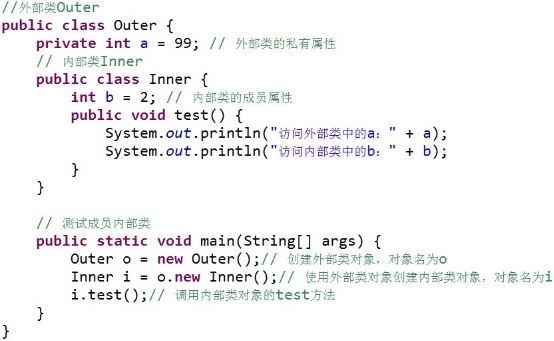
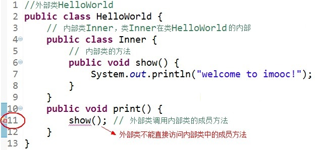
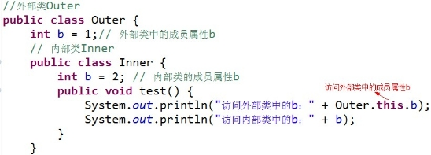
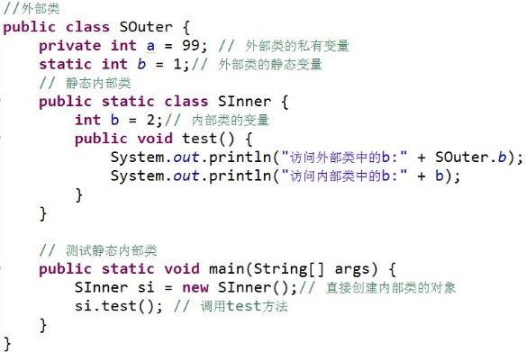
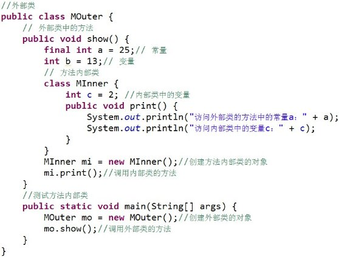

## **内部类**
### **普通成员内部类**


从上面的代码中我们可以看到，**成员内部类的使用方法**：

>1. Inner 类定义在 Outer 类的内部，相当于 Outer 类的一个成员变量的位置，Inner 类可以使用任意访问控制符，如 public 、 protected 、 private 等;
>2. Inner 类中定义的 test() 方法可以直接访问 Outer 类中的数据，而不受访问控制符的影响，如直接访问 Outer 类中的私有属性a;
>3. 定义了成员内部类后，必须使用外部类对象来创建内部类对象，而不能直接去 new 一个内部类对象，即：内部类 对象名 = 外部类对象.new 内部类( );
>4. 编译上面的程序后，会发现产生了两个 .class 文件:
>
其中，第二个是外部类的 .class 文件，第一个是内部类的 .class 文件，即成员内部类的 .class 文件总是这样：外部类名$内部类名.class

另外，**友情提示哦：**

1. 外部类是不能直接使用内部类的成员和方法滴



可先创建内部类的对象，然后通过内部类的对象来访问其成员变量和方法。

2. 如果外部类和内部类具有相同的成员变量或方法，内部类默认访问自己的成员变量或方法，如果要访问外部类的成员变量，可以使用 this 关键字。如：



运行结果：


### **静态成员内部类**
静态内部类是 static 修饰的内部类，这种内部类的特点是：

1. 静态内部类不能直接访问外部类的非静态成员，但可以通过 **new 外部类().成员** 的方式访问;

2. 如果外部类的静态成员与内部类的成员名称相同，可通过“类名.静态成员”访问外部类的静态成员；如果外部类的静态成员与内部类的成员名称不相同，则可通过“成员名”直接调用外部类的静态成员;

3. 创建静态内部类的对象时，不需要外部类的对象，可以直接创建 **内部类 对象名= new 内部类();**



运行结果 ： 

Souter.Sinner inner = new Souter.Sinner();


### **方法内部类**
方法内部类就是内部类定义在外部类的方法中，方法内部类只在该方法的内部可见，即只在该方法内可以使用。



**一定要注意哦：**

1. 由于方法内部类不能在外部类的方法以外的地方使用，因此方法内部类不能使用访问控制符和 static 修饰符。

2. 方法中的内部类可以访问外部类成员。对于方法的参数和局部变量，必须有final修饰才可以访问。

3. static方法中定义的内部类可以访问外部类定义的static成员


### **匿名内部类**
定义类的最终目的是创建一个类的实例，但是如果某个类的实例只是用一次，则可以将类的定义与类的创建，放到一起完成，或者说在定义类的同时就创建一个类。

以这种方法定义的没有名字的类成为匿名内部类。

声明和构造匿名内部类的一般格式如下：
```
new ClassOrInterfaceName(){
    /\*类体\*/ 
}
```
1. 匿名内部类可以继承一个类或实现一个接口，这里的ClassOrInterfaceName是匿名内部类所继承的类名或实现的接口名。但匿名内部类不能同时实现一个接口和继承一个类，也不能实现多个接口。如果实现了一个接口，该类是Object类的直接子类，匿名类继承一个类或实现一个接口，不需要extends和implements关键字。


2. 由于匿名内部类没有名称，所以类体中不能定义构造方法，由于不知道类名也不能使用关键字来创建该类的实例。实际上匿名内部类的定义、构造、和第一次使用都发生在同样一个地方。此外，上式是一个表达式，返回的是一个对象的引用，所以可以直接使用或将其复制给一个对象变量。例：
```
TypeName obj=new Name(){
    /\*此处为类体\*/
}
```
同样，也可以将构造的对象作为调用的参数。例：
```
someMethod(new Name(){
    /\*此处为类体\*/  
});
```
3. 程序代码：
```
public class NiMing {
	private int size=5;
	public Object makeInner(int localVar){
		final int finalLocalVar=localVar;
		return new Object(){
			//使用匿名内部类
			public String toString(){
				return "OuterSize="+size+"nfinalLocalVar="+finalLocalVar;
			}
		}
		;
	}
	/**
  * @param args
  */
	public static void main(String args[])
	 {
		Object obj=new NiMing().makeInner(47);
		System.out.println(obj.toString());
	}
}
```
4. 程序运行结果：
```
OuterSize=5
finalLocalVar=47
```

