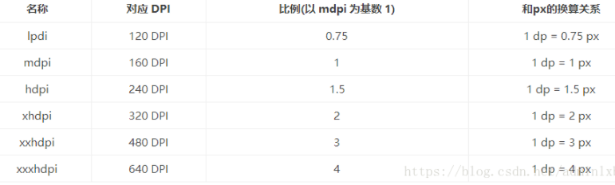

## 安卓获得对应hdpi目录中的图片

>按照我的例子，则是先计算像素密度，即dpi，分辨率为2400*1080，那么对角线分辨率为2631，尺寸或者说对角线长为6.67英寸，那么dpi = 2631/6.67=394,
>然后x(px) = dpi/160 = 394/160 = 2.4625，使用进一法等于3，即图片应存放在xxhdpi。

系统加载图片是，会优先寻找对应文件夹的图片，假设是xxhdpi目录，如果没有，则按照xxxhdpi ---> xhdpi ---> hdpi ---> mdpi 的顺序进行查找，直至找到为止。

解析：

首先通过计算1dp等于多少px，来筛选目录，通过公式px = 1dp * (dpi / 160)计算，结果使用进一法，即ceiling。
比例对应目录：

如果计算出的结果对应的目录没有想要的图片，那么从xxx开始往下找，如果xxx有，那么会将图片变为xxx的3/4倍即缩小，如果xxx没有，再找xhdpi，有的话，将图片变为x的1.5倍（3/2）即扩大，剩下的同理。