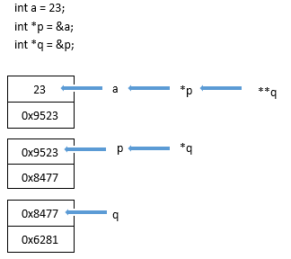
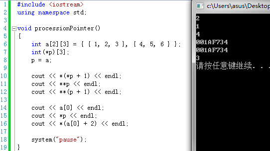
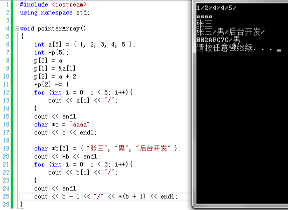
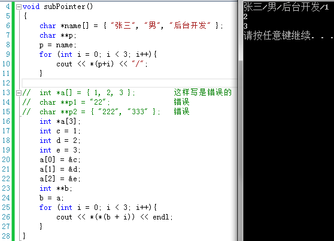

## 三大指针

* **行指针**
* **指针数组**
* **二级指针**

“三大指针”这个是自己命名的，应该是指针中比较难理解的一块，所以拿出来写了个笔记。

友情提示：在看下面部分之前，需要对指针指向二维数组有个比较清楚的了解

在介绍三个指针之前，一定要牢记下面这个图，也就是二级指针的概念。



### 1、行指针：数据类型 (*p)[m];
定义：指向由m个元素组成的一维数组的行指针变量
经测试，不能直接指向一维数组，如：
```
int a[3];
int (*p)[3];
p = a;
```
以上代码是错误的。
看接下来的代码：



所谓“行指针”，对上图代码中的二维数组a[2][3]来说，就指的是a[0],a[1]这两行，那么如果行指针加数字的话，如上图如果p+1，那么这时指向的就是a[1]，p本身指向的是a[0]。

通过不同的测试输出发现：
```
第一个：*(*p+1)输出的是2，第一行的第二个元素。根据指针与数组的关系我们知道，数组名可以当成指针来用，而这里明显a[0]是第一行的一维数组名，也是第一行的首地址，参考第六个输出不难发现，这里的*p可以换成a[0]，即*(a[0]+1)，所以验证了上面的推测：*p = a[0];

第二个就不用说了。

第三个：**(p+1)输出为4，同样，*(p+1) = a[1]，那么再加一个**(p+1)就等于*a[1]，输出为4。

第四个与第五个依然是同样来验证*p是否等于a[0]，输出结果和推测的一样。第六个也不说了。

说这么多，可能有些人认为是废话，也有可能有人是懵逼状态。

但我想说的是，对行指针，用上面那个例子来说：p其实是一个二级指针，而a[0],a[1]是一个一级指针，而记忆行指针的用法也很简单：
二维数组：int a[2][3]
行指针：int (*p)[3]
然后：p = a;
忽略后面的[3]，那么一眼就可以看出来*p = a[2]，即p指向a[0]，p+1指向a[1]；
```

### 2、指针数组：数据类型 *a[3];

[]的优先性大于*，所以a先和[]匹配，表示一个3个元素的数组，然后再与*结合，表示这个数组中的元素每一个都是指针变量。

有些同学可能不是很明白为啥指针数组相当于二级指针，这里就来仔细的解析一下。请看下面:


我相信来看这篇文章的，对指针数组应该有个了解，所以第一行的输出就不作解答了，

来看第二行输出，（先回忆一下文章首部的那张图）可以看见在代码中只传了地址进去，就输出了“aaaa”。

好的，再往下看\*b输出了“张三”，为什么？先不说，

再往下看，b[0]b[1]b[2]（这里是地址哦）先后输出了数组中的内容，可以看出：\*b的结果是等于b[0]的，即*b依然是个地址；

再看最后一行输出，确定*(b+1)等于b[1]，然后最后一行输出的第一个值是一个地址。大家应该看出来为什么指针数组是二级指针的变形了。

其实b是二级指针，b[0]b[1]这样的是一级指针，大家应该发现了，行指针与指针数组是不是感觉都是二级指针的变形？只是代表的意义不同！

### 3、二级指针

在上面的内容中，已经涉猎到了大量的二级指针内容，这里再说一个容易出错的地方。



来看第一行输出，在代码中是将name赋给p，再上一个指针数组，已经说过，name就是一个二级指针，那么将一个二级指针赋给一个二级指针，这没什么好说的，代码成功运行。

在这里想说的是代码注释里已经写了，当是int类型的时候是不能像字符串那样初始化的，所以指针数组一般是用来接收字符串，减少内存消耗。

### 总结：

是不是感觉二级指针老是要跟二维数组挂钩，二级指针名就是二维数组名，一级指针名就是二维数组中的一维数组行名，这里只是为了好理解才这么说，当然里面会有些差别。如果有错，还请各位大佬多多指教。
