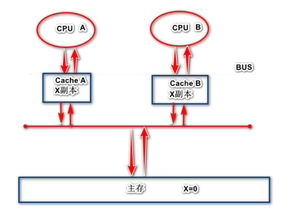

## MESI协议

https://www.cnblogs.com/itqczzz/p/12670782.html

缓存一致性协议（modified,exclusive,shared,invalid）

1.当CPU A将主存中的x cache line读入缓存中时，此时X副本的状态为**E**独占。

2.当CPU B将主存中的X cache line读入缓存中时，AB同时嗅探总线，得知X cache line不止一个副本，此时X的状态变为**S**共享

3,当CPU A将CACHE A中的x cache line修改为1后，Cache A中的X cache line 的状态变为**M**修改，并发送消息给CPU B，CPU将X cache line的状态变为**I**无效

4.当CPU A确认所有CPU缓存中的都提交了I无效状态，将修改后的值刷新到主存中，此时主存中的X变为了1，此时Cache A中的x cache line变为E独享

5.当CPU B需要用到X，发出读取X指令，于是读取主存中的x，于是重复第二步

更愿意称之为**ESMI**协议，好记。
