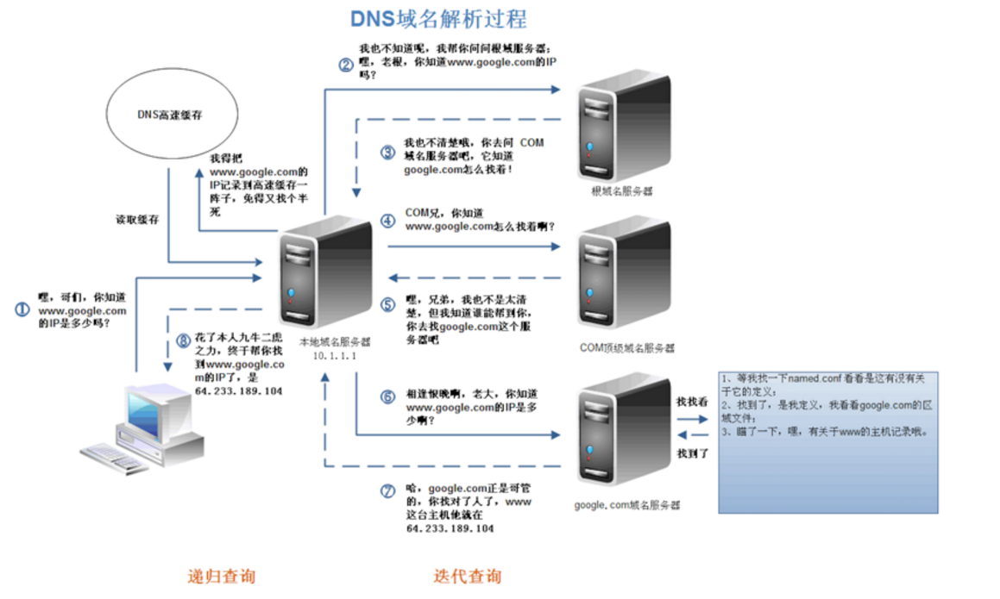

## DNS域名解析全过程

1. 检查浏览器缓存
2. 检查系统缓存（hosts文件）
3. 检查**本地域名服务器**（LDNS），这台服务器一般在你的城市的某个角落，距离你不会很远
4. LDNS请求**根域名服务器**（Root Server），返回给LDNS一个所查询域的主域名服务器（gTLD Server，**国际顶尖域名服务器**，如.com .cn .org等）
5. LDNS再发送请求给上一步返回的gTLD
6. gTLD查找并返回这个域名对应的Name Server的地址，这个Name Server就是**网站注册的域名服务器**
7. Name Server根据映射关系表找到目标ip，返回给LDNS
8. LDNS缓存这个域名和对应的ip
9. LDNS把解析的结果返回给用户，用户根据TTL值缓存到本地系统缓存中，域名解析过程至此结束

浏览器缓存->系统缓存->**本地域名服务器**->**根域名服务器**->**国际顶尖域名服务器**->**网站注册的域名服务器**

