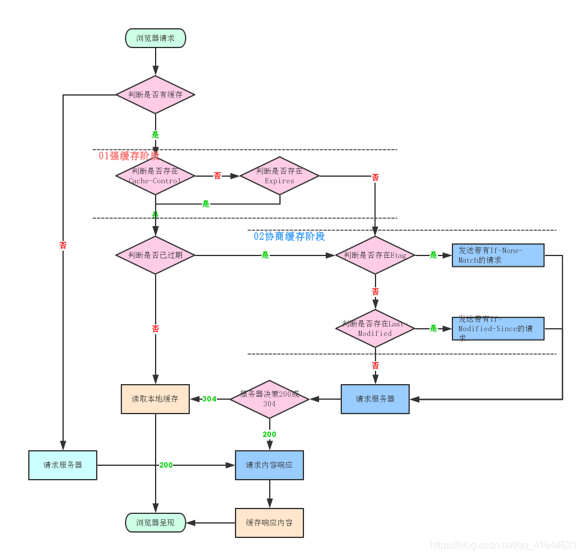

## http

### http头

* 常见请求头:
```
Accept: text/html,image/                                           浏览器可以接收的类型   
Accept-Charset: ISO-8859-1                                      浏览器可以接收的编码类型  
Accept-Encoding: gzip,compress                               浏览器可以接收压缩编码类型   
Accept-Language: en-us,zh-cn                                浏览器可以接收的语言和国家类型  
Host: www.lks.cn:80                                               浏览器请求的主机和端口  
If-Modified-Since: Tue, 11 Jul 2000 18:23:51 GMT   某个页面缓存时间   
Referer: http://www.lks.cn/index.html                         请求来自于哪个页面  
User-Agent: Mozilla/4.0 compatible; MSIE 5.5; Windows NT 5.0   浏览器相关信息  
Cookie：                                                                    浏览器暂存服务器发送的信息  
Connection: close1.0/Keep-Alive1.1                          HTTP请求的版本的特点  
Date: Tue, 11 Jul 2000 18:23:51GMT                       请求网站的时间  
Allow:GET                                                                  请求的方法 GET 常见的还有POST  
Keep-Alive：5                                                            连接的时间；5  
Connection：keep-alive                                             是否是长连接  
Cache-Control：max-age=300                                   缓存的最长时间 300s 
```

* 常见响应头:
```
Location: http://www.lks.cn/index.html                          控制浏览器显示哪个页面   
Server:apache nginx                                                   服务器的类型   
Content-Encoding: gzip                                               服务器发送的压缩编码方式   
Content-Length: 80                                                     服务器发送显示的字节码长度   
Content-Language: zh-cn                                           服务器发送内容的语言和国家名   
Content-Type: image/jpeg; charset=UTF-8                 服务器发送内容的类型和编码类型   
Last-Modified: Tue, 11 Jul 2000 18:23:51GMT           服务器最后一次修改的时间   
Refresh: 1;url=http://www.lks.cn                                  控制浏览器1秒钟后转发URL所指向的页面   
Content-Disposition: attachment; filename=lks.jpg      服务器控制浏览器发下载方式打开文件   
Transfer-Encoding: chunked                                      服务器分块传递数据到客户端    
Set-Cookie:SS=Q0=5Lb_nQ; path=/search                服务器发送Cookie相关的信息   
Expires: -1                                                                  资源的过期时间，提供给浏览器缓存数据,-1永远过期   
Cache-Control: no-cache                                           告诉浏览器，一定要回服务器校验，不管有没有缓存数据。   
Pragma: no-cache                                                      服务器控制浏览器不要缓存网页     
Connection: close/Keep-AliveHTTP                           请求的版本的特点     
Date: Tue, 11 Jul 2000 18:23:51 GMT                       响应网站的时间   
ETag：“ihfdgkdgnp98hdfg”                                       资源实体的标识(唯一标识，类似md5值，文件有修改md5就不  
```

### http缓存机制

https://blog.csdn.net/qq_41648631/article/details/106895782



### http完整请求过程

https://www.cnblogs.com/xuzekun/p/7527736.html