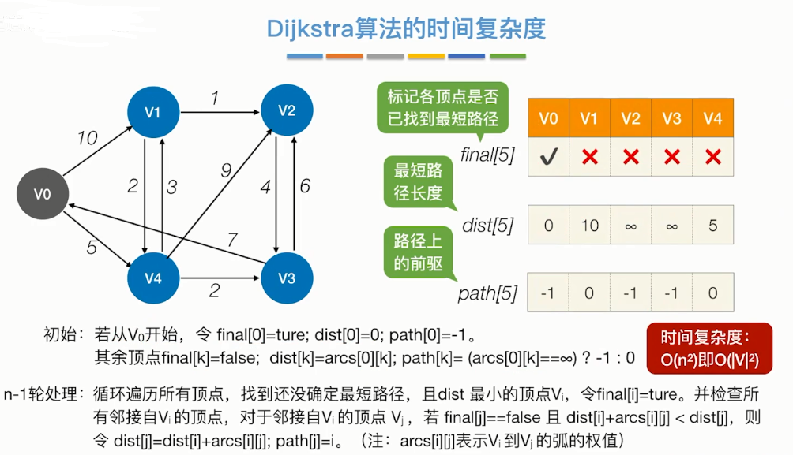
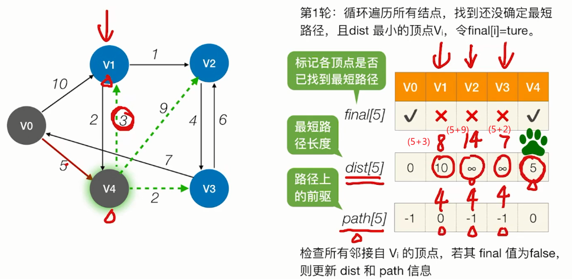
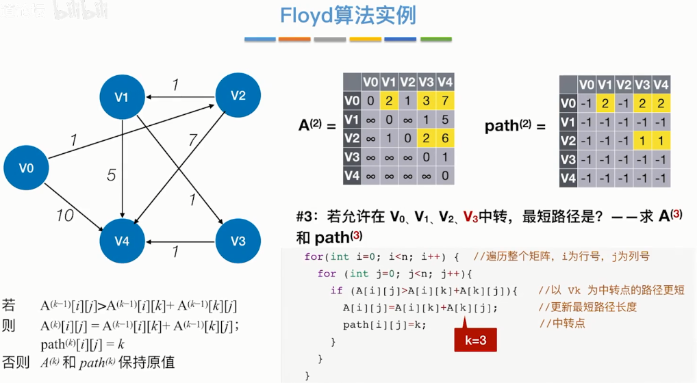
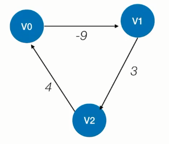

## **最短路径**
这些算法都有个额外的数组对每个结点的直接前驱进行记录，即path数组。

带权路径长度：一条路径所有边的权值之和。

### **单源**

**bfs**：无权图最短路径

**dijkstra**：带权图、无权图最短路径（不能解决带负权值的图）

https://blog.csdn.net/lbperfect123/article/details/84281300

final记录的是起点是否找到了到达其它顶点的最短路径。

dist记录的是已经加入了最短路径的顶点是否有能到其它未加入顶点的边，有则记录下最短的距离值。

path记录的是最短距离的直接前驱，如这一轮V1的前驱是V0，所以记录下0，

原理：根据dist数组更新final数组，然后再更新dist和path数组。

### **各顶点间**

**floyd**算法：带权图、无权图最短路径（能解决带负权值的图，但不能解决“负权回路”）

负权回路

