## **内部排序**
动态演示算法<https://www.cs.usfca.edu/~galles/visualization/Algorithms.html>

排序的稳定性：排序后，相同数据的相对顺序保持不变，即该算法稳定。
### **拓扑排序**
后序遍历的逆序即拓扑排序的结果.

找到做事的先后顺序（可以应用在找“关键路径”中）

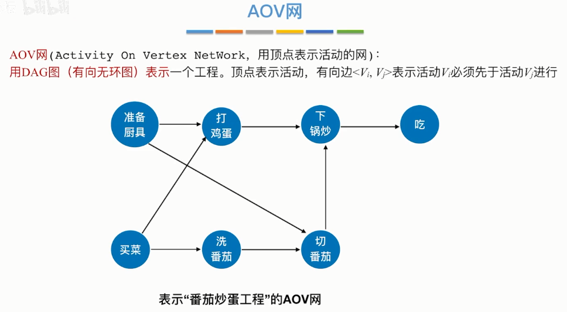

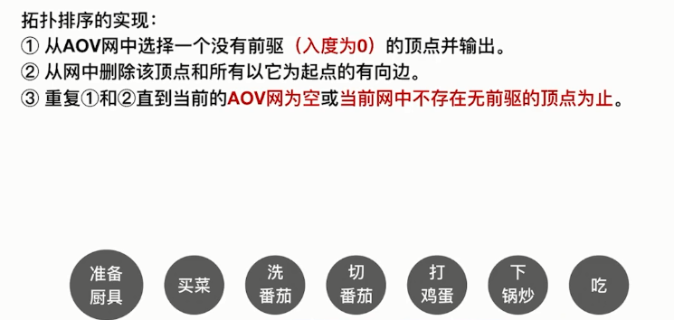

邻接表实现，时间复杂度低，逆拓扑排序（找出度为0）用邻接矩阵或逆邻接表，也可以用dfs实现

### **插入排序**
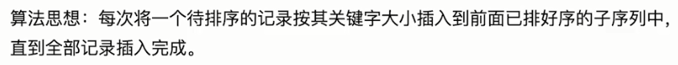
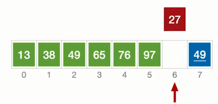
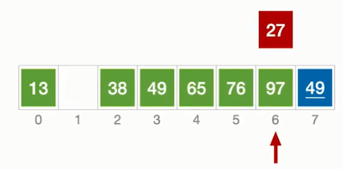
### **希尔排序**
对插入排序的优化
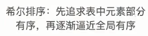

定义：

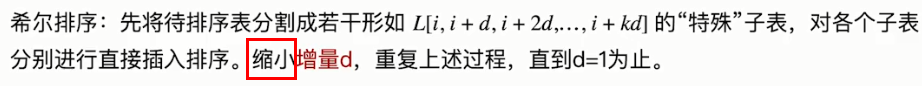

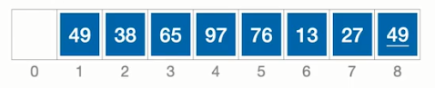
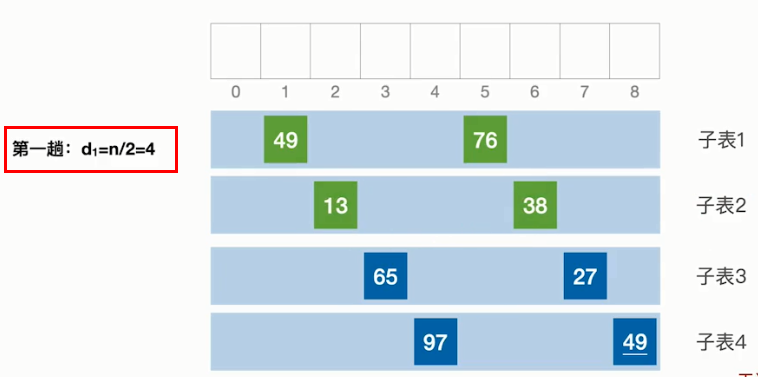

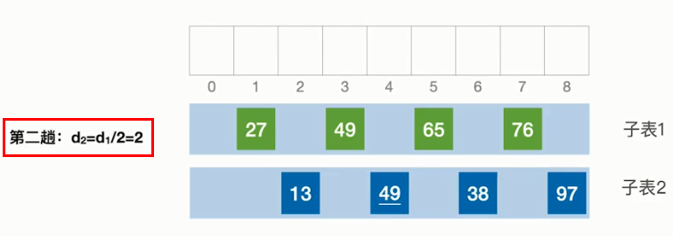
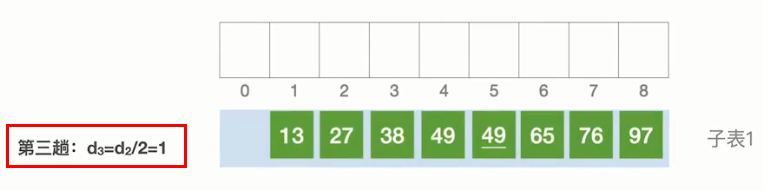
### **冒泡排序**
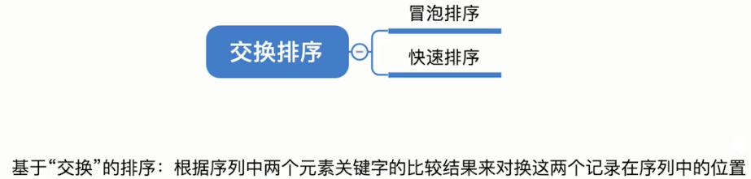

冒泡排序定义：

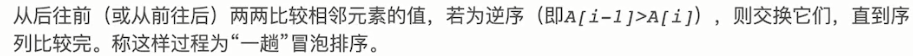
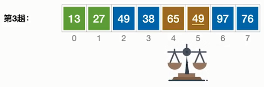
### **快速排序**
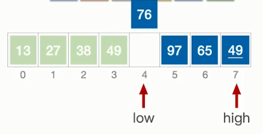

选择基准元素，

low指针：比基准元素小

high指针：比基准元素大

两个指针若谁的指向为空，则让另一个指针指向的元素和基准元素比较大小，

- 若不满足条件，将该指针指向的元素赋值到指向为空的指针；
- 若满足条件，则移动指向不为空的指针（low向后移，high向前移）。

### **简单选择排序**
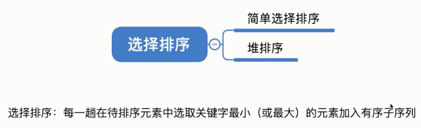

简单选择排序定义：

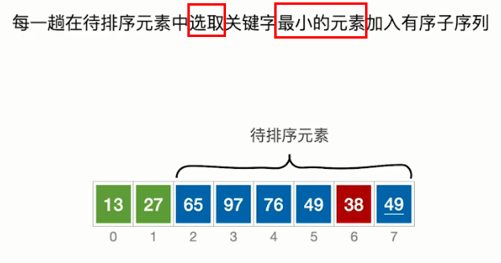
### **堆排序**
大根堆递增，小根堆递减。

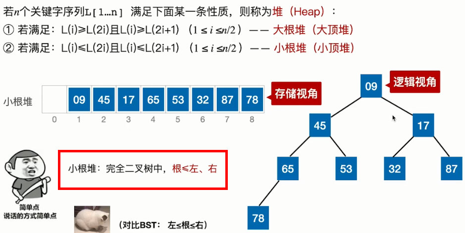

要使用堆排序，

1.首先必须将原始数组排成大根堆（小根堆）。

2.处理非终端结点：顺序存储的（数组）完全二叉树，其中非终端结点为i≤n/2的结点。令其满足大根堆（小根堆）的要求。

\3. 堆排序：每一趟将堆顶元素加入有序子序列，每一趟之后，整理剩下的二叉树（不算有序子序列）为大根堆（小根堆）。【重复3】

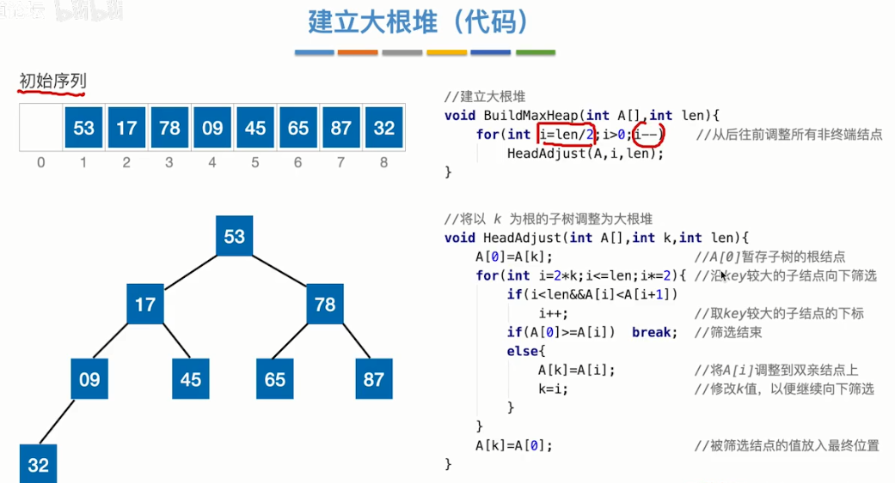

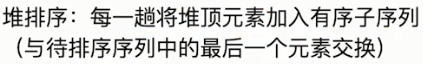

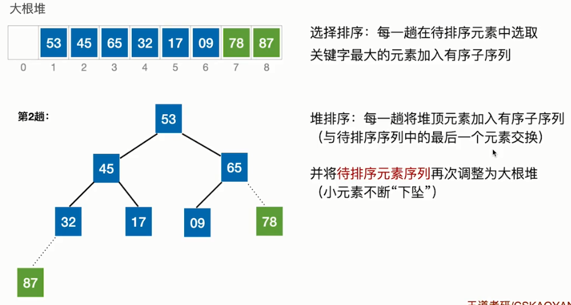

```
public class HelloWorld {  
    public static void main(String []args) {  
       int[] array = new int[]{4, 5, 8, 2};  
	int k = 3;  
	for(int i = array.length / 2 - 1; i >= 0; i--){  
	    adjustBigHeap(array, i, array.length);  
	}  
	  
	for(int i = 0; i<4;i++){  
	    System.out.println(array[i]);  
	}  
	  
    }  
      
    //调整为大根堆，左子结点为2i+1,右子结点为2i+2  
    public static void adjustBigHeap(int[] array, int i, int len){  
	int tmp = array[i];  
	for(int j = 2*i+1; j < len; j = 2*j+1){  
	    if(j<len-1 && array[j] < array[j+1]) j++;  
	    if(tmp < array[j]){  
		array[i] = array[j];  
		i = j;  
	    }else break;  
	}  
	array[i] = tmp;  
    }  
}  
```

### **归并排序**
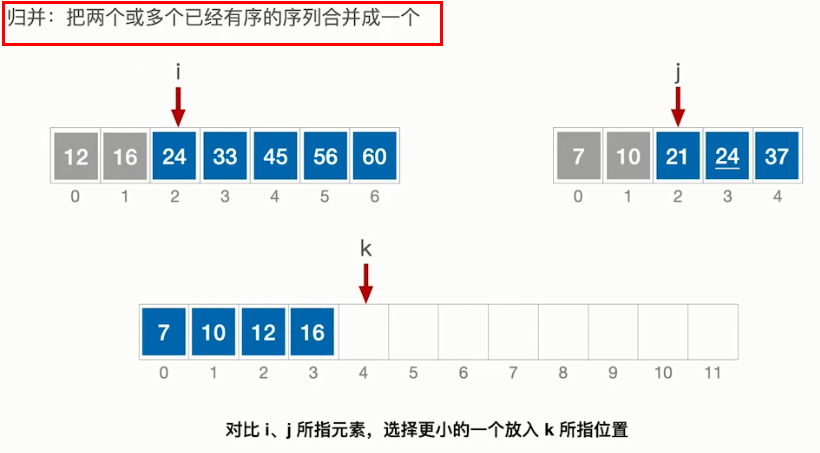

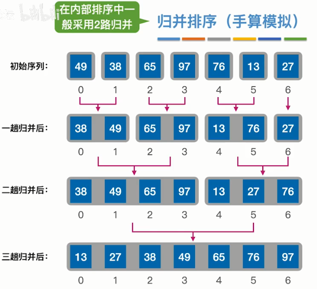

### **基数排序**
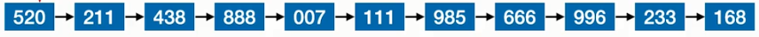

递减

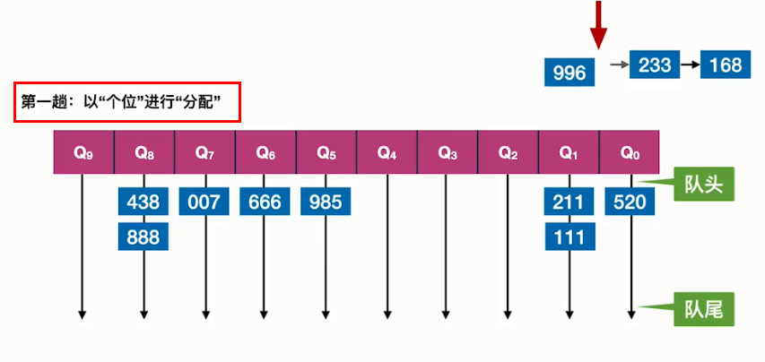

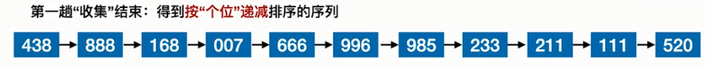

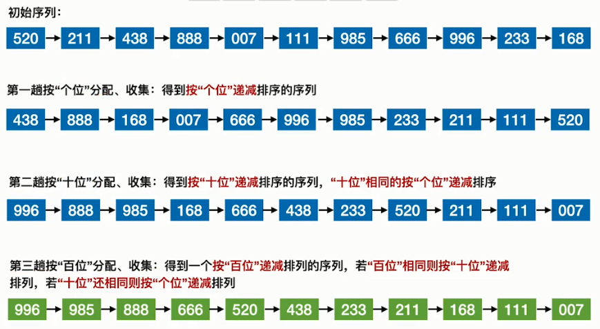


