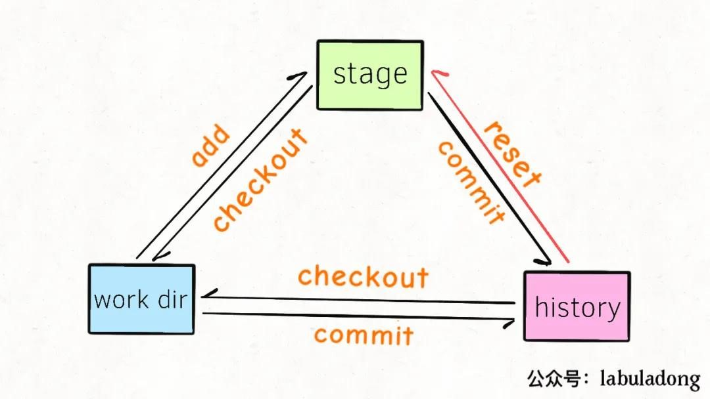

## **git命令**
### **本地**

```
git init             创建本地仓库

git add              添加某文件到暂存区

git commit           将暂存区所有文件提交到当前分支（快照）

git status           查看工作区状态

git diff             查看工作区某文件的变化

git log              查看提交到分支的版本/commit id（commit的记录）

git log --graph --pretty=oneline --abbrev-commit

`                     `可以查看到合并的图（merge）

git reset            版本回退（unlink...?需要将编辑器关闭）

git reset --hard HEAD^

`                     `其中HEAD为当前版本，一个^为上一版本，两个^为上上一个版本，往上100个版本写100个^比较容易数不过来，所以写成HEAD~100

除了用HEAD这种方式，还可以用commitID（可以通过git log查看），比如

git reset --hard cb926...（一个SHA1计算出来的一个非常大的数字，用十六进制表示），可以回退到这个“提交版本”

git reset --mixed：  此为默认方式，不带任何参数的git reset，即时这种方式，它回退到某个版本，只保留源码，回退commit和add信息

git reset --soft：   回退到某个版本，只回退了commit的信息。如果还要提交，直接commit即可

git reset  --hard：  彻底回退到某个版本，本地的源码也会变为上一个版本的内容，慎用！


git reflog           查看git所有分支操作（历史记录操作，每一个操作对应着一个ID）
```

以上是本地仓库版本回退


git checkout         有切换分支和撤销修改两种意思，当后面跟的是分支名，就表示切换，后面跟的是路径就是撤销，如果撤销文件名和分支名相同，需要在其前面加上“-- ”注意有一个空格。所以一般为了好分辨，如果是路径就加上“-- ”，如果是切换分支就不加。

git checkout -b dev  创建dev分支，并切换到dev分支

git checkout -- readme.txt意思就是，把readme.txt文件在工作区的修改全部撤销，这里有两种情况：

* 一种是readme.txt自修改后还没有被放到暂存区，现在，撤销修改就回到和版本库一模一样的状态；

* 一种是readme.txt已经添加到暂存区后，又作了修改，现在，撤销修改就回到添加到暂存区后的状态。

总之，就是让这个文件回到工作区没有修改的状态（用版本库里的版本替换工作区的版本，无论工作区是修改还是删除，都可以“一键还原”）
```
git reset HEAD 文件名  可以把暂存区的修改撤销掉（unstage），重新放回工作区
```

`                     `git reset命令既可以回退版本，也可以把暂存区的修改回退到工作区。当我们用HEAD时，表示当前分支最新的版本

Git 的一些命令中，借鉴了这种用法。使用 -- 去隔离开“树”与“路径”。

例如，你想还原 一个文件 path/to/file.txt，在Git中使用如下命令

git checkout path/to/file.txt

但是天杀的居然有一个文件名字就叫做 "master"

如果你套用上面的命令，想还原“master”文件

git checkout master

最终起的效果是变成切换到了master分支上。

正确的做法是使用 --，这样它后面的字符串不会当做“树”，而认为是文件路径。

如git checkout -- master

git checkout 还有一种作用，如果工作区中的文件被误删，但如果本地仓库中还有，可以将仓库中的文件恢复到工作区，即可以从本地仓库中有而工作区没有的copy到工作区中
```
git rm          删除本地连同版本库里的某文件，且需要commit一次

git rm –cached a/2.txt //unstaged,将暂存区的文件放回工作区

git rm -r --cached a/2.txt     删除a目录下的2.txt文件(删除远程不删除本地)

git rm -r --cached a    删除a目录，目录名有空格命令行需要用"\"进行转义，（如git rm -r --cached Photo\ albums）

git commit -m      "删除a目录下的2.txt文件" 

git push
```

### **远程**

ssh-keygen -t rsa -C "邮箱" 生成密钥，如果远程仓库没有保存你生成的密钥，你将只能pull，而不能push

>在这之前要确保git config --global –list，若没有配置用户名和电子邮件地址
>
>git config --global  user.name "这里换上你的用户名"
>
>git config --global user.email "这里换上你的邮箱"
>
>每次commit时都会引用这两条信息，以说明是谁提交了代码。


git remote add origin <git@gitee.com:ber3ud4/learngit.git>（首先本地仓库已经建立好了）

连接远程库

git remote -v   查看已连接的远程库，如果没有推送权限，就看不到push的地址。

git remote set-url origin git@gitee.com:ber3ud4/learngit.git 更改remote链接

>git branch -M main  //修改当前分支名为main（因为说以前的master有黑人奴隶歧视啥的）

git push -u origin master

`                `origin代表本地仓库，将本地的master分支推送到远程库的分支，同时把本地的master分支和远程的master分支关联起来，在以后的推送或者拉取时就可以简化命令，第一次push必须要加-u，否则会报错，推送时，要指定本地分支，这样，Git就会把该分支推送到远程库对应的远程分支上（在之前，首先要add,commit到本地仓库中）

### **分支**

git branch name   创建分支name，创建了分支后如果在工作区修改后且并未add、commit，如果这时想切换到其他分支，请务必stash，否则在当前的修改会覆盖你想切换的分支中的相关文件。


如果在dev分支工作区做了修改，且没有add或stash，这时你checkout到foo分支，就会把在dev分支做出的修改移动到foo分支，dev分支工作区就没有修改，而foo分支做出了修改


git push --set-upstream origin branch1 将本地分支推送到远程，让远程也建立该分支


git branch        查看所有分支

git branch -d dev    删除dev分支，如果未合并，不允许删除

git branch -D     强行删除，即使未合并

git merge dev     把dev分支合并到当前分支 fast-forward，查看log无法查到合并记录

git merge --no-ff 禁用fast-forward(快进模式)表示普通合并，合并后的历史有分支，能看出来曾经做过合并，而fast forward合并就看不出来曾经做过合并。其实合并相当于提交当前分支，可以加上-m参数

git merge --no-ff -m "merge with no-ff" dev

git stash         将当前分支的工作现场储藏起来

类似栈，先进后出

git stash list    查看当前分支所储藏的工作现场列表

git stash apply   将当前分支储藏的工作现场列表最新的放回工作区，stash列表的其记录并不删除

git stash pop     同上一样，只不过列表中的其记当会被删除

git stash apply stash@{0}   放回指定的stash记录，需要手动删除stash列表记录

git stash drop stash@{0}   删除stash列表中的指定记录，用法和上述相同，如果不跟名称，删除所有


git checkout -b branch-name origin/branch-name

`                           `本地没有某分支，在本地创建和远程分支对应的分支，使用这个，本地和远程分支的名称最好一致

### **冲突**
https://www.cnblogs.com/gavincoder/p/9071959.html

只有**分支合并**会产生**冲突**

多人协作的工作模式通常是这样：

>首先，可以试图用git push origin branch-name推送自己的修改；
>
>如果推送失败，则因为远程分支比你的本地更新，需要先用git pull试图合并；
>
>如果合并有冲突（merging提示），则找到冲突的地方（git会在文件中将互相冲突的内容标明），视情况更改，更改完成后在本地提交，至此冲突解决完毕（将不会再有merging提示）；
>
>没有冲突或者解决掉冲突后，再用git push origin branch-name推送就能成功！
>
>如果git pull提示“no tracking information”，则说明本地分支和远程分支的链接关系没有创建，用命令
>
>git branch --set-upstream branch-name origin/branch-name。

这就是多人协作的工作模式，一旦熟悉了，就非常简单。

### **标签**

git tag \<tagname>  用于新建一个标签，默认为HEAD，也可以指定一个commit id

`                   `git tag v0.9 6224937

git show \<tagname> 查看标签信息

git tag -d v0.1    删除v0.1这个标签

git push origin \<tagname>  推送某个标签到远程

git push origin --tags     一次性推送全部尚未推送到远程的本地标签


git tag -d v0.9

git push origin :refs/tags/v0.9   

`            `标签已经推送到远程，先从本地删除，然后，从远程删除。删除命令也是push


同一台电脑设置多个公钥与不同GITHUB帐号交互，在config文件中只需要更改host即可，git remote add git@host:账户名/仓库名.git，其中的host用config中的host

### **删除仓库**
删除本地仓库

方法：

1.手动删除掉“Git本地仓库”里面的根目录下面的隐藏文件夹“.git”

2.命令：find . -name ".git" | xargs rm -Rf

验证：在Gitbash中进入仓库的目录中，如果目录末尾没有"(master)"，说明成功删除了本地仓库。


删除远程仓库

在github网站上找到tab上的settings,然后找到删除仓库链接即可。


### 总结
git仓库分为3个区，


1.	工作区（看得到的文件系统）
2.	暂存区stage
3.	历史区history（里面存的链表或者说是树【因为有多个分支】）：每1个结点便为commit的版本。

其实可以类比【事务】。

只有当一次事务commit后，才真正地保存了修改，每一次事务当然有事务id，git中对应commit的唯一hash，而history区中head指针则指向某一次提交的版本，默认指向最新修改的版本。

git status查看work dir和stage区域的状态，
git log查看history区域的提交历史。

 

git checkout 会覆盖
git reset的应用场景（将文件的状态从stage退化到工作区，和checkout不同）：
对某文件进行了修改，然后git add将修改信息同步进了stage【工作区和stage区的内容相同，history不同】
此时使用git reset,会将history区里head指向的对应文件对stage区里的该文件进行覆盖【工作区为做出修改后的内容，history同化stage区的内容】
并将该文件设为unstage状态【此时可以接着之前的修改继续对该文件进行修改，然后git add】
