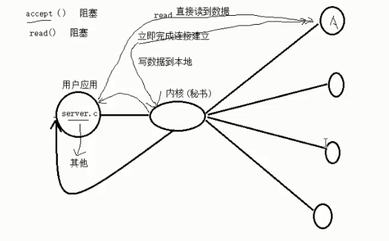
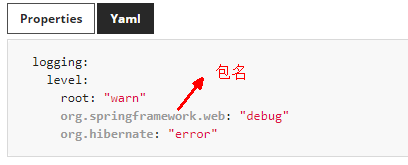
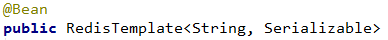
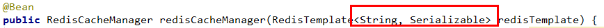
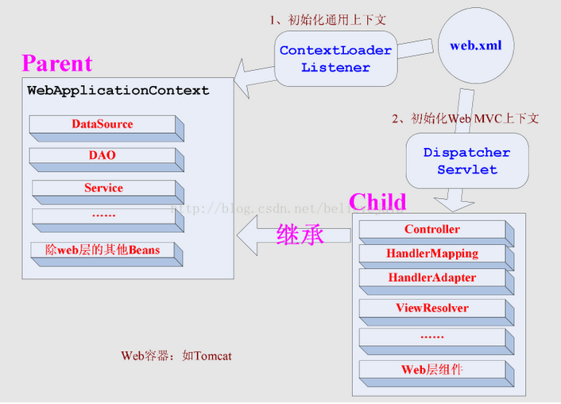
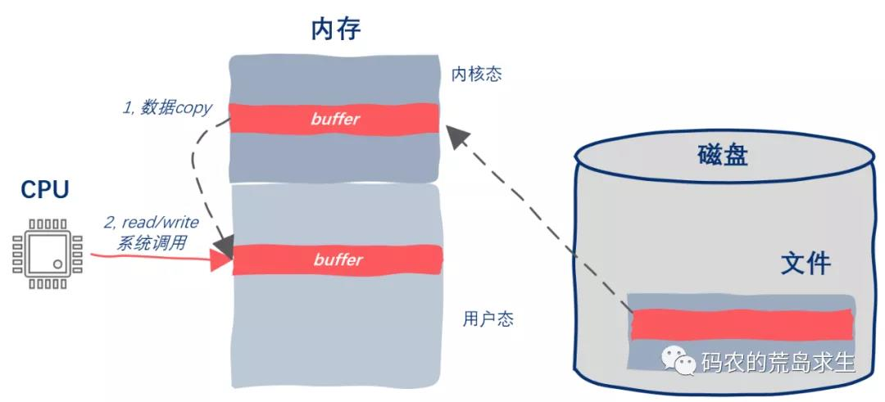
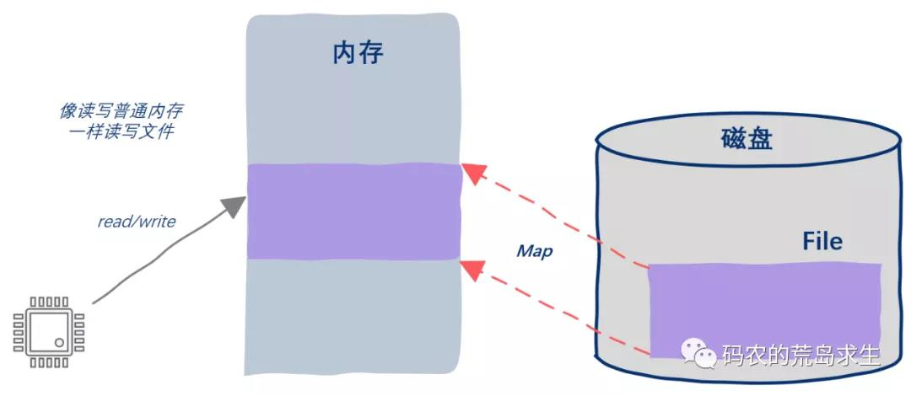

# 问题篇

## 0x7FFFFFFF

0x7FFFFFFF == (int)(0x7FFFFFFF \* 2.0)

在打印这个语句的时候，编译器给出的答案是true

System.out.println((int)(0x7FFFFFFF \* 2.0) == (int)(0x7FFFFFFF \* 2));

System.out.println((int)(0x7FFFFF \* 2.0) == (int)(0x7FFFFF \* 2));

而这两个语句java给出的分别为false和true。

在java中，int是占4个字节大小，double占8个字节的大小，当你把某变量乘以2的时候，在计算机里面的处理方式是左移一位。当使用浮点数进行乘法运算时，若结果很大，会以科学计数法表示。

下面具体分析：

1、表达式0x7FFFFFFF == (int)(0x7FFFFFFF \* 2.0)

0x7FFFFFFF 已经占了4个字节，也就是int型的最大范围，以二进制表示出来为01111111
11111111 11111111 11111111

0X7FFFFFFF\*2.0
计算出来的结果为double型，那么结果将会以科学计数法来表示，也就是4.294967294E9，
以二进制表示为0 11111111 11111111 11111111 11111110，以16进制表示为0xFF FF FF
FE，注意，这里的计算结果并没有超出double的范围8字节。

(int)(0x7FFFFFFF \* 2.0) 在上面已经看到0x7FFFFFFFF的二进制表示为01111111
11111111 11111111 11111111乘以2就表示左移一位，结果为0 11111111 11111111
11111111 11111110
(注意，这个数并未超出8字节的范围)然后再把结果强制转换为int型，也就是从最高位开始向下取4个字节，因此最后一位的0被丢弃(取double的最大值，因此丢弃最低位)，最后结果以二进制表示为01111111
11111111 11111111 11111111，以16进制表示为0x7F FF FF
FF，可以看到与0x7FFFFFFFF的相同，因此第一个表达式0x7FFFFFFF == (int)(0x7FFFFFFF
\* 2.0)返回true。

2、表达式(int)(0x7FFFFFFF \* 2.0) == (int)(0x7FFFFFFF \* 2)

(int)(0x7FFFFFFF \*
2.0)这部分的结果在上面介绍过了，这里就不用介绍了，结果还是为0x7F FF FF FF。

(int)(0x7FFFFFFF \* 2)
其中0x7FFFFFFF\*2表示把0x7FFFFFFF左移一位，其二进制结果为0 11111111 11111111
11111111
11111110，因为最后为int型，计算结果超出4个字节，因此最高位的0被丢弃(int型的计算是抛弃最高位)，结果为11111111
11111111 11111111 11111110，以16进制表示为0xFF FF FF
FE与0x7FFFFFFF不相同，因此结果为false。

要注意，在计算机中数值是以补码的形式表示的(包括以上的计算结果全都是以补码表示的)，补码知识不作介绍，这里只要知道，正数的被码就为原来的正数，而负数的补码为符号位不变，其余各位按位取反再加1。因此0xFF
FF FF
FE除符号位不变(在java中int型最高位为符号位)，其余各位取反再加1，结果为10000000
00000000 00000000 00000010最后结果为-2，以16进制表示为0x80 00 00
02，因此使用print输出该数，则为-2，并不为0xFF FF FF FE的十进制数值。

3、表达式0x7FFFFF \* 2.0== (int)(0x7FFFFF \* 2)

因为两个数字计算的结果都没有出现超出int型的4个字节的情况，因此计算结果相同，这个就不介绍了，相信你应该明白了。

## 整数默认是int类型

java中的整数默认是int类型的，也就是4个字节，

写long b = 0xfffffffff; 实际上相当于long b = (int)0xfffffffff;

0xfffffffff 已经超过int的范围了，强转的话，超过范围转不了，所以会报错。

在0xfffffffff后面加个L，相当于把int强转成long就不会报错了。

另外，java中的浮点小数默认是double的，float f = 0.9;这样写也是不行的，

要这样写float f = 0.9F;

如果：double a = 0x7fffffff;要写比这个更大的数的话，

同理，需要在后面加个L，如double a = 0x7ffffffffffl;就不会报错了

## 查看servlet版本

1\. 简要说明：Tomcat6.0 所支持的是Servlet2.5，Tomcat 7.0
所支持的Servlet3.0，Servlet2.5
和Servlet3.0的差异较大，对于Servlet3.0而言，WEB-INF路径下的web.xml文件不再是必需的，但通常还是建议保留；当
然，Servlet2.5 和 Servlet3.0 还是有很多其他方面的差别

2\. 查看Servlet和jsp的版本

-   进入Tomcat根目录下的lib，找到servlet-api.jar/jsp-api.jar

-   双击使用WinRAR打开，找到META-INF\\MANIFEST.MF文件，其中便包含了其版本信息；

-   我的Servlet版本信息

Manifest-Version: 1.0

Ant-Version: Apache Ant 1.8.4

Created-By: 1.6.0_39-b04 (Sun Microsystems Inc.)

X-Compile-Source-JDK: 1.6

X-Compile-Target-JDK: 1.6

Name: javax/servlet/

Specification-Title: Java API for Servlets

Specification-Version: 3.0 //servlet版本

Specification-Vendor: Sun Microsystems, Inc.

Implementation-Title: javax.servlet

Implementation-Version: 3.0.FR

Implementation-Vendor: Apache Software Foundation

我的Jsp版本信息

Manifest-Version: 1.0

Ant-Version: Apache Ant 1.8.4

Created-By: 1.6.0_39-b04 (Sun Microsystems Inc.)

X-Compile-Source-JDK: 1.6

X-Compile-Target-JDK: 1.6

Name: javax/servlet/jsp/

Specification-Title: Java API for JavaServer Pages

Specification-Version: 2.2 //jsp版本

Specification-Vendor: Sun Microsystems, Inc.

Implementation-Title: javax.servlet.jsp

Implementation-Version: 2.2.FR

Implementation-Vendor: Apache Software Foundation

## 操作系统对int的影响

通常，int被设置为对目标计算机而言最为“自然”的长度。

自然长度指的是计算机处理起来效率最高的长度。如果没有非常有说服力的理由来选择其他类型，则应使用int。

如果知道变量可能表示的整数值大于16位整数的最大可能值，则使用long，即使系统上int为32位，也应这样做，这样做了后，即使将程序移植到16位系统时，也能正常工作，不会报错。

如果节省内存很重要，则应使用short而不是使用int，即便他们的长度是一样的。

例如，假设要将程序从int为16位的系统移到int为32位的系统，则用于存储int数组的内存量将加倍，但short数组不受影响。

请记住，节省一点就是赢得一点。

ps:

short至少16位；

int至少与short一样长；

long至少32位，且至少与int一样长；

long long至少64位，且至少与long一样长。

## double太大int结果未定义

问：

(int)(0x7FFFFFFF \* 2.0)

答：

在Java中，如果 double 类型的值太大以至于超过了 int 的范围，那么转换后得到的会是
int 的最大值（即 0x7FFFFFFF）。

在C++中，如果 double 类型的值太大以至于超过了 int 的范围，那么结果是"未定义"的。

问：

官方文档写的“未定义”指的是不能得到确定的结果，还是不能重现？

答：

不确定结果不能重现的结果都只是“未指定”（unspecified）。

未定义的行为允许程序崩溃或者其他意想不到的效果,这是平台供应商便宜行事，语言使用者应小心回避。

就是说你换个编译器/换个编译选项就可能会有不同的结果，应当尽量避免。还有可能把你的硬盘格式化等各种可能

## springboot-jar包资源文件找不到

springboot打的jar包中的文件读取问题。fileNotFoundException

在实际开发中，我们需要把服务器上面的文件下载到本地。如果该文件被包含在jar包中，这时去读取就可能会找不到文件

1.  File file = ResourceUtils.getFile("static/template/user.xls");

2.  Resource resource = new UrlResource(file.toURI());

但是当这个代码被打包成jar包运行时，无法读取到文件

必须使用ClassPathResource()类。

Resource resource = new ClassPathResource("static/template/user.xls");

有时间可以研究下

UrlResource 和 ClassPathResource 的区别

## Math.round(x)

round(x)方法，底层调用的是native方法（c++写的），它表示“四舍五入”，算法为Math.floor(x+0.5)，即将原来的数字x加上0.5后再向下取整，所以，Math.round(11.5)的结果为12，Math.round(-11.5)的结果为-11

## 多路I/O转接服务器（NIO+选择器概念）

由题可知，不再由应用程序自己监听客户端连接，将这个任务转接给内核（秘书），让内核替应用程序监视连接。

用户应用在accept时不会再阻塞（也就是所谓的nio），一读就能读到。

三种：

select

poll

epoll

**这三者本质上是监听的文件描述符，因此不仅可以监听socket返回的文件描述符，还可以监听文件、管道等凡是可以使用文件描述符句柄的东西。**

## hashmap扩容是2的n次幂

方便rehash位运算提高性能。

取余运算能换成&操作，只要被余数是2的n次幂，x%(被余数）=x&(被余数-1）

## spring解决循环依赖

<https://blog.csdn.net/weixin_47340771/article/details/113407267>

<https://blog.csdn.net/m0_43448868/article/details/113578628>

<https://www.jianshu.com/p/84fc65f2764b>

为了解决循环依赖，spring采取了提前暴露半成品bean的想法，而bean有可能会被代理，因此在bean被循环引用时，需要临时生成代理对象并将引用交出去，因此采用了三级缓存（其中二级缓存存放代理对象），spring的设计原则是在bean初始化完成后，再生成代理对象。而在有循环依赖的情况下，为了不让这种设计原则被打破，才在一级缓存和三级缓存中加入了二级缓存，来暂时给半成品生成代理对象。

存在代理的情况下：

1，无循环依赖情况，就正常完成bean的初始化，然后进行代理对象的生成

2，有循环依赖，半成品对象被引用时，临时生成代理对象（该代理对象内部引用了原半成品对象，某变量记录该代理对象并从三级放入二级缓存）并返回给其它引用该对象的属性；当来到原始的半成品对象生成时，会将属性填充完成，再尝试从某变量的记录中获取该对象的代理对象，若获得则直接返回代理对象，bean生成完成。

## 补码运算

1\. cpu都是采用补码进行运算。

2.
从原码到补码的过程符号位不变，即使是反码到补码的+1操作或者反过来的-1进位到了符号位，符号位依然不变。

3.
补码不分符号位，运算位，全部参与运算，但是补码的最高位可以分辨出该数是负数还是正数。

## spring事务传播

spring的事务传播，不同方法该怎么加入同一个事务，外方法加@Transactional,然后内方法也加上@Transactional,异常全部抛出，由调用外方法的方法处理。

## mybatis返回创建的主键值

mybatis的插入方法的返回值，返回的是影响行数，如果设置了useGeneratedKey和keyProperty=id，那么mybatis会在插入数据库后，将生成的主键给传的对象里的id设值。

## springboot中打印日志

其本身内置了slf4j日志框架，我们只需要添加依赖lombok，idea再下载lombok插件即可使用。

如果要更改打印级别：debug\>info(默认)\>error，springboot2.4.6官网：

## mybatis注解映射参数

@Insert(**"insert into blog_user_articleview(user_id,article_id,article_view)
values(\#{userId},\#{articleId},\#{view})"**)  
**public int** insertArticleViewByUser(@Param(**"articleId"**) String
articleId,@Param(**"userId"**) Long userId,@Param(**"view"**)String view);

有多个需要@Param，但如果只有一个参数，则不用。

## mybatis返回参数resultType为map

如果返回单行记录，dao里的方法返回值应该写Map\<String,Object\>，则map的key为字段，value为字段的值

如果返回多行记录，dao里的方法返回值应写List\<Map\<String,Object\>\>

## 让mysql中字段的默认值起作用

mysql设置的字段默认值，本意是想要插入时如果不给该字段设值，则会有个默认值，

但是在用mybatis的默认insert方法时，查看他的sql语句写的是给每个字段赋值，而java里没写的字段，默认为null值，插入数据库后，本该是设定默认值的字段变成了显式的字符串“null”值.

应该采用insertSelective写法。

## 在同一个类中传播事务

使当前类实现BeanFactoryAware接口，并实现setBeanFactory方法，添加BeanFactory字段，然后通过beanFactory的getBean方法获取当前类的Bean实例来调用目标事务方法，即可实现嵌套之类的事务调用。

## shiroConfig的bug

在建redis公共模块的时候，发现只有shiroConfig通过@Value是获取不到值的，不像我之前想的是因为spring在扫描bean时出了问题，然后单独搜了一下为什么shiroConfig获取不到。

原来是shiro自己把自己相关的bean的初始化和销毁给控制了，也就是说在初始化shiro的bean的时候，spring里的其它bean还没有初始化（我猜测，没看源码也不清楚），所以获取不到值。

解决办法是通过把那个shiro管理生命周期的bean给弄成static，这样这个bean就不会被spring给放进缓存中，那么它就管不到其他shiro的bean了，由spring接管。

## @cachable使用自定义序列化

<https://www.cnblogs.com/cjsblog/p/9150482.html>

<https://blog.csdn.net/b376924098/article/details/79820642>

<https://blog.csdn.net/weixin_46828364/article/details/110796040>

尝试解决：@cachable无法使用自定义序列化的设置，导致redis数据库存储乱码时，

没有注意到存进spring容器中的redisTemplate的bean是有泛型说明的，但在注入redisCacheManager时，却没有加泛型说明，因此导致redisCacheManager的redisTemplate是默认的redisTemplate,而不是我修改过的使用fastjson的valueSeriliazer的redisTemplate.

解决了@Cacheable序列化乱码的问题，但是发现了若是命名空间含有中文，则命名空间会有乱码。

## 唯一标识浏览器

然后又找到了一种叫“浏览器指纹”的东西，它能唯一标识一个浏览器，

也就是一个浏览器（可打开多个标签）则为一个人

<https://zhuanlan.zhihu.com/p/67923680>

使用的canvasFP成功实现。

## 添加https证书(未解决)

本来打算先尝试将登录页面与后台接口连接起来，结果一上来就碰到了cookie无法设置的跨域问题，

原因是谷歌的内核在19年在response的header中的set-cookie字段上新增加了属性samesite,避免csrf攻击，它的要求是如果要无障碍的跨域访问，必须得设置samesite为None（默认是Lax）,且必须得有secure属性（有该属性意味着接口必须是https而不是http）。

因此要变更接口的访问协议httphttps，添加安全证书，因为是测试，所以就随便找了个网上的方法，整了个证书放到resources下面，配置好application.yml后，启动服务，却在证书对应的路径下报“无可读文件”的异常，

不是说没有文件，而是“无可读文件”，怀疑是格式无法正常识别？或者是其它问题

## classpath与classpath\*区别

同名资源存在时，classpath只从第一个符合条件的classpath中加载资源，而classpath\*会从所有的classpath中加载符合条件的资源。classpath\*，需要遍历所有的classpath，效率肯定比不上classpath，因此在项目设计的初期就尽量规划好资源文件所在的路径，避免使用classpath\*来加载。

## ContextLoaderListener和DispatcherServlet初始化上下文关系和区别

从上图可以看出，ContextLoaderListener初始化的上下文加载的Bean是对于整个应用程序共享的，一般如：DAO层、Service层Bean；DispatcherServlet初始化的上下文加载的Bean是只对Spring
MVC有效的Bean，如：Controller、HandlerMapping、HandlerAdapter等，该初始化上下文只加载Web相关组件。

注意：用户可以配置多个DispatcherServlet来分别处理不同的url请求，每个DispatcherServlet上下文都对应一个自己的子Spring容器，他们都拥有相同的父Spring容器（业务层，持久（dao）bean所在的容器）。

## servlet多init-param示例

1.  \<servlet\>

2.  \<servlet-name\>JerseyServlet\</servlet-name\>

3.  \<servlet-**class**\>com.sun.jersey.spi.spring.container.servlet.SpringServlet\</servlet-**class**\>

4.  \<init-param\>

5.  \<param-name\>com.sun.jersey.api.json.POJOMappingFeature\</param-name\>

6.  \<param-value\>**true**\</param-value\>

7.  \</init-param\>

8.  \<init-param\>

9.  \<param-name\>com.sun.jersey.config.property.packages\</param-name\>

10. \<param-value\>

11. com.app.system.ifbus;

12. com.app.user.api

13. \</param-value\>

14. \</init-param\>

15. \<load-on-startup\>1\</load-on-startup\>

16. \</servlet\>

17. \<servlet-mapping\>

18. \<servlet-name\>JerseyServlet\</servlet-name\>

19. \<url-pattern\>/rest/\*\</url-pattern\>

20. \</servlet-mapping\>

## timeStamp还是dateTime?

[https://snailclimb.gitee.io/javaguide/\#/docs/database/mysql/%E5%85%B3%E4%BA%8E%E6%95%B0%E6%8D%AE%E5%BA%93%E5%AD%98%E5%82%A8%E6%97%B6%E9%97%B4%E7%9A%84%E4%B8%80%E7%82%B9%E6%80%9D%E8%80%83](https://snailclimb.gitee.io/javaguide/#/docs/database/mysql/%E5%85%B3%E4%BA%8E%E6%95%B0%E6%8D%AE%E5%BA%93%E5%AD%98%E5%82%A8%E6%97%B6%E9%97%B4%E7%9A%84%E4%B8%80%E7%82%B9%E6%80%9D%E8%80%83)

## 标准IO和mmap

我们常用的标准IO，也就是read/write其底层是涉及到系统调用的，同时当使用read/write读写文件内容时，需要将数据从内核态copy到用户态，修改完毕后再从用户态copy到内核态，显然，这些都是有开销的。

而mmap则无此问题，基于mmap读写磁盘文件不会招致系统调用以及额外的内存copy开销，但mmap也不是完美的，mmap也有自己的缺点。

1.  其中一方面在于为了创建并维持地址空间与文件的映射关系，内核中需要有特定的数据结构来实现这一映射，这当然是有性能开销的，

2.  除此之外另一点就是缺页问题，page fault。

注意，缺页中断也是有开销的，而且不同的内核由于内部的实现机制不同，其系统调用、数据copy以及缺页处理的开销也不同，因此就性能上来说我们不能肯定的说mmap就比标准IO好。这要看标准IO中的系统调用、内存调用的开销与mmap方法中的缺页中断处理的开销哪个更小，开销小的一方将展现出更优异的性能。

## mysql删除重复数据且保留一行

1.  DELETE

2.  FROM

3.  dept

4.  WHERE

5.  deptno NOT IN (

6.  SELECT

7.  dt.minno

8.  FROM

9.  (

10. SELECT

11. MIN(deptno) AS minno

12. FROM

13. dept

14. GROUP BY

15. dname

16. ) dt

17. )

## String的intern

总结：

intern和字面值的方式是一样的。

toString和字面值的方式是一样的。

\---------------------------------

String类的intern()方法：一个初始为空的字符串池，它由类String独自维护。当调用
intern方法时，

-   不包括的话，1.7及以前，将此String对象添加到池中，并返回此String对象（注意是常量池中的对象，不是堆中的对象）的引用。

-   如果池已经包含一个等于此String对象的字符串或者字符串对象（用equals(object)方法确定），则返回池中的字符串引用或者字符串对象引用。

对于任意两个字符串s和t，当且仅当s.equals(t)为true时，s.intern() ==
t.intern()才为true。所有字面值字符串和字符串赋值常量表达式都使用
intern方法进行操作。

\---------------------------------

1.  String s1 = "abc";

2.  String s2 = "abc";

3.  System.out.println(s1==s2); //true

一共只创建了1个对象。

采用字面值的方式创建一个字符串时，JVM首先会去字符串池中查找是否存在"abc"这个对象，

-   如果不存在，则在字符串池中创建"abc"这个对象，然后将池中"abc"这个对象的引用地址返回给"abc"对象的引用s1，这样s1会指向池中"abc"这个字符串对象；

-   如果存在，则不创建任何对象，直接将池中"abc"这个对象的地址返回，赋给引用s2。

因为s1、s2都是指向同一个字符串池中的"abc"对象，所以结果为true。

\---------------------------------

1.  String s3 = **new** String("xyz");

2.  String s4 = **new** String("xyz");

3.  System.out.println(s3==s4); //false

一共创建了3个对象。

采用new关键字新建一个字符串对象时，JVM首先在字符串池中查找有没有"xyz"这个字符串对象，

-   如果不存在，则首先在字符串池中创建一个"xyz"字符串对象，然后再在堆中创建一个"xyz"字符串对象，然后将堆中这个"xyz"字符串对象的地址返回赋给s3引用，这样，s3指向了堆中创建的这个"xyz"字符串对象。

-   如果存在，则不在池中再去创建"xyz"这个对象了，直接在堆中创建一个"xyz"字符串对象，然后将堆中的这个"xyz"对象的地址返回赋给引用s4，这样，s4就指向了堆中创建的这个"xyz"字符串对象。

s3 、s4是两个指向不同对象的引用，结果当然是false。

\---------------------------------

1.  //等价于”ja”+”va1”,常量折叠会优化成”java1”

2.  String s1 = **new** StringBuilder().append("ja").append("va1").toString();

3.  System.out.println(s1.intern() == s1); //true

StringBuilder().toString()这个方法虽然是new了一个String对象，但其实和"java1"字面量是一样的（可以看下源码），即池中不存在，那么新建创建这个字符串的对象，然后返回该引用给s1,

s1.intern()，通过equals判断池中是否已经包含一个等于此String对象【s1】的字符串【上一步池中创建的字符串对象】（实际上这两个就是同一个引用），s1.intern()返回的是常量池中存的字符串对象的引用，所以s1.intern()
== s1。

\---------------------------------

1.  String str1 = "str"; //“str”“ing”在编译期间就已经放入字符串常量池

2.  String str2 = "ing";

3.  String str3 = "str" + "ing";//常量池中的对象
    “string”运行期间放入字符串常量池

4.  // 等价于String str4 = new
    StringBuilder().append(str1).append(str2).toString();

5.  String str4 = str1 + str2; //在堆上创建的新的对象

引用的值在程序编译期是无法确定的，因此str4得到的是堆上对象的引用。

如果：

1.  final String str1 = "str";

2.  final String str2 = "ing";

3.  // 下面三个表达式其实是等价的

4.  String c = "str" + str2;// 常量池中的对象

5.  String d = str1 + str2; // 常量池中的对象

6.  String e = **new** StringBuilder().append(str1).append("ing").toString();

7.  System.out.println(c == d && d == e);// true

str1和str2通过final被定义为了常量，因此str1和str2被其它地方使用时，在编译期间就知道他们的具体值，不再是引用。

总之，非常量的toString会返回堆中的引用，常量的toString会在字符串常量池中创建该字符串常量，并返回该引用。

1.  String a = "1";

2.  String b = "2";

3.  //String c = "1"+"2";//将字符串"12"保存进字符串常量池

4.  //System.out.println(c.intern()==c);//true,c返回的是字符串常量池的引用，c.intern也是直接返回的这个引用

5.  

6.  String d = a + b;//d返回的是堆区里的对象引用，

7.  //d.intern会用equals去判断字符串常量池是否有与该对象d的内容相等的字符串，

8.  //
    若有，直接返回，没有的话，在1.8就直接将堆对象d的引用保存进字符串常量池，返回该引用，即该对象在堆上的引用

9.  //如果把上面c的代码注释了，这里应该返回true,因为都是堆对象上的引用

10. //
    但如果去掉注释，返回false，因为d.intern返回的是字符串常量池的字符串引用，d是堆对象上的引用

11. System.out.println(d.intern()==d);
