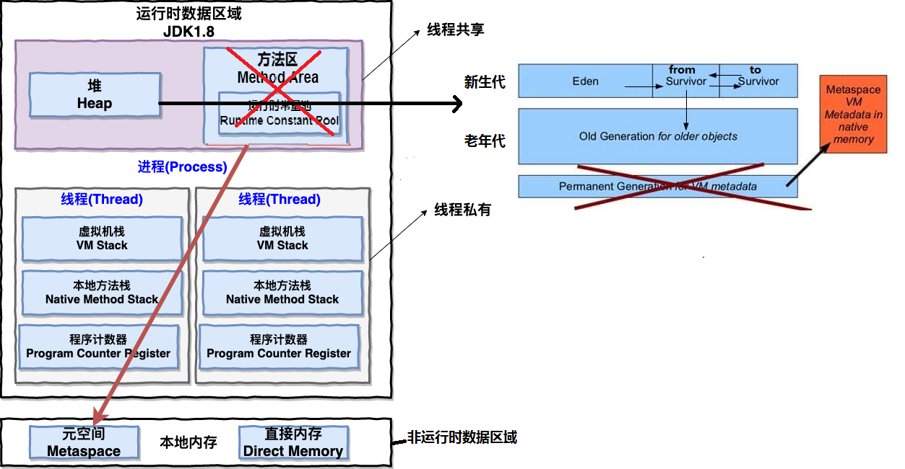
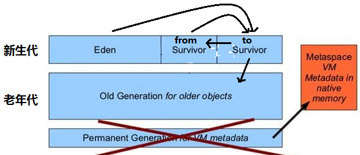
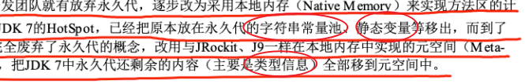

## **java内存区域（运行时数据区域）**

### **程序计数器**
（唯一一个不会出现 OutOfMemoryError 的内存区域）：

1. 字节码解释器通过改变程序计数器来**依次读取指令，从而实现代码的流程控制**，如：顺序执行、选择、循环、异常处理。 
2. 在多线程的情况下，程序计数器用于**记录当前线程执行的位置**，从而当线程被切换回来的时候能够知道该线程上次运行到哪儿了。

### **Java 虚拟机栈**

由一个个栈帧组成，而每个栈帧中都拥有：局部变量表、操作数栈、动态链接、方法出口信息。

会出现两种错误：

1. StackOverFlowError： 若 Java 虚拟机**栈**的内存大小**不允许动态扩展**，那么当线程请求栈的**深度超过**当前 Java 虚拟机栈的**最大深度**的时候，就抛出 StackOverFlowError 错误。 
2. OutOfMemoryError： Java 虚拟机栈的内存大小**可以动态扩展**， 如果虚拟机在动态扩展栈时**无法申请到**足够的内存空间，则抛出OutOfMemoryError异常。

Java 方法有两种返回方式：return 语句和抛出异常。不管哪种返回方式都会导致**栈帧被弹出**。

### **堆**
并不是所有对象都在堆上进行分配，从 JDK 1.7 开始已经默认开启逃逸分析，如果某些**方法中的对象引用**没有被返回或者**未被外面使用**（也就是未逃逸出去），那么对象可以**直接在栈上分配内存**。

对象都会首先在 Eden 区域分配，在一次**新生代垃圾回收**后，如果对象还存活，则会进入逻辑上的 from区（to区一直保持为空），并且对象的年龄还会加 1(Eden 区->Survivor 区后对象的初始年龄变为 1)，

当它的年龄增加到一定程度（默认为 15 岁，但默认晋升年龄并不都是 15，这个是要区分垃圾收集器的，CMS 就是 6），就会被晋升到老年代中。

对象晋升到老年代的年龄阈值，

1. 可以通过参数 -XX:MaxTenuringThreshold 来设置。
2. 或者Hotspot 遍历所有对象时，按照年龄从小到大对其所占用的大小进行累积，当累积的某个年龄大小超过了 survivor 区的一半时，取这个年龄和 MaxTenuringThreshold 中更小的一个值，作为新的晋升年龄阈值。

容易出现OutOfMemoryError 错误，表现形式：

>1. java.lang.OutOfMemoryError: GC Overhead Limit Exceeded ： 当 JVM 花太多时间执行垃圾回收并且只能回收很少的堆空间时，就会发生此错误。 
>2. java.lang.OutOfMemoryError: Java heap space :假如在创建新的对象时, 堆内存中的空间不足以存放新创建的对象（full gc后）, 就会引发此错误。(和配置的最大堆内存有关，且受制于物理内存大小。最大堆内存可通过-Xmx参数配置，若没有特别配置，将会使用默认值，详见：<https://stackoverflow.com/questions/28272923/default-xmxsize-in-java-8-max-heap-size>)
>3. 等

### **方法区**
- 方法区是 Java 虚拟机规范中的定义，是一种规范。
- hotspot永久代是对该标准的实现，1.8后改为在直接内存里划分出一片空间称为元空间进行实现。

存储已被虚拟机加载的：

- 类信息、
- 常量、
- 静态变量、
- 即时编译器编译后的代码等数据。

设置元空间大小：

>-XX:MetaspaceSize=N //设置 Metaspace 的初始（和最小大小）

>-XX:MaxMetaspaceSize=N //设置 Metaspace 的最大大小

与永久代很大的不同就是，如果不指定大小的话，随着更多类的创建，虚拟机会耗尽所有可用的系统内存。

注意：【字符串常量池被从永久代拿到了堆中，而不是移到了元空间】

### **常量池**
运行时常量池逻辑包含字符串常量池。

**字符串常量池**在堆，存的是

- 实际的在编译期间就确定的字符串常量，
- 或在运行期间创建的字符串常量，

编译期可以确定值的字符串，也就是常量字符串(实际的字符串)，jvm 会将其存入字符串常量池。

**运行时常量池**在方法区（永久代/元空间）

>在类加载到内存后，将class常量池（即.class文件的内容）转移到元空间，原先存储在硬盘上的各种字面量和符号引用都会去找字符串常量池，查看其是否存在相关字符串，则返回常量池中该字符串的引用，没有则：
>1. JDK1.7 之前（不包含 1.7）的处理方式是在字符串常量池中创建与此 String 内容相同的字符串（不是对象），并返回该字符串的引用，
>2. JDK1.7 以及之后的处理方式是jvm 不会在常量池中创建该字符串，而是将方法区（String.intern这里是堆）中这个字符串的引用（地址）直接放到常量池中，并返回该引用。

### **直接内存** 

直接内存并不是虚拟机运行时数据区的一部分，也不是虚拟机规范中定义的内存区域，但是这部分内存也被频繁地使用。而且也可能导致 OutOfMemoryError 错误出现。 

JDK1.4 中新加入的 NIO(New Input/Output) 类，引入了一种基于通道（Channel）与缓存区（Buffer）的 I/O 方式，它可以直接使用 Native 函数库直接分配堆外内存，然后通过一个存储在 Java 堆中的 DirectByteBuffer 对象作为这块内存的引用进行操作。这样就能在一些场景中显著提高性能，因为避免了在 Java 堆和 Native 堆之间来回复制数据。

