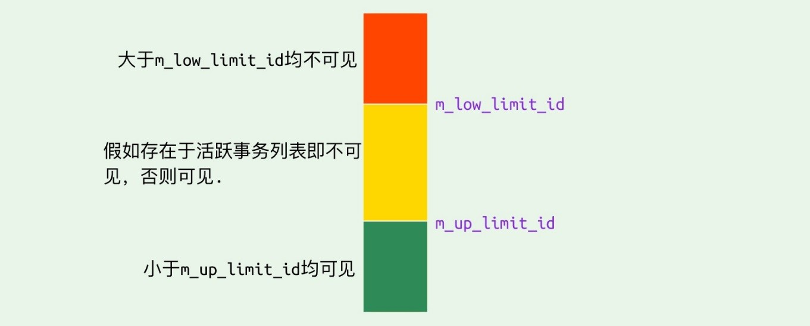

## mvcc

多版本并发控制：

1. 每行记录隐藏的3个字段；
2. 其中一个字段类似指针，指向可以回退的该记录的不同版本，形成的链表称为update undo-log
3. readview中的不同字段记录了不同的事务id集合

在内部实现中，InnoDB 通过数据行的 **DB_TRX_ID 和 Read View 来判断数据的可见性**，如不可见，则通过数据行的 **DB_ROLL_PTR 找到 undo log 中的历史版本**。

每个事务读到的数据版本可能是不一样的，在同一个事务中，用户只能看到该事务创建 Read View 之前已经提交的修改和该事务本身做的修改。

事务开始后，根据隔离级别的不同，如分别在RC和RR下，前一个是在每次select前生成readview，而后一个是只有第一次select前生成快照readview，这也就是RC导致了不可重复读的问题，而RR解决了这个问题。

InnoDB 在实现Repeatable Read 时，
1.	MVCC实现了一致性**非锁定读**，解决了幻读（只能读取到第一次查询之前所插入的数据）；
2.	如果执行的是**锁定读**（又叫当前读，每次都读取最新的记录，如更新操作），则会对读取的记录使用 Next-key Lock（行锁+间隙锁），来防止其它事务在间隙间插入数据（解决幻读）。
